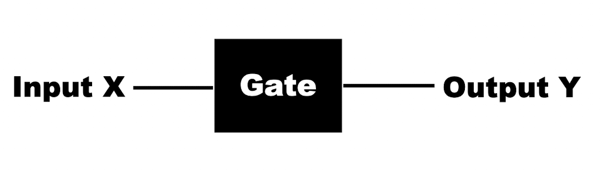
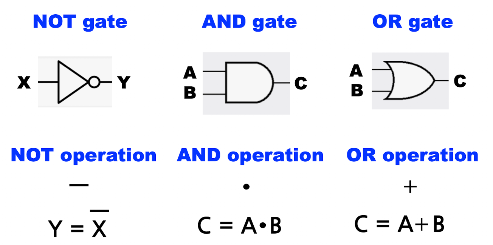
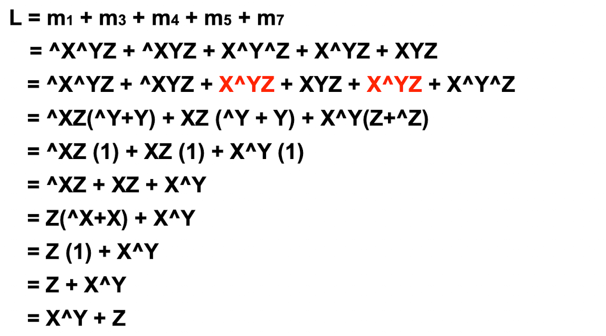

*본 포스팅은 Logic and Computer Design Fundementals (Pearson, 2013)의 내용을 다루고 있습니다.*

# Introduction
---
Logic Design 논리설계란?
---
단순화시켜서 이야기하면, 논리설계란 다수의 게이트들을 연결하는 것이다.

# Gate
---

Logic Gate 게이트란?
---
논리 게이트는 기본 프리미티브 모듈이다.
- 게이트는 입력(들)과 출력(들)을 가진다.
- 게이트의 입력과 출력들은 이진값 0(false) 또는 1(true)를 가진다.
  - 여기서 0과 1은 각각 낮은 전압과 높은 전압을 추상적으로 말하는 것
  - 디지털 회로도 전기회로의 한 종류이다.

  
<em class="fig">X와 Y는 0 또는 1을 가진다</em>

게이트의 특성을 어떻게 정의하는가?
---
ONEWAY - 입력과 출력의 관계를 보여준다.

일반적으로 **표**나 **함수**와 같은 수학적 방법을 사용하여 gate를 정의한다.

### 1. Table 표

{:.r}
- verbally하게 표현한다면, 출력 값과 입력 값은 반대이다.
- 임의의 어떤 게이트의 특성을 정의하기 위하여 말대신에 테이블을 써서 표현가능하다.

- 이러한 테이블들을 **진리표 truth table** 이라고 부른다.
    
진리표를 사용하여 게이트의 특성을 나타낼 수 있다.

### 2. function 수학적 함수

입력과 출력의 관계를 나타내기 위하여, 특별한 수학적 연산자를 사용한다.
이를 **Logic operation** **논리 연산자**라고 한다.
  

논리 연산자를 사용하여, 게이트릐 특성을 수학적 함수로 나타낼 수 있다.

# Bool Algebra 부울 대수
---
논리 연산자는 게이트들을 특별한 수학적 함수로 정의한다.
이 특별한 수학적 함수는 부울 대수라는 특별한 대수에 기반을 둔다.

### Bool Algebra
  

위와 같이 표현된 식은 출력값 Y에 대해 **Boolean equation**또는 Boolean function이다.

  
부울 대수에서는 위와 같은 중요한 항등식과 정리들이 있다.

15번의 distribute 법칙은 일반적인 대수의 계산과 달라 헷갈릴 수 있으므로 주의한다.

# More on Gates and Boolean Algebra
---
자주 사용되는 로직게이트에는 NAND NOR XOR XNOR 등이 있다.

위의 사진은 각 게이트들을 스키메틱과 부울식, 진리표로 나타내었다.

논리 회로를 설계할 때에는 가장 처음으로 진리표로 회로를 정의하고, 부울 함수로 바꾸어 표현한 뒤, 마지막으로 스키메틱으로 표현할 수 있다.

진리표에서 부울식으로 나타내었을 때, 우리는 이를 **optimize 최소화** 할 수 있다.

*(b)와 같이 설계하는 것이 이상적이다.*

# Logic Expression
---

우리는 *A*와 *B*를 입력값으로, *C*를 출력값으로 가지는 임의의 게이트가 있다고 하자.

이 로직게이트의 특성을 정의하기 위해서는 모든 경우의 수를 진리표로 나타내야 할 것이다.
*16가지 경우의 출력 값이 존재한다.*

우리는 이러한 *C*출력값의 경우의 수들 중 1가지 case에 대해 true를 띄는 출력값을 찾아 볼 수 있다.
이는 *C1 C2 C4 C8* 이며 이를 **minterm**이라고 부른다.
{:.r} 

다른 출력값들은 이러한 **minterms** *m0,m1,m2,m3*의 **sum**로 표현될 수 있다.

용어 정의
---
- **Literal** 
: 입력변수 그 자체(A, B, etc)이거나, 또는 그것의  complement(^A, ^B, etc)이다.
- **Product (적항)**
: 적항은 1개 이상의 리터럴들이 AND 연산자로 묶여진 것인데, 단 입력변수 X와 그것의 보수 ^X가 동시에 존재하지는 말아야 함.
- **Minterm (최소적항)**
: 최소적항은 모든 입력들 각각이 그 자체로 또는 그것의 보수형태로 모두 존재하는 product이다.
- **Sum**
: 1개 이상의 리터럴들이 OR 연산자로 묶인 것인데, 단 입력변수 X와 그것의 보수 ^X가 동시에 존재하지는 말아야 함.

입력값 *X Y Z* 3개가 존재하는 로직게이트 L의 출력값은 아래와 같다고 하자.
  

  *게이트 L은 X Y Z의 minterm들의 sum으로 표현가능하다.*

정리하면
---
논리회로를 표현할 때
1. Truth table 진리표 적어 게이트의 특성을 정의하고
2. minterm들의 sum으로 부울식으로 표현한다.
3. two-level의 로직의 경우 이를 optimize하여, 최소화된 부울식으로 나타낸다.
4. 이를 schemetic 으로 그려서 나타낼 수 있다.

# Logic Optimization
---

최소화 되기전의 부울식을 **Sum of Minterms** 라고 하고,  
최소화 된 부울식을 **Sum of Products**라고 한다.

최소화의 기준
---
Sum of products로 만들기 위해 optimize할 때,
optimize된 식의 기준을 판단하기 위해 2가지를 보면 된다.
1. 첫번째로 *Product*의 수가 적은지
2. 두번째로 *literal*의 수가 적은지  

둘다 같다면 최적화 정도가 같다고 봐도 된다.

예로 아래와 같이 부울식을 조작하여 최소화 할 수 있다.
*단순법칙 : AB + A^B = A 를 적용하자*

**[[Logic Design - 2]](../2021-04/logicdesign2)에 계속↗**