# K-map with minterm
---
K-map은 시각화된 논리회로 최소화 기법이다.

### two input variables

두 개의 입력값으로 A와 B를 가지는 논리회로를 K-map으로 표현한다고 하자.

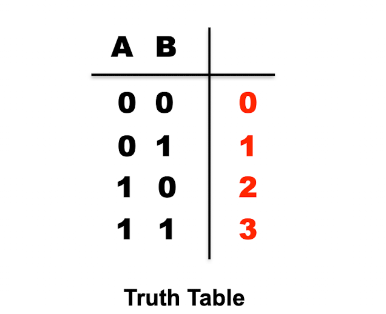{:.y}

진리표를 조작하여 위와 같이 나타낼 수 있다.
진리표의 오른쪽에 해당하는 출력값(minterm)들의 순서를 빨간색의 숫자로 표시하였는데, 이를 K-map에 적용하면 아래와 같다.

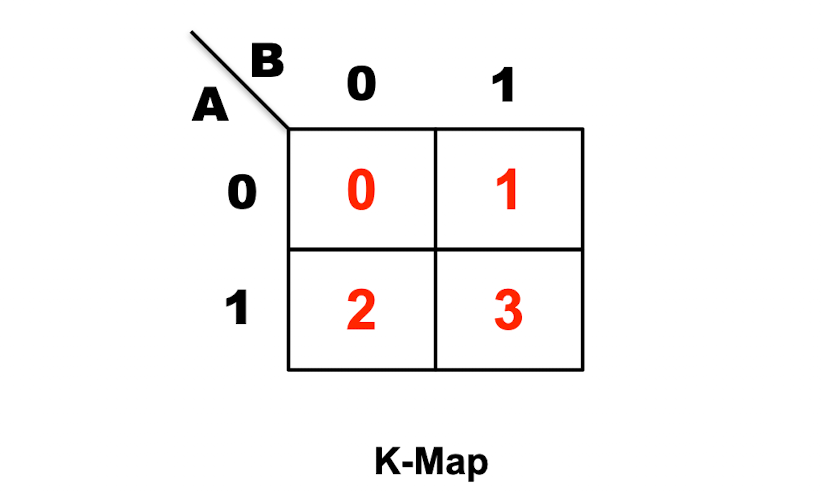{:.y}  

A와 B로 이루어진 product(minterm)들을 해당하는 칸에 맞춰 집어 넣으면 된다.

예를 들면,
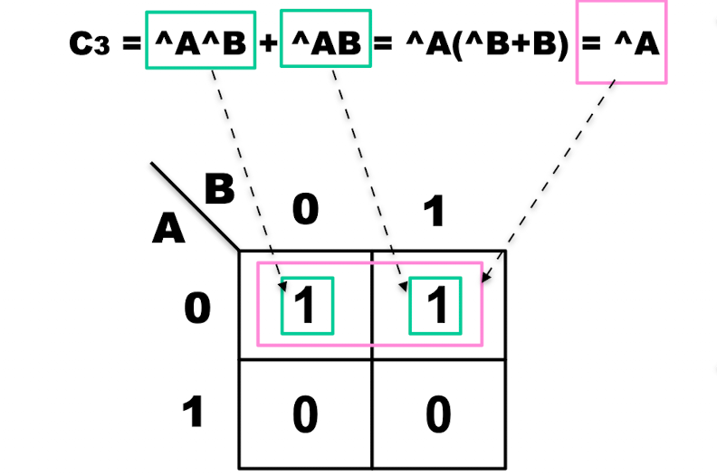{:.y}
와 같은데,

인접하는 두 좌표에 값이 들어간다면, 두 값을 묶어 최소화 할 수 있다.

### three input variables

3개의 입력값이 주어진다면, 아래와 같이 표현 가능하다.
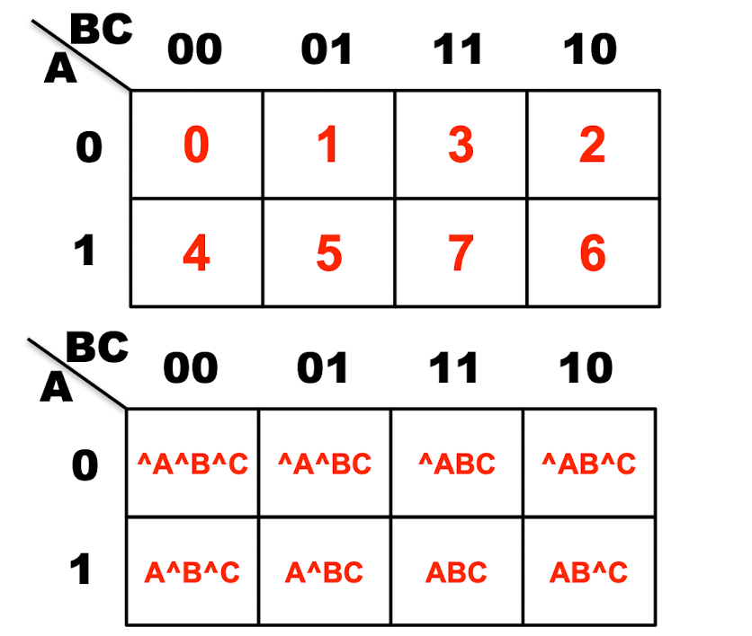{:.y}

- 순서대로 01 23 45 67이 아닌, **01 32 45 76 임을 유의**한다.
- 그리고 **0과 2** 그리고 **4와 6** 또한 **인접해있음을 유의**한다.

#### four input variables

마찬가지로 4개의 입력값이 주어졌을 때에도 표현가능하다.
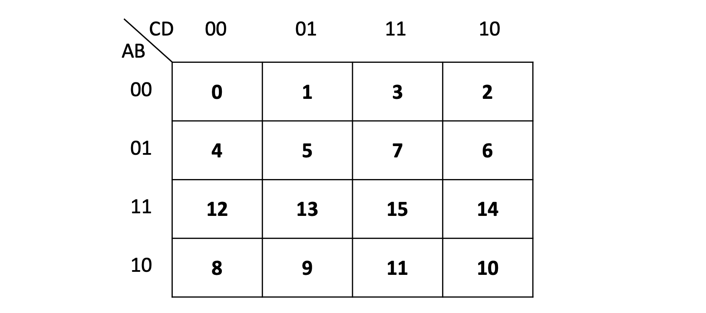  
- 마찬가지로 순서에 유의한다. 행과 열이 00 01 11 10 순이다.
- 0은 8과 2에 인접해있다. 즉, 가장자리에 위치한 칸은 그 맞은편 product와 인접해있다.(연결됨)

# Sum of Product Oprimization Algorithm
---
K-map을 이용하여 최소화하는 알고리즘은 어떤 것인가?

### 용어 정의
- **Prime implicant**
: 다른 product를 포함하지 않는 **가장 큰** product (사각형)
- **Non-prime implicant**
: 다른 product를 **포함하는** product
- **Essential prime implicant**
: 최소 한개의 다른 prime implicant에 **속하지 않는 minterm을 가지는** prime implicant

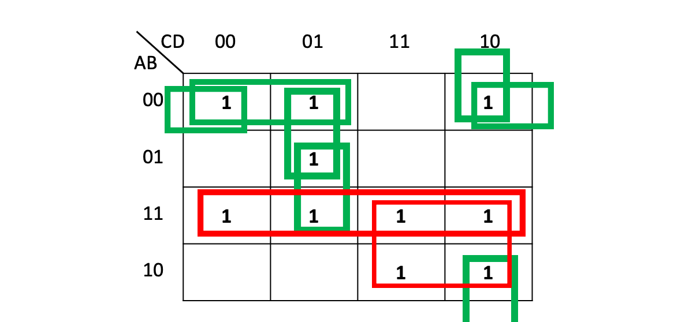  
- 빨간색 사각형
  -  product는 한개의 다른 prime implicant에 속하지 않는 minterm을 가지는 prime implicant
- 초록색 사각형
  -  Non-prime implicant

Sum of Product를 Optimization 하는 Algorithm
---
1. 모든 prime implicant들을 찾는다.
2. 찾은 것들 중, 모든 essential prime implicant를 찾아 선택한다.
3. 최소한의 non-essential prime implicant를 찾아 선택한다.

# Maxterm을 이용한 Two-level Logic Expression
---
지금까지, 논리회로를 표현할 때, sum of product의 형식으로 표현하였다.
이제는 다른 방법의 표현방법을 생각해보자.

Maxterm
---
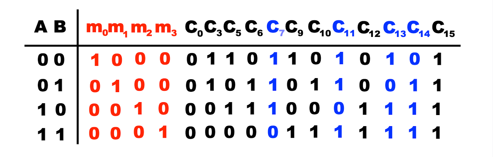  
위 사진과 같이, 지금까지는 minterm을 sum 하여 나머지 C 출력값들을 표현할 수 있었다.

여기서 *C7 C11 C13 C14*를 보자.
minterm이 한가지 경우에만 *true*값을 가지는 반면, 이들은 한 가지 경우에만 *false*값을 가지고, 나머지는 *true*이다.
즉, **non-trival** 하면서 **1이 가장 많은** 경우들이다.

이를 **maxterm**이라고 하며 아래와 같이 표현된다.
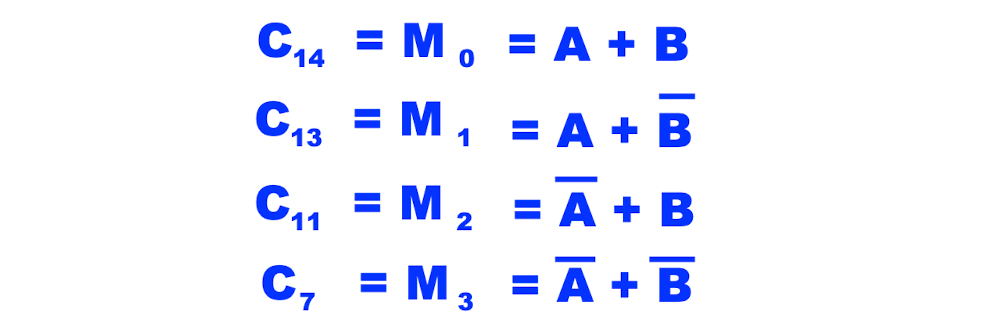  

나머지 출력값들을 maxterm들을 **product**하여 표현가능하다.

### minterm과 maxterm을 사용한 부울식 표현방법의 비교

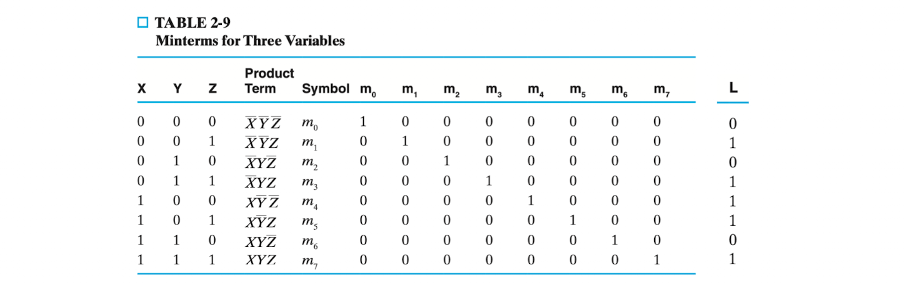  
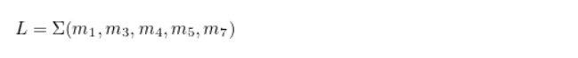{:.i}

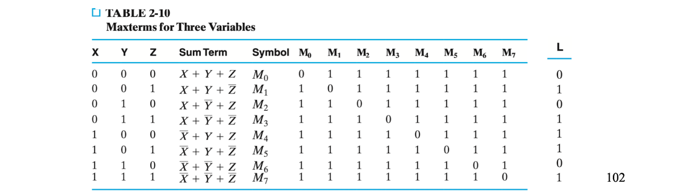  
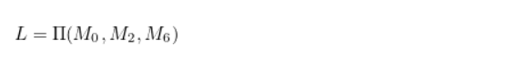{:.i}

# K-map with maxtrem 
---
maxterm을 이용하여 K-map으로 optimization된 부울식을 구할 수 있다.
minterm과 반대로 K-map의 0인 부분을 대상으로 최적화한다.

### two input variables

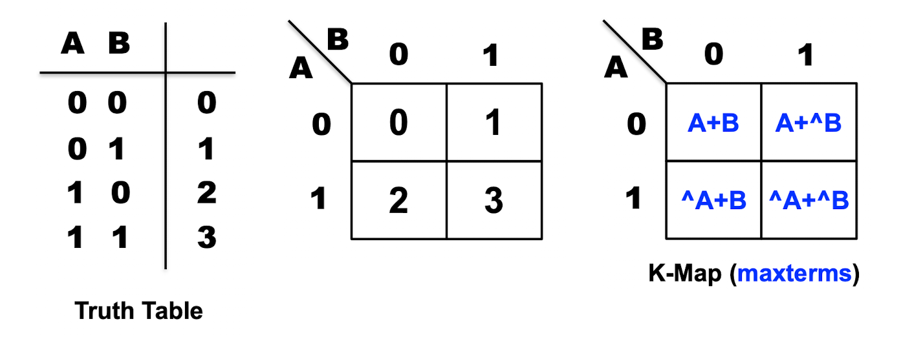  
minterm과 마찬가지로 k-map을 채우지만, 칸을 선택했을 때의 표현은 전혀 다르다.

product가 아니라 **sum**으로 표현됨을 유의

### three input variables

입력 값이 3개일 때에도 마찬가지이다.
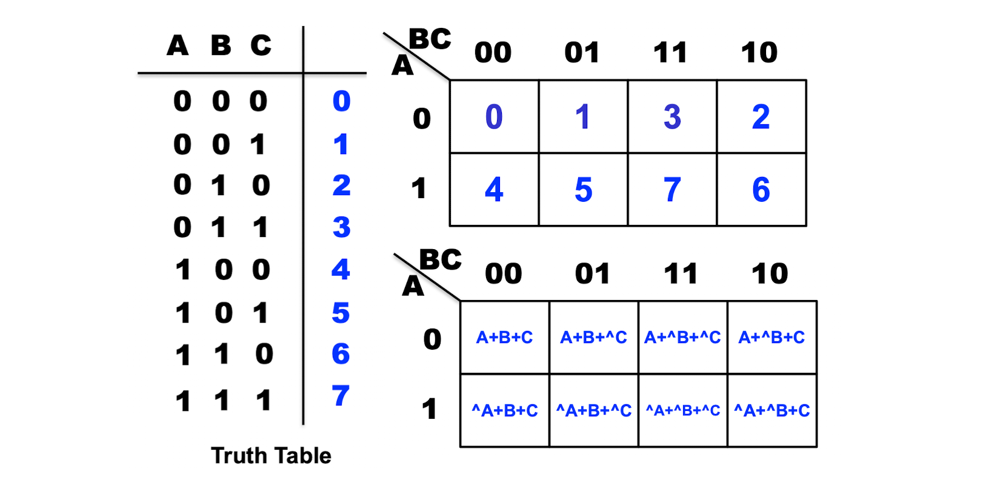  

순서에 유의하고, 맞은편의 sum도 인접해있음을 유의한다.

### example

minterm과 다르게 K-map의 0인 부분을 대상으로 최적화한다.
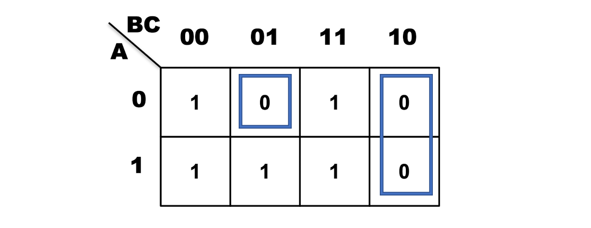  
0에 해당하는 부분을 최적화 알고리즘을 적용하여 파란색으로 박스쳐두었다.

이를 식으로 표현하면
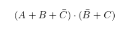  

**[[Logic Design - 3]](../2021-04/logicdesign3)에 계속↗**