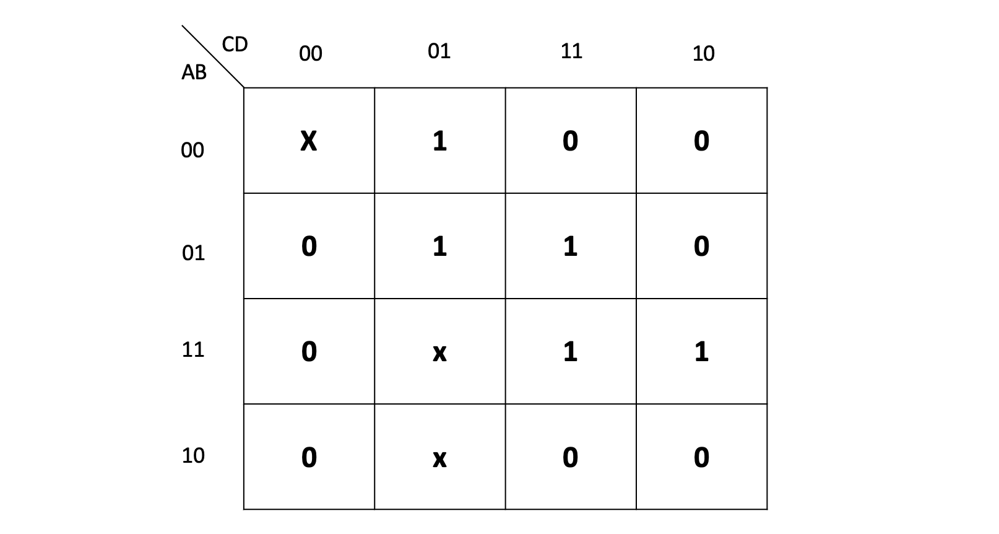

*본 포스팅은 Logic and Computer Design Fundementals (Pearson, 2013)의 내용을 다루고 있습니다.*

# Oprimization Algorithm
---
### Sum of Product
1. 모든 **prime implicant**를 찾는다.
2. 그들 중, 모든 **essential prime implicant**를 찾아 선택한다.
3. 나머지 **non essential prime implicant**들 중 **최소한**을 선택한다.

### Product of Sum
1. 모든 **prime sum**을 찾는다.
2. 그들 중, 모든 **essential prime sum**을 찾아 선택한다.
3. 나머지 **non essential prime sum**들 중 **최소한**을 선택한다.

 
minterm 과 maxterm의 갯수로 비교하면 안된다!

# Logic Optimization For Don't Cares
---
### 용어 정리
- **Don't Care**
: 출력으로 0 또는 1 모두 올 수 있다. 
- **Incompletely Specified Function**
: dont care를 가진 boolean function
- **Completely Specified Function**
: dont care를 가지고 있지 않은 boolean function

Optimization For Don't Care
---
### Sum of Product
1. 모든 **prime implicant**를 찾는다.
   - dont care을 1로 취급한다
2. 그들 중, 모든 **essential prime implicant**를 찾아 선택한다.
   - dont care은 무시하고 선택한다
3. 나머지 **non essential prime implicant**들 중 **최소한**을 선택한다.
   - dont care은 무시한다

**Product of Sum**도 마찬가지이다.

### example

  
위 그림의 sum of product의 k-map을 구해보자

#### STEP 1
  
**dont care을 1로 취급**하여 모든 **prime implicant**를 찾는다

#### STEP 2
  
그들 중, 모든 **essential prime implicant**를 찾아 선택한다.
essential prime implicant는 최소 한개 이상의 어느 implicant에도 속하지 않는 minterm을 가져야한다. (dont care 제외)

초록색으로 essential prime implicant을 표시하였다.

#### STEP 3
  
dont care는 무시하고 최소한의 갯수와 최소의 리터럴을 가지도록 박스를 친다.

# GATE Delay
---
게이트 출력값의 변화는 원인이 되는 입력값의 변화의 결과이다.
그 원인(입력)과 결과(출력) 사이에는 반드시 **시간차**가 존재한다.

  

디지털 회로의 함수적 기능을 생각하는 경우에는 게이트 지연시간을 무시할 수 없다.
그러나 회로의 성능을 고려할 때에는 게이트 지연시간을 무시할 수 없다.

로직레벨이 높아질수록 지연시간은 증가한다.

**[[Logic Design - 4]](../2021-04/logicdesign4)에 계속↗**

