*본 포스팅은 Logic and Computer Design Fundementals (Pearson, 2013)의 내용을 다루고 있습니다.*

# Hirarchical Design

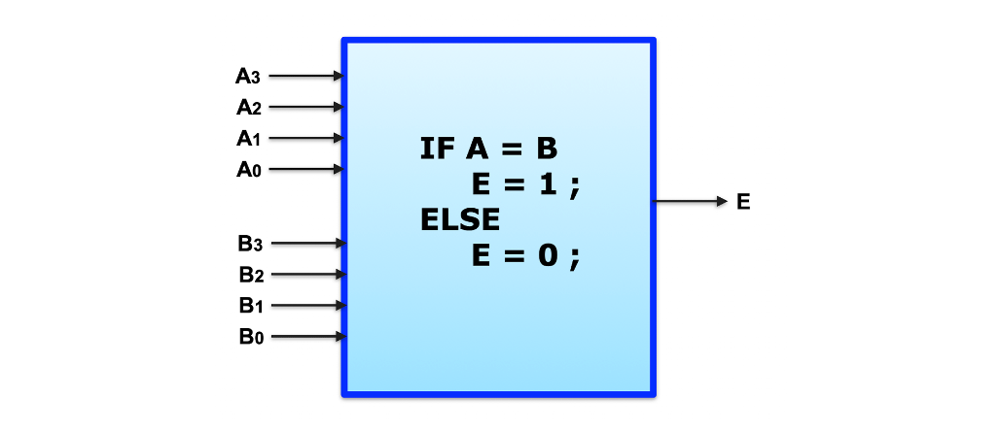  

다음과 같은 논리 회로가 있다고 치자.

4비트 입력 A와 B를 비교하며  
A와 B가 같다면 1을 출력하고, 같지 않다면 0을 출력한다.

하지만 이를 설계하기 위하여 진리표를 그리기에는 경우의 수가 너무 많다.  
총 8개의 입력이 있으므로 2의 8승 = 256행의 진리표를 그려야 한다.

A0는 B0와, A1은 B1과 각각 비교하면 되는데 더 효율적이게 나타낼 순 없는가?

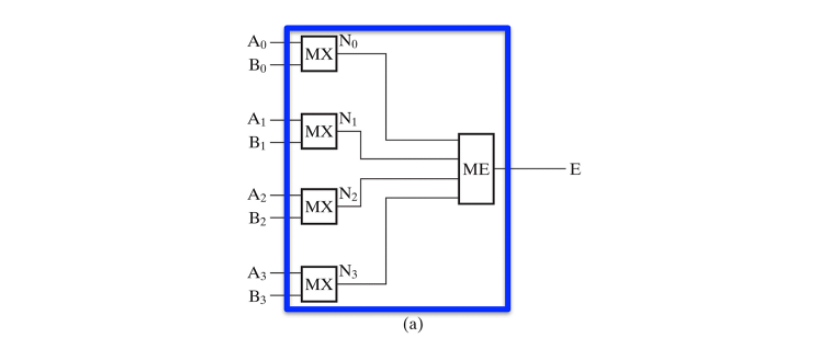  

위에서 말했듯이 각 비트에 맞는 수 2가지를 각각 비교하면 된다.

이를 위해 두 입력이 같은지 비교하는 sub-module MX를 사용한다.   
MX는 An와 Bn을 비교하고, 또 다른 모듈 ME는 0부터 3까지의 MX 연산 결과를 종합한다.

처음 주어진 논리 회로를 통채로 생각하기는 어렵지만,  
각각의 모듈 MX와 ME에 대해서는 진리표를 그려 설계해 볼 수 있다.

>- **MX**는 입력 Ai와 Bi가 같을 때만 0을 출력하는 **XOR** 게이트이다.
>- **ME**는 MX의 출력(N0 ~ N3)들이 모두 0일때에만 1을 출력하는 **NOR** 게이트이다.

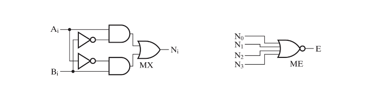
*MX와 ME를 스키메틱으로 표현하면 위와 같다*
  
회로를 설계하기 위해서는 진리표를 세워, 로직최적화를 하고, 스키메틱을 그리기 전에  
**Hirarchical Design**, 즉 **계층 설계**를 하는 것이 중요하다.

Single variable 표현
---
---
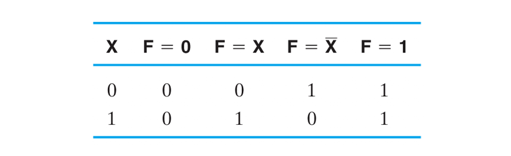  
단일 입력 X의 입력에 따라 F의 출력을 내는 회로를 생각해보자.

F=0 또는 1이라면 입력값에 상관없이 출력값이 정해진다.  
그러므로 0일때에는 그라운드에 연결하고, 1일때에는 인가전압에 연락하면 된다.

출력값이 입력과 같이 나온다면 그대로 출력하면 되고, 반대이면 인버터를 연결하여 출력하면 된다.

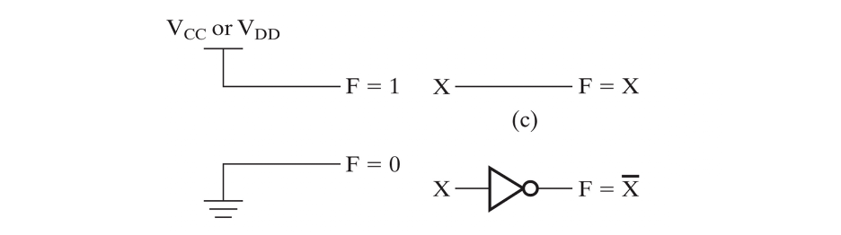  

Three function by using value fixing
---
---
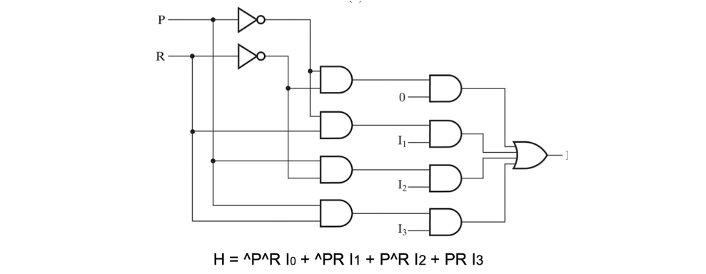  

위 회로를 보자.

입력 P와 R를 decoding 하고 and연산하여 minterm을 만든 후  
각각 I값과 AND연산한 값을 OR하여 출력하는 회로이다.

입력값이 총 6개이기에, 진리표를 그리기 위해서는 64행의 표를 그려야한다.

하지만, 위의 회로를 보면 P와 R에 대한 minterm에 I 값을 AND하여 합친 값과 같다.  
이말은 P와 R을 입력값으로 가지고 출력값을 I0 ~ I3로 가지는 상황과 동일하다.

*이를 Condensed Truth Table 압축된 진리표라고 한다*

Enabling Circuit
---
---
Enabling Circuit이란,  
입력값 EN에 따라 X가 그대로 나올지, 0또는 1로 나올지 결정하는 회로이다.

즉, EN은 X를 활성화 할지말지 결정한다.
  
AND게이트로 만들어진 enable 회로는  
EN이 1일 때 X를 활성화하고, 0일 때 무조건 0을 출력한다.

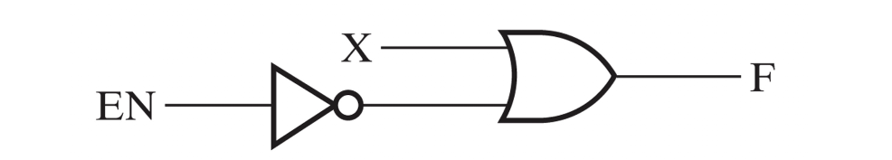  
인버터와 OR게이트로 만들어진 enable 회로는  
EN이 1일 때 X를 활성화하고, 0일 때 무조건 1을 출력한다.

Decoder
---
---
Decoder는 n개의 입력을 받았을 때, 입력을 분해하고 합쳐 입력들의 minterm형태를 출력하는 회로이다.  
n개의 입력을 받으면 2의 n승개의 출력이 존재한다.

### 1 to 2 Decoder

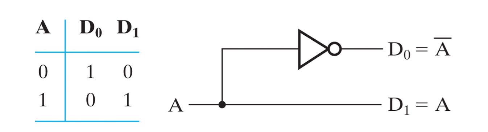
위는 입력이 한개인 1 to 2 decoder이다.

위 1to2 디코더는 입력 A를 A와 ^A로 decoding 하였다.

### 2 to 4 Decoder

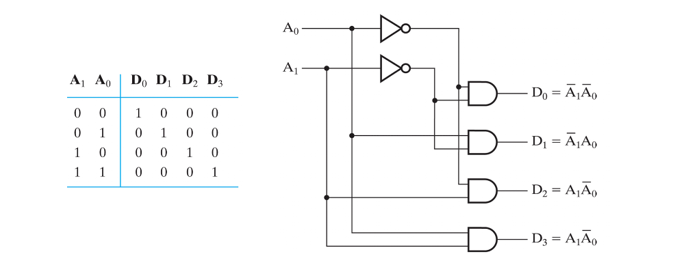
*2 to 4 decoder*

2 to 4의 경우는 1 to 2 디코더로 입력값을 쪼개어  
AND 연산하여 출력한다.

### 3 to 8 Decoder
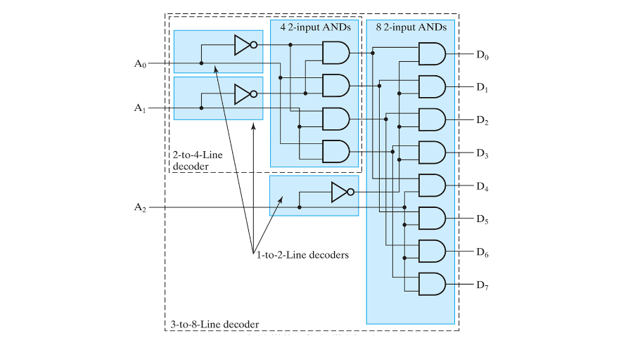  

3 to 8 디코더도 마찬가지로 1 to 2 디코더와, 2 to 4 디코더를  
서브모듈로 사용하여 AND연산한 값을 출력한다.

### 6 to 64 Decoder

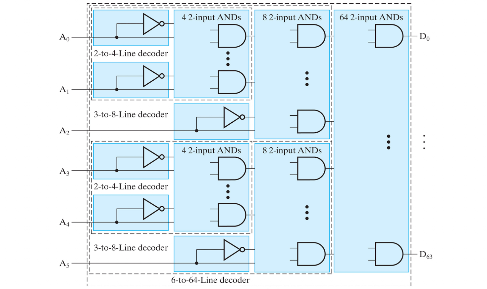  

3 to 8 디코더를 서브모듈로 사용하여,  AND 연산하여 출력한다.

이와 같이 **계층적 구조**로 더 많은 입력을 갖는 디코더를 구현할 수 있다.

### Decoder with Enable

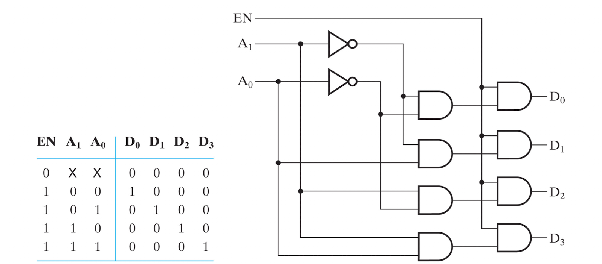  
위 회로는 2 to 4 디코더 이지만  
Enable 회로가 추가되 형태의 회로이다.

추가된 입력값 EN이 0이라면 A0와 A1에 상관없이 모든 출력이 0으로 나오고,
EN이 1일때에만 활성화 되는 것이다.

---

### 1-Bit Binary Adder

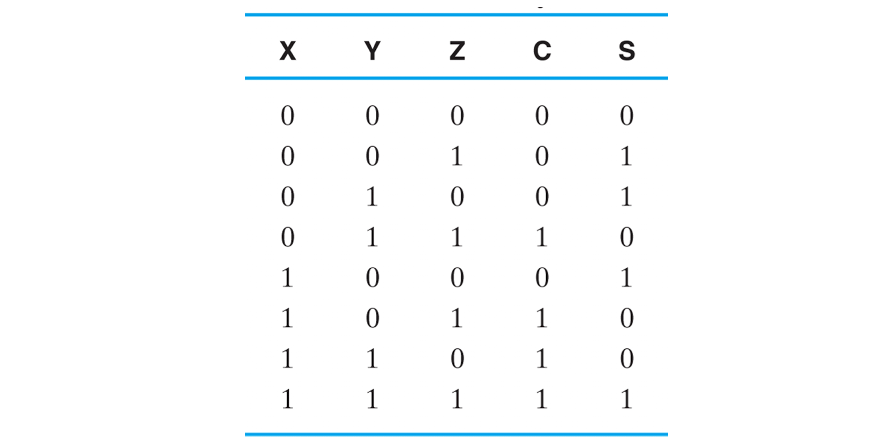  

1-Bit Binary Adder란  
입력값 X, Y, Z를 모두 더하여 C와 S 2비트로 나타내어 출력하는 회로이다.

예를 들어 XYZ가 모두 1이라면, 더하였을때 3이므로 C S = (1, 1) 로 나타낼 수 있는 것이다.

이를 어떻게 구현할 수 있을까?  

C와 S를 따로 생각해보면 3개의 입력 조합에 따른 출력을 알고 있다.
이는 잘 생각해보면 출력이 1인 조합의 minterm들을 OR연산 한 값과 같다.

즉 C의 경우 m1 + m2 + m4 + m7이고,  
S의 경우 m3 + m5 + m6 + m7 으로 나타낼 수 있는것이다!!

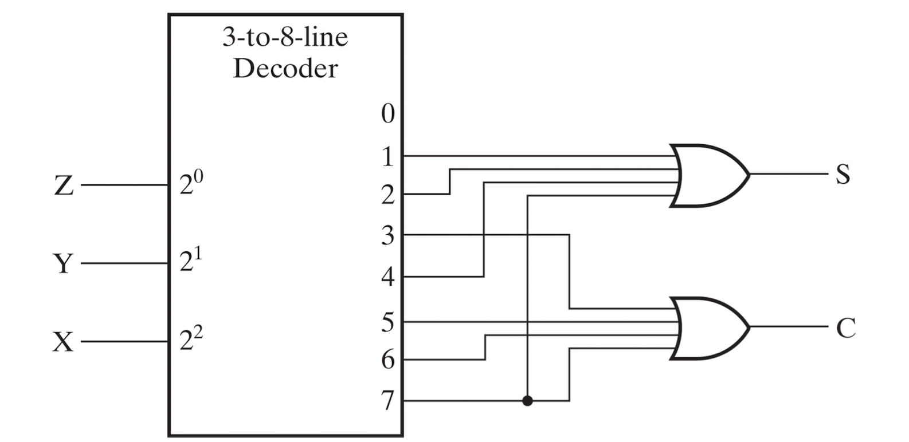  

이를 스키메틱으로 표현하면 위 그림과 같다.

**[[Logic Design - 5]](../2021-04/logicdesign5)에 계속↗**