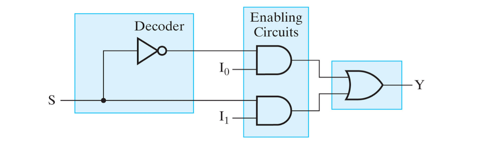

Encoder
---
---
Encoder란 Decoder의 반대 역할을 하는 회로하고 생각하면 된다.

### Octal to Binary Encoder

  

입력들 중 한개의 입력만 1이고 나머지는 0인 경우들을 생각해보자.  
각 입력의 첨자에 해당하는 digit 값을 binary로 바꾸어 A(3bit)를 통해 출력하는 것과 같다.

입력이 8개 이므로 한개만 1인 경우 외에도 수많은 경우가 있는데,  
나머지는 제대로 encoding 되지 않으며, 할 필요가 없다.

그 경우에는 출력을 don't care로 나타낸다.

### Priority Encoder

  

위에서 말한 한개의 입력만 1인 경우 외 othes를 고려하기 위해서는 Priority Encoder를 사용하면 된다.

이는 1을 갖는 단 한개의 입력을 우선적으로 고려하여 그 첨자에 맞는 binary로 출력한다.  
나머지는 어떠한 경우가 오던 don't care로 생각하는 것이다.

진리표를 보면
- D3가 1일때, D2 ~ D0는 신경쓰지 않는다.
- D3가 0이고, D2가 1일때 D1, D0는 신경 쓰지 않는다.
- D2, D3가 0이고, D1이 1일때, D0는 신경 쓰지 않는다.
- encoding 대상이 없는 입력이 모두 0일때, 출력 V는 0이고 A0와 A1은 dont care로 나타낸다.

위와 같이 나타낸 priorty encoder는 A0와 A1에 대하여 **K-map**으로 나타낼 수 있다.
  

당연히 K-map으로 나타내었으니, optimize할 수 있고,    
최적화된 우선순위 인코더를 스키메틱을 아래와 같이 나타낼 수 있다.

*optimized priority encoder*

Multiplexer
---
---
Multiplexer란?  
2^n개의 data input들 중 n개의 selector input으로 1가지를 골라서 출력하는 회로이다.  
sector가 어떤 input을 출력할지 고른다.

*Singel-Bit 2-to-1 Line Multiflexer*

줄여서 MUX 또는 MX라고 하며, decoder와 enable 회로를 섞어놓은 형태이다.  
[Logic Design - 4](../2021-04/logicdesign4)에서 보았던 *Three function by using value fixing*이 MUX이다.

  
MUX는 **Condensed Truth Table** 압축된 진리표로 나타낼 수 있으며,  
Enable 입력(selector)를 입력으로 하고 data inputs를 출력으로 나타내는 진리표이다.

*Condensed Truth Table* 

### 4 to 1 Line Multiflexer

  

### 64 to 1 Line Multiflexer

  

### Multi-Bits Line Multiflexer

  

위 *Quad 4 to 1 Line Multiflexer*는 일반 4to1 MUX의 형태와 유사하지만,
4bit - vector의 형태이다.

입력값 *I0 ~ I1*는 각각 4비트의 멀티비트를 가지는 vector이다.  
그러므로 각 비트에 따라 4번의 연산 과정을 가지고 4개의 출력을 가지는 것이다.

selector는 동일하다.

### 1-Bit Binary Adder with 8 to 1 MUX

위에서 말하였듯이 예를 들어 8 to 1 MUX의 경우 3개의 selector를 input으로 하고   
data input을 출력으로 표현하여 생각하면 3개의 입력을 가지는 모든 경우의 출력(256가지)을 가지는 회로를 구현가능하다.

  

마찬가지로 [Logic Design 4](../2021-04/logicdesign4)에서 보았던 1bit binary adder를 2-bit 8 to 1 MUX로 구현가능하다.

3개의 selecor를 입력으로 가지고 8개의 data input(2bits)을 출력값으로 가지는 진리표를 생각하면된다.

### 1-Bit Binary Adder with 4 to 1 MUX

방금 다루었던 *1-Bit Binary Adder with 8 to 1 MUX*를 더 싼 비용으로 설계할 수 있을까?

놀랍게도 8 to 1 MUX가 아닌 4 to 1 MUX로 *1-Bit Binary Adder*를 구현할 수 있다.

  

위 *1-Bit Binary Adder* Condensed 진리표를 살펴보자.

selector XYZ 에 따른 출력 값(data inputs)를 표현하였는데  
X와 Y가 같은 경우에 따라, Z의 조합과 출력 값의 조합을 보아라.

4가지의 경우가 존재한다.
>1. Z와 상관없이 0인 경우
>2. Z와 상관없이 1인 경우
>3. Z입력 조합과 같은 경우
>4. Z입력 조합과 반대인 경우

이 말은 즉, 출력값(data inputs) C와 S를 Z로 나타내어 표기할 수 있는 것이다.

1번의 경우 0, 2번의 경우 1, 3번의 경우 Z 그래로, 4번의 경우 Z에 인버터

### 16to1 MUX to 8to1 MUX

  

위에서 말했던 방법과 마찬가지로,   
16 to 1 MUX의 한개의 selector 입력값을 data input으로 표현하여 8 to 1 MUX 표현할 수 있다.

### BCD to 7 segment Decoder

  
알람 시계와 같은 전자잉크 액정에서는 흔히 7 segment로 화면에 출력되는 digit을 볼 수 있다.

0부터 9까지의 숫자를 7가지의 표시부(출력)이 켜지고(1) 꺼지는(0) 회로로 생각할 수 있다.

  

0부터 9까지의 숫자(10개)를 입력으로 사용하기 위해서는 4bit가 필요하고 출력값으로 7개의 표시부가 있다.
이도 당연히 MUX로 구현 가능하며, BCD를 selector, 7표시부를 data input으로 두는 것이다.

  
마찬가지로 selector 4 비트중 하나를 data input으로 넣어 표현해버리면 더욱 싼 비용의 회로를 설계할 수 있다.

**[[Logic Design - 6]](../2021-04/logicdesign6)에 계속↗**