*본 포스팅은 Logic and Computer Design Fundementals (Pearson, 2013)의 내용을 다루고 있습니다.*

Iterative Circuit
---
---
**Iterative Circuit**이란?

동일회로가 반복적으로 연결되어 있는 형태의 회로를 뜻한다.  

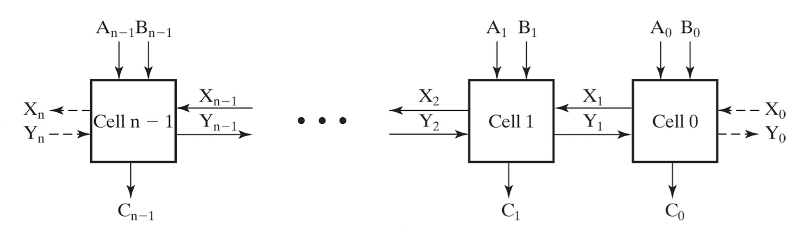  
위 회로를 보면 Cell 회로 *n*개가 연속적으로 연결되어 있는 상태이므로 iterative 회로라고 할 수 있다.

Half Adder
---
---
**Half Adder** (반가산기)란  
두 입력을 더한 값을 binary(2bit)로 출력하는 회로이다.

*0, 1, 2, 3* 총 4가지 경우에 대한 출력을 가진다.  
진리표를 그려 스키메틱으로 나타내면 아래와 같다.

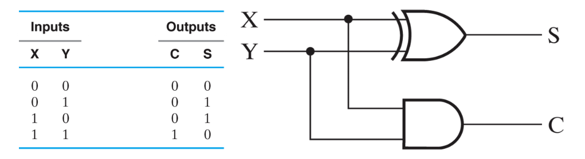
*Half Adder*  

이름이 **반**가산기인 이유는 올림수(carry)를 생각하지 않는 구조이기 때문이다.

멀티비트의 경우, 더하는 비트의 밑의 자리수에서 carry가 발생한다면   
1을 더하여 생각해야하기에, **Full Adder**가 필요하다.

Full Adder
---
---

**Full Adder**(이하 FA) 란

두개의 비트을 더하고, 올림 수까지 고려하는 가산기이다.  
더하는 대상인 두 입력 *X*와 *Y* 그리고 올림 수 *Z* 를 모두 더한다.

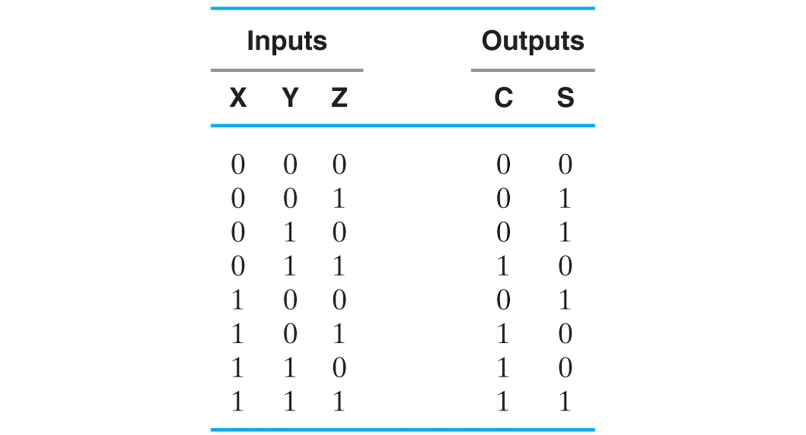
*Truth Table of Full Adder*

이는 사실 전 포스팅에서 다루었던 1Bit binary adder이다.

전에는 minterm을 OR 연산하는 방법으로 회로를 구현하여 스키메틱을 그렸지만  
우리는 그 방법이 최적화 되지 않음을 알고 있다.

sum of minterm들은 **K-map**으로 나타내어 optimize 할 수 있다.

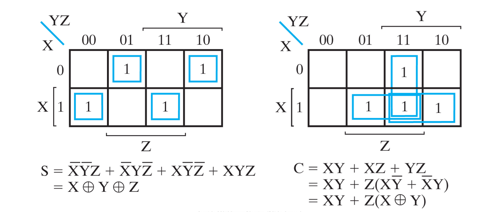  

K-map으로 최적화 된 부울식을 위와 같이 구할 수 있고 스키메틱을 그려보면 아래와 같다.  
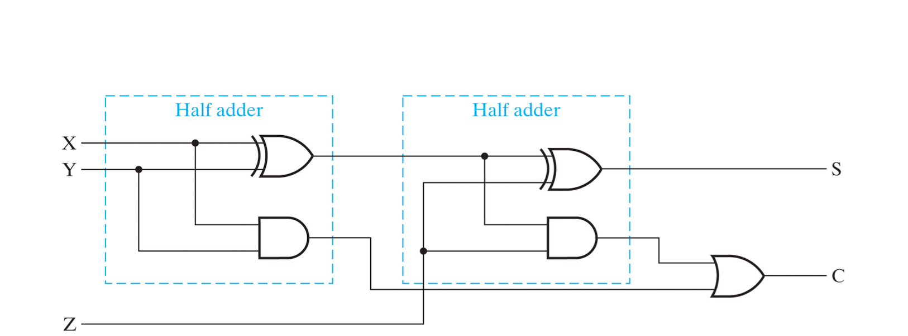
*Full Adder*

그림을 살펴보면 두개의 반 가산기가 sub-module로서 사용되고 있음을 확인가능하다.    
FA도 계층 구조를 가지고 있는 회로이다.

Ripple Carry Adder
---
---
Ripple Carry Adder란

여러 개의 Fuller Adder가 반복적으로 연결되어 있는 형태의 회로를 말한다.

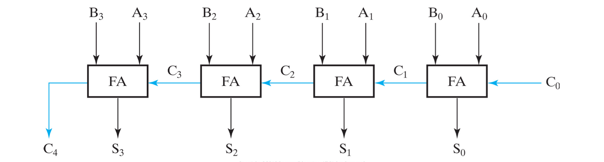
*4-bit Ripple Carry Adder*

Ripple Carry Adder(이하 RCA)는 iterative 회로의 구조를 가진다.

FA에서 올림 수를 고려한다고 하였었는데 RCA에서 이를 활용할 수 있다.  
2bit 출력값 *C*와 *S*중 높은 자리의 비트인 *C*를 다음으로 연결된 가산기의 입력(올림)으로 사용하는 것이다.

이런식으로 사용하면 2이상의 멀티 비트를 가지는 두 값 A와 B를 각각의 비트 RCA에 입력하여 합의 비트을 구할 수 있다.

또한, 첫 단계의 FA에서는 올림수가 존재하지 않음이 분명하다.  

그러므로 입력값 *C0*를 그라운드에 연결하여 0을 입력해주거나, FA대신 HA를 사용할 수 있다.

 
RCA는 장점과 단점을 가지고 있다.  
- **Pro :** N-bit로의 확장이 매우 용이하다.   
  마지막 단계의 FA에 FA를 하나더 연결하면 된다.
- **Con :** FA를 여러개 연결할 수 록 Logic-Level이 그만큼 증가한다.  
  level이 증가하면 gate delay가 늘어난다.

Adder-Subtractor
---
---
뺄셈을 위한 Subtractor를 따로 설계하기 보다는 Adder를 변형시켜 뺄셈도 가능토록 할 수 있다.

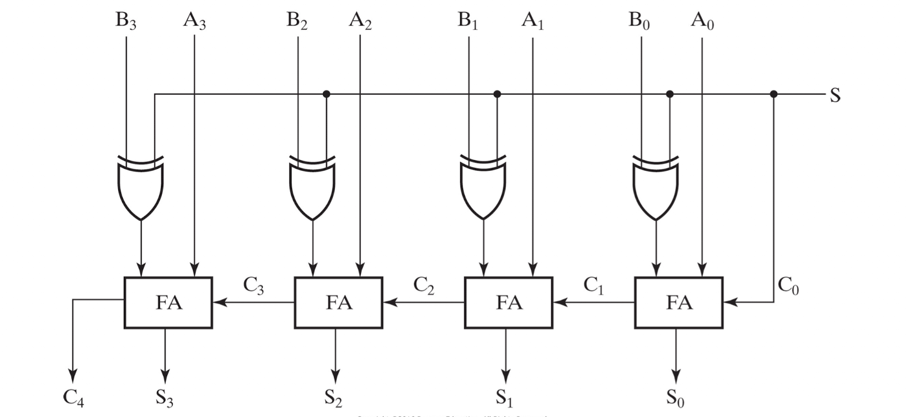
*4-Bits Adder-Subtractor Circuit*

위 회로는 RCA를 변형한 Adder-Subtractor Circuit이며  
**unsigned** 형태의 입력 *A - B*을 **2의 보수** 형태로 나타낼 수 있다.
 

- **S가 0인경우**

각 *B*비트 *B0 ~ B3*는 *S*와 XOR게이트로 연결되어있다.    
S가 0이므로 B는 모두 그대로 출력될 것이며, 첫단계의 FA에 올림수도 0일 것이다.

즉, 정상적인 가산기의 역할 *A + B* 을 한다.

- **S가 1인 경우**

XOR게이트에 *S* 와 연산되는 *B* 비트들은 S가 1이므로 원 값의 보수가 출력되어 FA의 입력값으로 들어간다.  
즉 *A + ~B* 의 역할을 한다.

이때 첫 단계의 FA에 올림수로 *S*가 더해지므로, *A + ~B + 1* 의 연산을 하는 것이다.  
*~B + 1* 는 *B* 의 2의 보수 형태로, 결국은 *A - B* 의 연산을 하는 subtractor 로 사용할 수 있다.

 
다만 마지막 비트의 캐리는 무시한다.

### Overflow

주어진 비트내에서 Demical 수를 2의 보수 형태로 나타내다보면 표현할 수 있는 범위를 넘어서는 경우가 있다.

이때 overflow (또는 underflow)가 발생하며,  그 경우 의도하지 않은 값을 얻게될 것이다.

그러므로 adder-subtractor에서 오버플로우가 발생하였는지 알아야 할 필요가 있으므로 추가적인 회로가 필요하다.

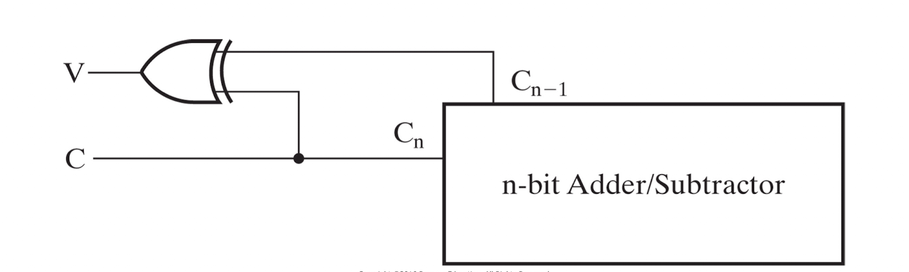  

마지막과 마지막 바로 전 비트의 FA의 carry를 빼와서 XOR연산하게 되면   
오버플로우가 발생했는지 알 수 있는 플래그로 사용할 수 있다.

출력값이 2의 보수 형태로 나타나기에 마지막 비트(MSB)는 signed 비트이다.   
그러므로 마지막 비트와, 그 전 비트 **둘 중 하나에서만 carry가 발생한다면** 오버플로우가 발생한 것이다.

Incrementer
---
---
지금 까지는 입력 *A* 와 *B* 를 더하거나 빼는 두개의 입력에 대한 연산을 수행하는 회로였다.

Incrementer는 단일 입력 *A*에 1을 더하주는 회로이다.

물론 이 회로도 Adder를 통해 구현 가능하다.  
그냥 입력 *B0* 의 자리에 1, 그리고 나머지 *B* 비트의 자리는 그라운드에 연결하면 되기 때문이다.

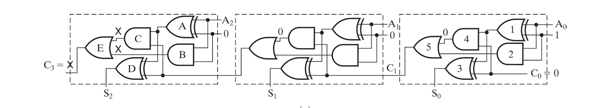  

하지만 단지 1을 더하기 위해 RCA를 사용하기에는 불필요한 게이트들이 많다.  

이를 optimize하여 최소한의 필요한 회로를 남겨 설계한다면 Incrementer는 아래와 같다.

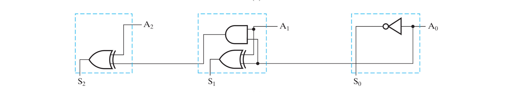  

Multiplier
---
---
곱셈의 연산을 하는 Multiplier도 마찬가지로 RCA를 서브모듈로 가지도록 계층구조로 설계된다.

Multiplier의 구조를 이해하기 위해 다음 비트끼리의 곱셈 연산을 살펴보자

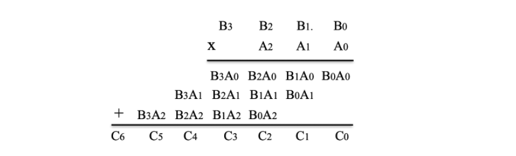  

일반 대수 곱셈하듯이 각 비트를 자리수에 맞게 곱하여(AND) 모두 더하면 된다.

위 연산 도출과정의 첫째 줄을 보면 *A0* 와 *B* 의 각 비트를 각 자리수에 맞게 AND연산하고 있다.  
이는 *A0* 가 enable 회로의 입력으로서 이용되는 것과 같은 상황이다.

LSB 자리의 연산된 결과인 *A0B0* 은 더 이상 더할 비트가 없으므로, 그 자리에 바로 출력한다.

그 후, *A1* 과 AND연산 된 *B* 비트들을 첫째 줄의 연산결과와 더해준다.

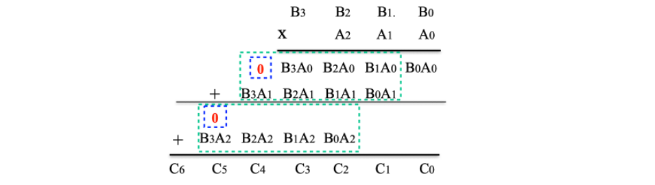  

다만, 비트 자리가 다르므로 첫째 줄의 MSB앞에 0을 추가하여 FA로 더해주어야 한다.

이 과정을 반복하는 과정을 회로로 설계하면 Multiplier가 되는것이다.  
스키메틱으로 표현하면 아래와 같다.

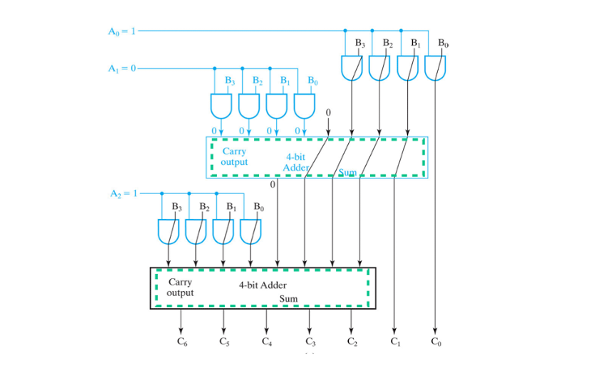  

*A* 비트들은 Enable 회로의 입력으로 생각하고, 각 자리에 맞게 곱해진 연산결과들을 비트 자리에 맞게 FA로 더해주는 식이다.

### Shift 연산

두 입력을 곱하는것이 아닌 단항 입력에 2의 배수를 곱하거나, 나누는 경우에는  
multiplier를 곱하는 것 보다는 Shift를 하는것이 더 비용이 적게 든다.

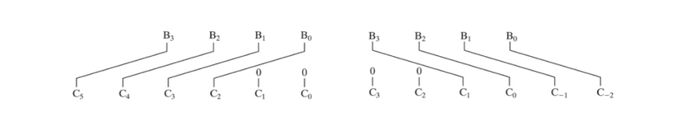  

입력 *B (4bit)* 에 2의 n승을 곱한다면  

n 자리 만큼 우측 또는 좌측으로 비트 자리수를 옮긴다.  
빈 자리는 0으로 채우면 된다. (Logical) 

--- 
 

