*본 포스팅은 Logic and Computer Design Fundementals (Pearson, 2013)의 내용을 다루고 있습니다.*

 
지난 포스팅에서는 상태를 저장하는 Latch와 Flip-Flop을 이해하고 순차회로를 이해하였다. 순차회로를 베이스로 하는 State Machine인 Mealy 머신과 Moore 머신도 알게되었다. 이번 시간에는 상태머신의 그래프 표현과 유한상태머신 FSM에 관하여 알아보도록 하자.

## State Transtion Diagram
---

이전까지는 완성된 순차회로의 스키메틱을 보고 상태표로 회로를 나타내었다. 이러한 State machine은 상태 테이블 대신 그래프 다이어그램으로 더 이해하기 쉽게 표현해볼 수 있다.

### Mealy Machine

저번 포스팅에서 다루었던 Mealy 머신의 예제 회로인 Example 1의 state table 을 다시 꺼내보자.
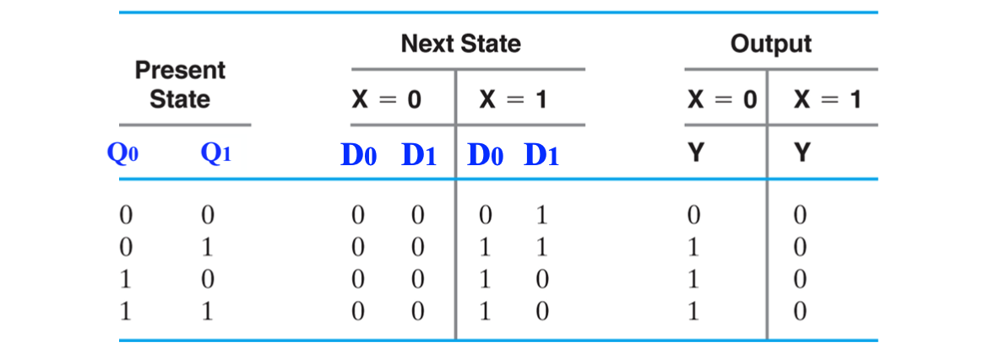  

`입력 X`와 `현재상태 Q`에 따라 `다음상태 D`가 정해지고 그에 따른 `출력 Y`가 존재한다.

네 가지의 요소 `X` `Q` `D` `Y` 는 아래 그림과 같이 간단하게 표현할 수 있다.

  

여러 상태들을 그래프의 한 노드로 표현하고, 상태 천이를 Q에서 D로 향하도록 directed edge로 나타낸다.  
그리고 그 edge 위에 입력과 출력 X,Y를 써넣는다.

이러한 단순한 메커니즘은 이 밀리머신의 상태표를 모두 상태 그래프로 나타낼 수 있다.

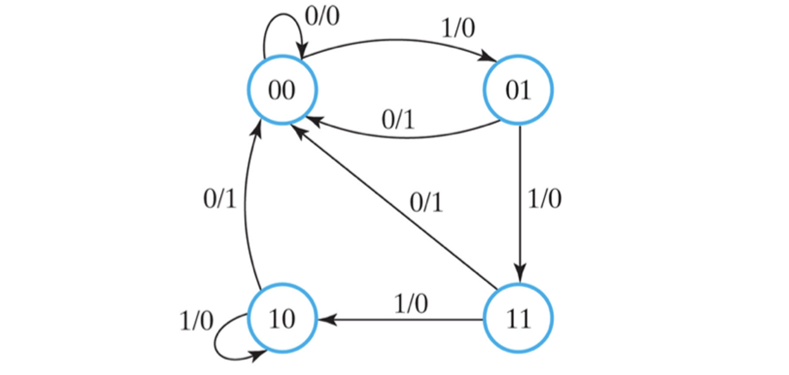
*State Transition Graph Diagram for Mealy Machine*

### Moore Machine

이번에는 Moore 머신이였던 Example 2의 state table을 살펴보자.
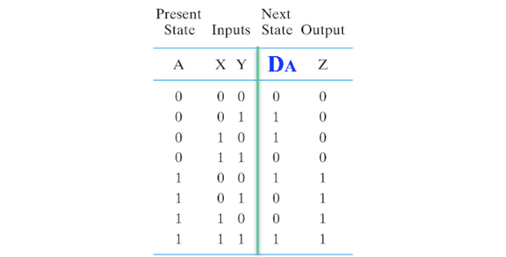  
`입력 XY`와 `현재상태 A`에 따라 `다음상태 D`가 정해지고 `출력 Z`는 곧 현재 상태이다.
 
밀리 머신과 마찬가지로 네 가지 요소 `XY` `A` `D` `Z` 는 아래와 같이 간단하게 나타낼 수 있다.

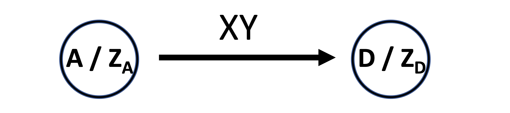  

현재 상태와 출력은 항상 같다. 입력값에 의하여 상태천이를 일으킨다.

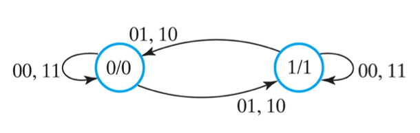
*State Transition Graph Diagram for Moore Machine*

### Symbolize State

밀리 머신과 무어 머신 모두 상태를 바이너리에서  알파 뉴메릭으로 심볼화하여 나타내면 아래와 같다.
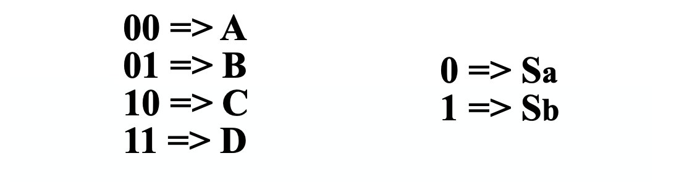
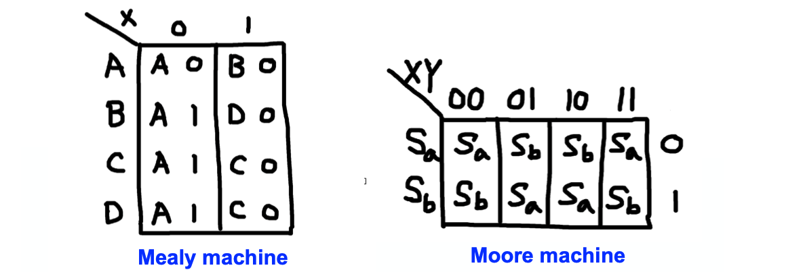  
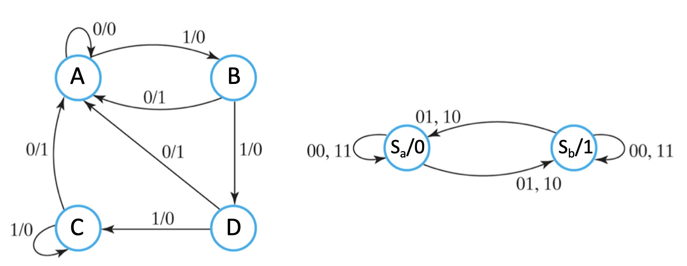  

---

지금까지 state machine 설계를 위한 방법을 역으로 훑어보았다. 완성된 스키메틱 회로에서 상태 테이블로, 상태 테이블에서 그래프로 나타내어 state 머신을 분석하였다. 

State 머신의 설계를 위해서는 Specification에서 State Table 또는 State Graph을 작성한다. 그리고 심볼화된 상태를 바이너리 값으로 상태 할당을 해준다. 그 후 logic optimaization을 거쳐 완성된 회로의 스키메틱을 그려 설계해 볼 수 있겠다.

이제 **FSM**, **Finite State Machine**을 알아보자.

## Finite State Machine
---
Finite State Machine 유한상태기계는 말그대로 유한한 상태를 가지고 입력에 따라 천이를 일으키는 회로이다. 

하지만 이 말로만 이해하기는 쉽지 않으므로 이를 이해하기 위해 재미있는 동작을 하는 FSM을 살펴보자.

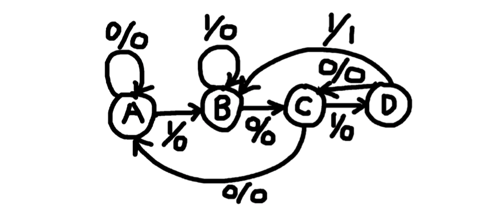
*Mealy Machine for "1011" detector*

위 밀리 FSM은 연속된 입력들 중에서 "1 0 1 1"의 입력값을 찾으면 1을 출력하는 회로이다.

이해가 안간다고? 그럼 한번 입력 값을 "10110010110011"로 설정하고 상태변화와 그에 따른 출력을 살펴보자.

|입력|1|0|1|1|0|0|1|0|1|1|0|0|1|1|
|---|---|---|---|---|---|---|---|---|---|---|---|---|---|---|
|상태|B|C|D|B|C|A|B|C|D|B|C|A|B|B|
|출력|0|0|0|1|0|0|0|0|0|1|0|0|0|0|

입력에 따른 상태 천이를 따라가며 출력값을 기록하면 1011을 찾는 순간 1을 출력함을 알 수 있다.

물론 이는 밀리머신이 아니라 무어 머신으로도 설계 가능하다.

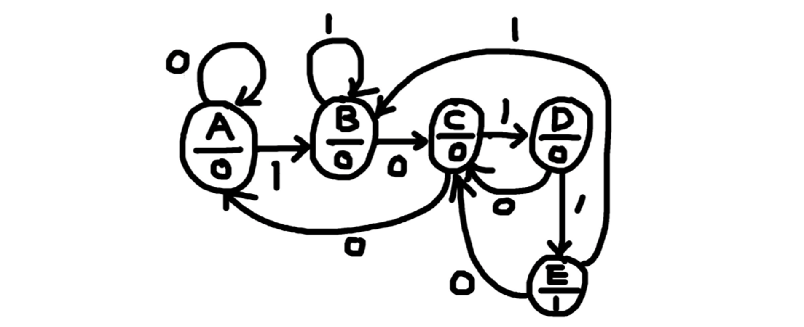
*Moore Machine for "1011" detector*

직접 FSM의 그래프대로 입력에 대한 출력값을 기록해보면 Mealy 머신과 똑같은 일을 하는 것을 알 수 있다.

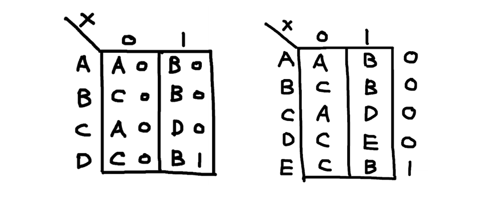  
밀리 FSM과 무어 FSM의 State Table을 위와 같이 나타낼 수 있다.

## State Assignment
---

FSM을 설계할 때에는 Specification 대로 표나 그래프를 그린 뒤 상태 할당을 한다고 하였다. 상태할당이란 추상화된 상태 심볼을 Flip-Flop이 어떠한 바이너리 출력값을 가지는지 할당을 해주는 것이다. 이는 2가지 방법이 존재한다.

### Minimum Length Encoding

  
Minimum length encoding은 말그대로 상태를 최소한의 길이로, 최소한의 flip-flop을 이용하여 할당해주는 방법이다.

`A B C D` 와 같이 4개의 상태를 가진 FSM이라면  
2개의 flip-flop으로 `00 01 10 11` 의 바이너리 값으로 할당해 줄 수 있는 것이다. 

### One-Hot Encoding
  

One-Hot encoding은 각 상태의 인덱스에 맞는 단 하나의 비트만 1을 가지도록 바이너리 값을 할당해주는 방법이다.
앞선 방법과 달리 4개의 상태에 4비트가 필요하므로 4개의 flip-flop이 요구된다.

당연히 같은 속도라면 flip-flop을 덜 사용하는 **Minimum Length Encoding**이 비용적으로 좋겠지만, 오히려 동작 속도면에서는 **One-Hot Encoding** 이 더 빠르다고 한다.

---

 
이번 포스팅에서는 상태 머신을 그래프로 나타내는 법과 FSM, 그리고 상태할당의 방법에 관하여 알아보았다.  
다음 포스팅에서는 레지스터와 레지스터 transfer 에 관하여 알아보도록 하겠다.

**[[Logic Design - 9]](../2021-06/logicdesign9)에 계속↗**