*본 포스팅은 Logic and Computer Design Fundementals (Pearson, 2013)의 내용을 다루고 있습니다.*

지난 포스팅까지는 계속 Combination 조합회로에 관하여 알아보았다. 이번에는 조합회로와 다른 구조와 특성을 가지는 Squential 순차회로에 관하여 알아보겠다.

# Sequential Circiut
---

순차 회로는 Combination circut 조합회로와는 다른 특성을 가지고 있다. 

조합회로는 같은 데이터의 입력이라면 항상 같은 값을 출력한다. 하지만 순차 회로는 조합회로의 모듈 외 추가로 State 상태를 저장하는 저장소가 존재한다. 그러한 저장소는 조합회로 부의 출력을 입력으로 받으며, 출력으로 다시 회로의 입력으로 들어가는 형태이다.

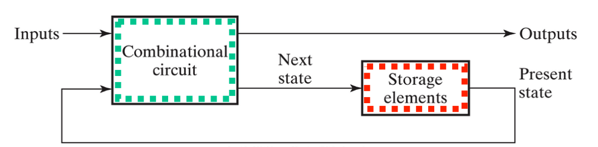  

즉,  이전의 연산 과정으로 인한 상태가 다음 회로 사이클의 결과값에 영향을 미친다는 것이다.

storage element에는 2가지 종류가 존재하는데, Latch와 Flip-Flop이다.  
먼저 Latch를 살펴보자

##  SR Latch 
--- 
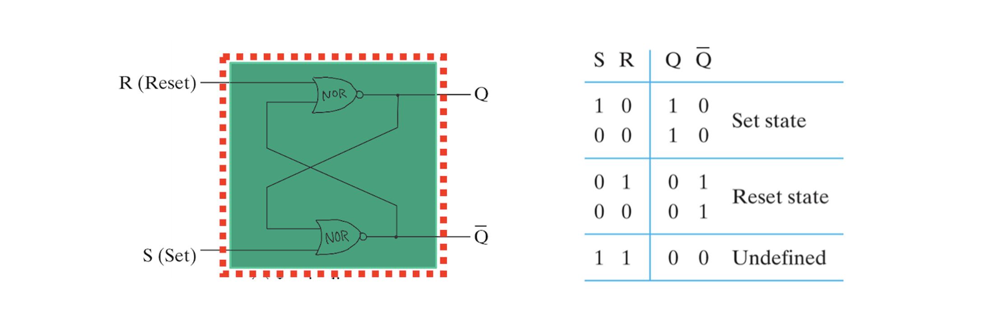
*SR Latch with NOR gates*

NOR 게이트로 만들어진 SR Latch이다. Latch면 latch이지 SR은 무엇일까. SR은 set 과 reset을 뜻한다.

위 그림 우측의 funtion table을 살펴보면, 
- **SR**이 `1 0` 일때 출력 **Q**가 `1` 이고
- **SR**이 `0 1` 일때 출력 **Q**가 `0` 이 된다.
- **SR**이 `0 0` 일때 출력 **Q**는 `이전 값과 같다`.
- **SR**이 `1 1` 일때 출력 **Q**는 `정의되지 않는다`.

즉 SET이면 1을, RESET이면 0을 준다. 그외는 값을 유지하거나 정의되지 않는 회로이다.

위 그림에서는 회로를 그렸지만, 이후에는 직접적인 회로의 구성보다는 blackbox화 하여 회로를 모듈처럼 어떠한 기능을 하는지가 더 중요하기 때문에 밑으로는 회로를 표시 하지 않겠다.

### ^S^R Latch with NAND Gates

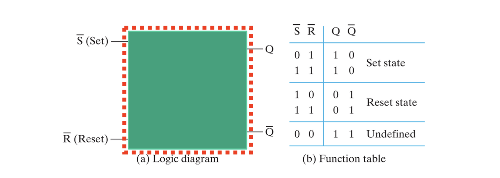

SR latch 이지만 출력을 complement로 줄 수 있다. 당연히 SR Latch 와 SR의 입력의 따라 반대의 출력을 가진다.

이와 같이 반대의 입력을 가지는 회로를 Active low 하다고한다.

### SR Latch with Control Input
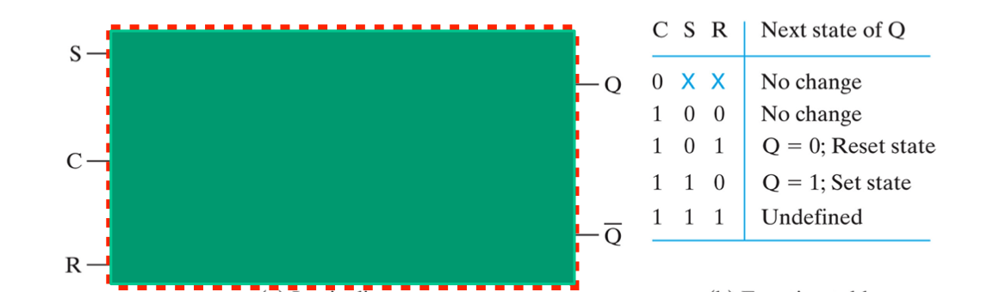  

 NAND 게이트로 만들어진 SR Latch이지만 입력값 C를 추가로 가지고 있다.

 C는 Clock input 이며, 이는 enable 의 역할을 하게된다. C가 0 일 때에는 SR의 값에 상관없이 상태 변화가 일어나지 않지만, C가 1이 되면 SR이 동기화되어 기존 SR Latch와 같이 사용 가능하다.

 이러한 회로는 Clocked SR Latch 라고도 한다.

### D Latch

 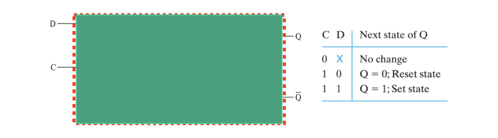  

위 회로는 *Clocked D Latch*이다. 이제 Clocked 와 SR의 뜻은 알겠는데 또 D는 무엇인가?  
SR은 대체하고 나타난 새로운 입력 D는 Set 과 Reset의 입력을 한 비트로 입력할 수 있다.

D가 1이면 다음 상태 Q가 1이다. 반대로 0이면 Q가 0이다.  
즉 Q는 C가 1일때 **D와 동기화** 된다. 상태 값을 보존하려면 C를 0으로 주면된다.

Latch에는 Clock이 꼭 필요한 것은 아니며, D latch에서는 굳이 active low하게 쓰지 않는다.

다음은 또 다른 형태의 storage element인 Flip Flop에 대해 알아보자.

## Flip - Flop
---
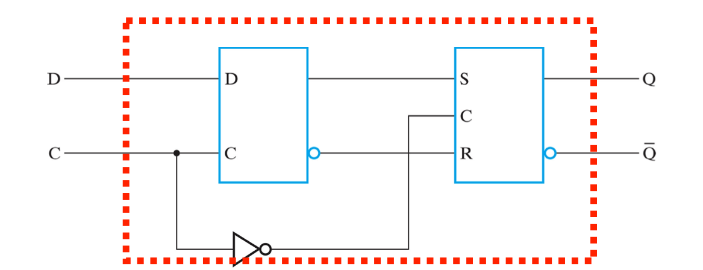
*Negative-Edge-Triggered D Flip-Flop*

Flip-Flop은 Latch에 비해 구조가 훨씬 복잡해 보인다. 입력으로 D와 C가 주어지며 Clocked D latch로 들어가 그 출력이 다시 Cloked SR Latch로 들어가는 구조를 가진다.

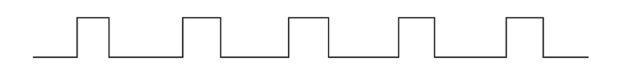
*Timing diagram of clock pules* 
Clock 입력은 주기성을 가지는 입력이다. 위와 같이 주기적으로 신호를 주며 사이클마다 0과 1이 빈복된다.  
Flip-Flop을 이해하기 위해 clock pulse에 따른 내부 값들의 시간에 따른 변화를 살펴 볼 필요가 있다.

  

*Negative-Edge-Triggered D Flip-Flop* 의 내부 값들을 위와 같이 표기하여 clock pulse에 따른 변화 비교 그래프를 그려보자. 물리적 거리에 따른 latency가 존재하지만 아래 그림에서는 무시하였다.  
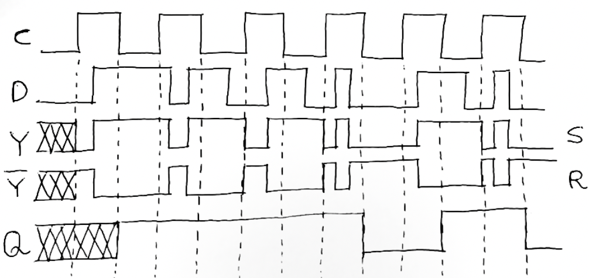
*state graph for clock pulse*

C는 위에서 말했다싶이 enable의 역할을 한다.  

그러므로 C가 1일때만 입력 D와 출력 Y가 동기화 되고 0일때는 상태를 유지함을 볼 수 있다. 반대로 인버터를 Clock이 들어가는 SR Latch 부에서는 C가 0일 때 입력 S와 R (Y와 ^Y)이 출력 Q와 동기화 됨을 알 수 있다.

이를 통해 알 수 있는 사실은 Clock이 1일때 D값이 Y로 전해지고 다시 0으로 내려갈 때 뒤에 연결된 latch로 Y가 입력되어 최종 출력인 Q에 반영된다. 즉, **1 에서 0으로 falling 하락할 때 출력 Q값은 변화한다.** 

이러한 회로를 *Negative Edge Triggerd* 또는 *Falling Edge* 또는 *Falling Sensitive*라고 한다.

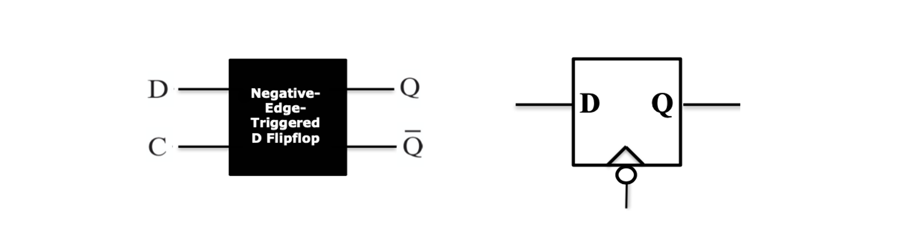  
Latch와 마찬가지로 blackbox화 하여 모듈처럼 나타낼 수 있으며  
Falling Edge D Flip-Flop의 경우 위와 같이 표기한다.

### SR vs JK 와 D vs T

storage elements의 이름 앞에 붙은 수식어 SR JK D T의 특성과 차이점에 대해 알아보자.

먼저 **SR**과 **JK**이다.  

SR은 위에서 말하였듯이 Set과 Reset의 입력으로 10 일때 1, 01일때 0, 00일때 상태보존하고 11일때 undefined 된다. JK는 SR과 거의 유사하지만 두 입력이 모두 활성화 되어있는 경우를 정의하지 않는 SR과 다르게 11일때에는 현 상태의 complement를 출력한다.

**D**와 **T**는 SR, JK와 달리 한 비트로만 입력을 받는다.   

D는 출력과 그래도 동기화 된다. D가 0이면 Q도 0, 1이면 Q도 1이다. 하지만 T의 경우 T의 값에 따라 정해지기 보다는 현 상태를 기준으로 유지할지, complement를 출력할 지 정한다고 생각하면 된다. D가 0이라면 상태를 유지하나 1이라면 ^Q를 내보낸다는 것이다.

### D Flip-Flop with Direct Set and Reset
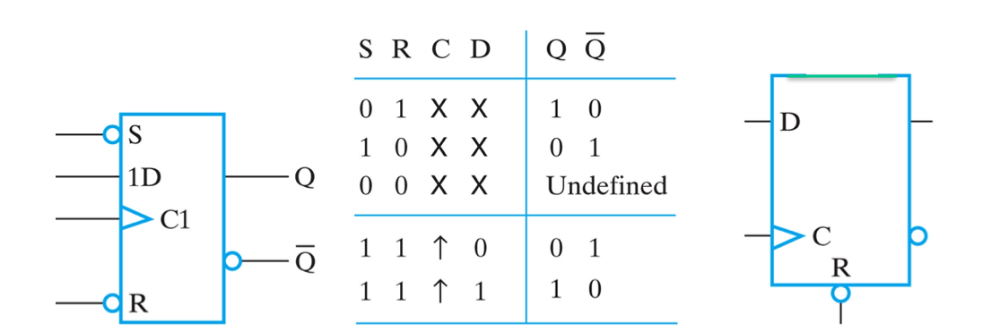  

위는 D Flip-Flop에 Set과 Reset의 입력으로 초기화 할 수 있는 기능을 구현한 회로이다.

이전에 그린 *state graph for clock pulse* 를 다시 보자.  

Falling Sensitive 한 회로였으므로 clock의 한 사이클이 지나고 falling하는 edge에서만 Q값의 변화가 일어난다. clock이 1로 올라갔을 때 D값이 Y에 동기화되고, 내려가면서 Y가 Q를 변화시킨다. 하지만 초기 상태의 출력은 입력 D가 주어지더라도 clock pulse의 한 사이클이 돌기 전까지는 결정되지 않는다.

그래서 첫 상태의 초기값을 설정하기 위해 D Flip-Flop with Asynchronose Set and Reset를 사용할 수 있다.  

위 회로는 SR이 active low 하게 들어온다. S와 R이 01, 10 일 때 C와 D의 입력에 관계없이 Q값을 1, 0으로 초기화 해준다.  SR이 11 이 된다면 C와 D가 동기화 되어 일반 D flip flop처럼 작동한다. 이러한 회로는 SR이 flip flop에 비동기화 되어 직접적으로 출력값에 관여하므로 SR이 *Asynchronose* 하다고 할 수 있다.

지금까지 순차 회로에 필요한 storage element인 다양한 Lacth와 Flip-Flop을 알아보았다.  
그럼 본격적으로 순차회로 Sequential Circuit에 대해 알아보자.

## Squential Circuit
---

### Example 1 of Squential Circuit
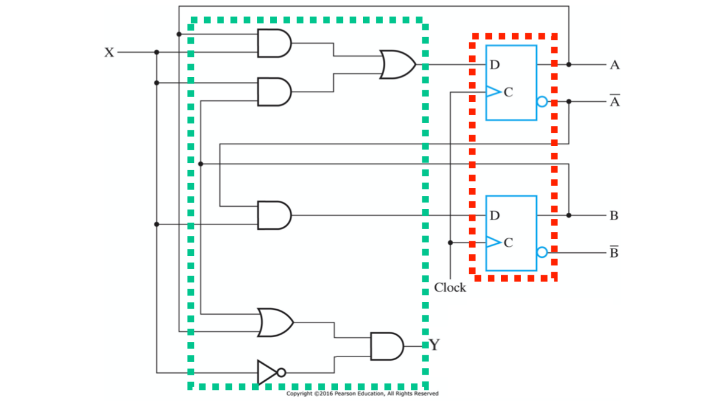  
처음에 말하였듯이 순차회로는 Storage elements가 저장하는 상태가 다음 입력으로 같이 들어가면서 다음 출력 값에 영향을 끼친다. 위 그림에서 볼 수 있듯이, 순차회로의 조합회로 부는 상태저장소 부의 입력으로 들어가고, 상태저장소의 출력은 다시 조합회로 부분의 입력으로 들어가는 구조를 확인할 수 있다.

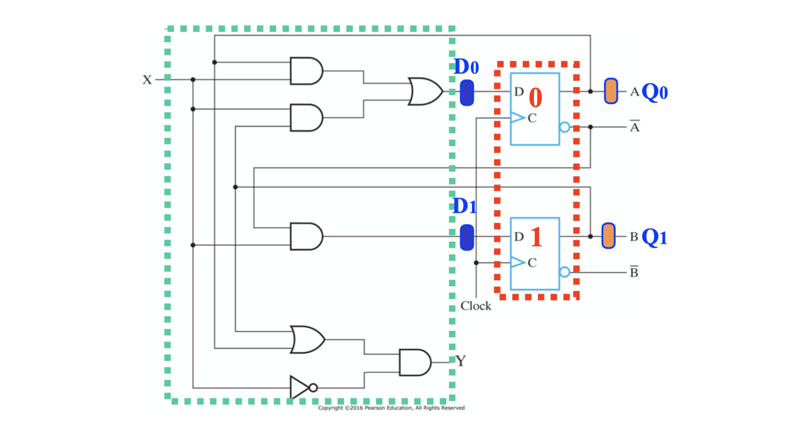  
위와 같이 외부 입력을 **X**, 조합회로 부의 출력을 **D0 D1**, 상태 저장 회로의 출력을 **Q0 Q1** 그리고 최종 출력을 **Y** 라고 해보자.

조합회로의 출력 D는 외부 입력 X와 상태저장소의 출력값이자 이전의 상태인 Q을 입력을 받고 있으므로 부울식으로 나타내 볼 수 있겠다.
  

이를 상태표 State Table로 나타내면 아래와 같다.
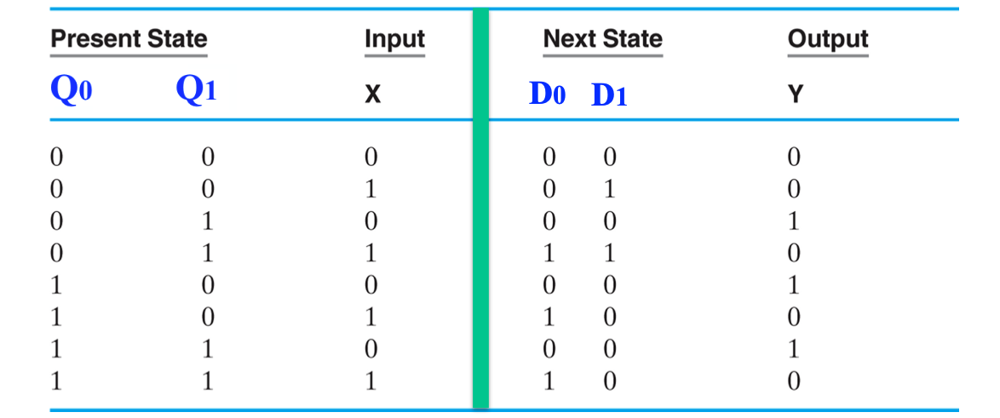
*State Table for Squential Circuit* 

X의 입력에 따라 2차원으로 상태표를 더 간단하게 나타내 볼 수도 있겠다.
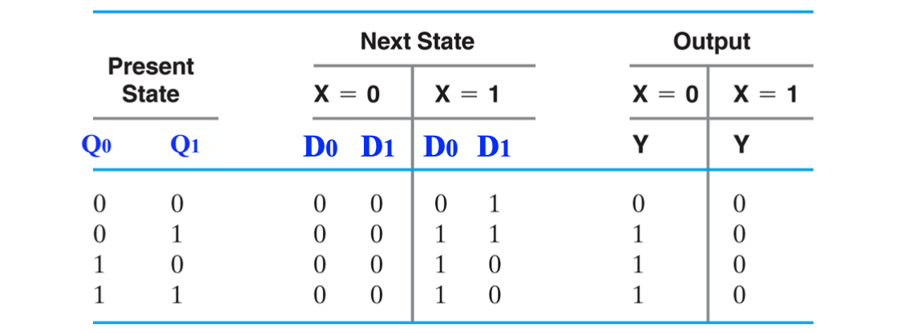
*Two-Dimentional State Table for Squential Circuit*

위 상태표에서는 State Q0 Q1을 binary 로 나타내었지만 상태를 심볼(alpha numeric)로 나타낼 수 있다.  
예를 들면 00은 A, 01은 B, 10 은 C.... 와 같은 식으로 말이다.

### Example 2 of Squential Circuit

다음은 다른 형태의 순차회로를 살펴보자.
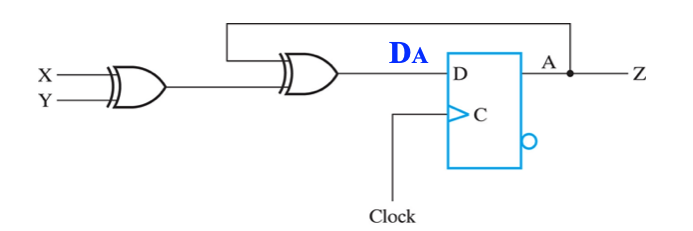  

이전의 회로와 비슷해보이지만, 큰 차이점이 있다. Example 1에서는 외부 입력 X와 현재 상태인 Q로 다음 상태인 Y가 바로 정해졌었다. 하지만 Example 2는 출력은 입력이 출력에 직접적인 영향을 주지 못하고 현재 상태값에 의해 다음 상태가 결정된다.

위 회로를 상태표로 나타내면 아래와 같다.
  
입력 X와 Y가 최종 출력인 Z에 직접적인 영향을 주지 못하고 flip flop을 한번 거친 후 (decode) 전달되는 것을 확인할 수 있다.

## State Transition Machine
---
이렇게 입력에 따라 상태를 천이 시켜주는 순차회로를 State Machine이라고 부르며,  
이는 Mealy Machine과 Moore Machine으로 구분한다.

#### Mealy Machine
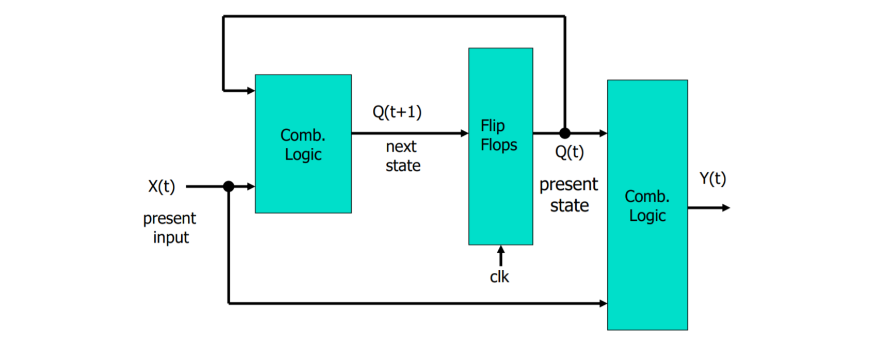  
밀리머신은 입력값과 현재 상태에 의해 출력값이 곧바로 정해진다. Example1 회로가 그 예시이다.

#### Moore Machine
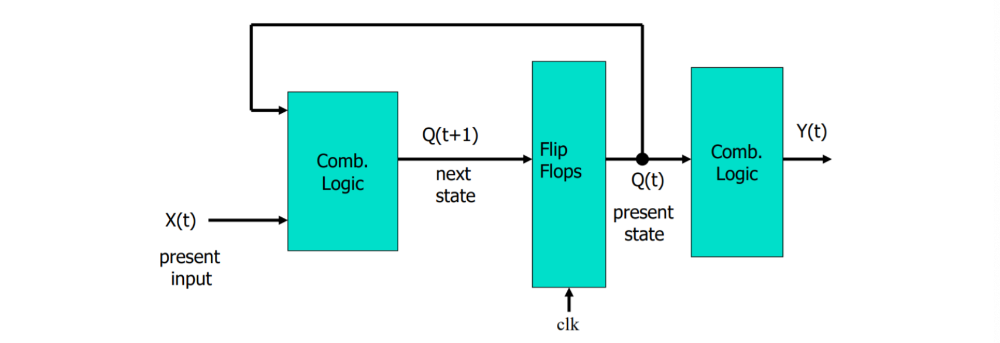  
무어 머신은 입력값이 출력에 바로 영향을 주지 못하고 flip-flop을 한번 거쳐 반영된다. Example2 회로가 그 예시이다.

---

이번 포스팅에서는 Storage element Latch와 Flip-Flop 그리고 순차회로 State Transition Machine에 관하여 알아보았다.
다음 포스팅에서는 FSM에 관하여 알아보도록 하자.

**[[Logic Design - 8]](../2021-04/logicdesign8)에 계속↗**