*본 포스팅은 Logic and Computer Design Fundementals (Pearson, 2013)의 내용을 다루고 있습니다.*

 

지난 포스팅까지 레지스터와 레지스터 전달에 대하여 알아보았다. 이번시간에는 심볼과 연산자 표기, 그리고 여러가지 연산을 수행하는 레지스터 회로를 살펴보자.

 

## Symbols for Register Transfers
---
### Basic Symbol
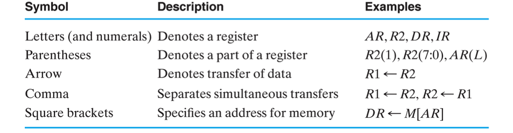
*Basic Symbols for Register Transfers*

레지스터 전달을 심볼로서 표기할 때는 여러가지 기호들이 사용된다. 보통 알파벳 레터와 숫자로 레지스터를 표기하고, 그 둘을 잇는 화살표로 전달자와 피전달자를 구분한다.

만약 comma로 쓰여있다면 동시에 수행, 즉 같은 clock cycle에 같이 연산되는 전달이다. []의 경우 메모리를 참조한다는 뜻이다.

### Arithmetic
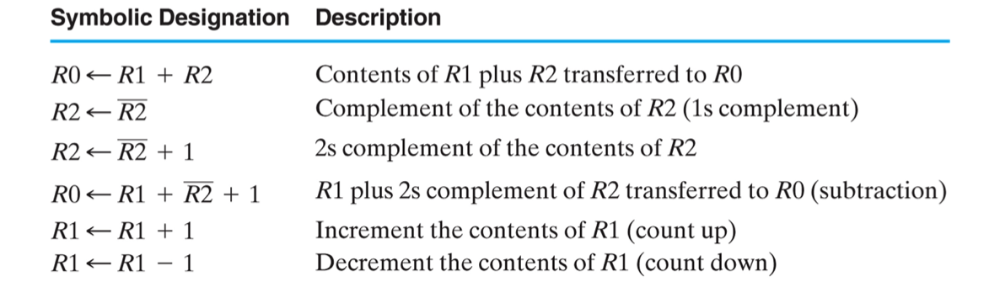  
위와 같은 arithmetic 연산들도 수행할 수 있겠다.

`R0 ← R1 + R2`와 같이 두개의 레지스터를 더하여 다른 레지스터에 전달하는 경우 adder와 같은 조합회로를 거쳐서 전달된다.

### Logic 

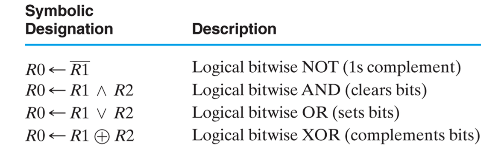  
논리 연산도 가능하다.

### Shift

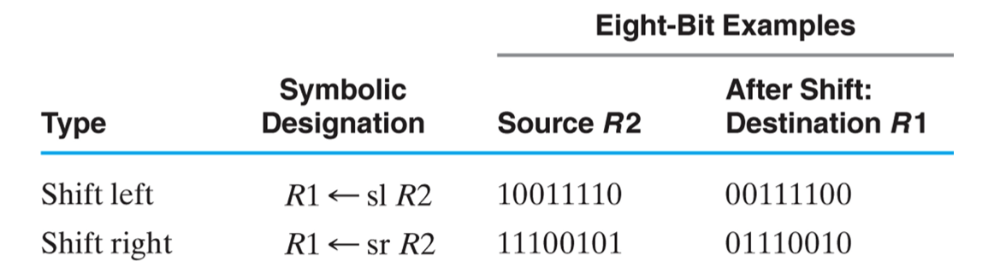  
당연히 Shift 연산도 가능하다.

## Various Register Transfer Circuits
---
이제 레지스터 전달로 연산을 수행하는 여러가지 회로와 구현방법에 관해 살펴보자.

### Add & Subtract Microoperation

레지스터 전달 회로로 가감산기를 구현할 수 있다.

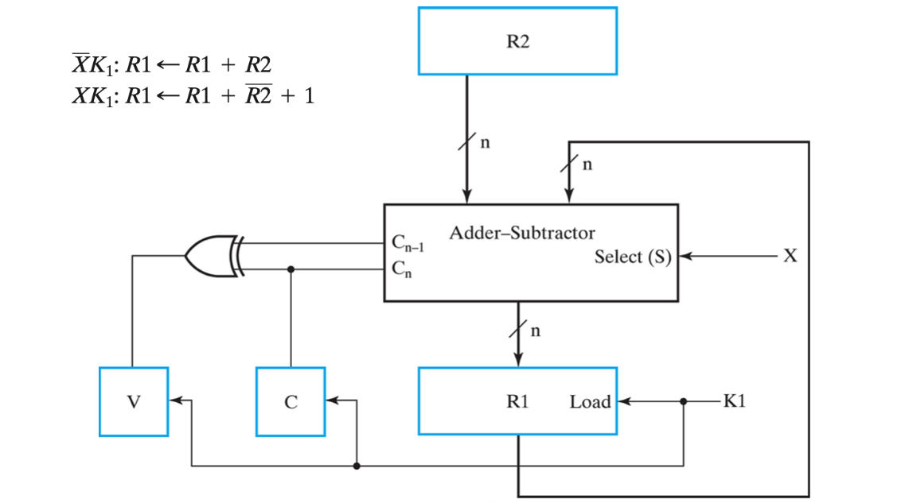  

구조를 보면 Selector 입력 X에 의해 R1에 R2를 더하거나, 빼는 micro 연산을 수행한다.

K1 로드 입력에 의해 컨트롤 되며, carry를 통해 오버플로우를 체크하는 V와 C를 저장하는 레지스터가 존재한다.

### Register Selecting

두 개의 레지스터 `R1`과 `R2` 중 한 개를 골라 또 다른 레지스터 `R0`에 전달하는 회로를 만든다고 하자.  
아래와 같이 구현할 수 있다.
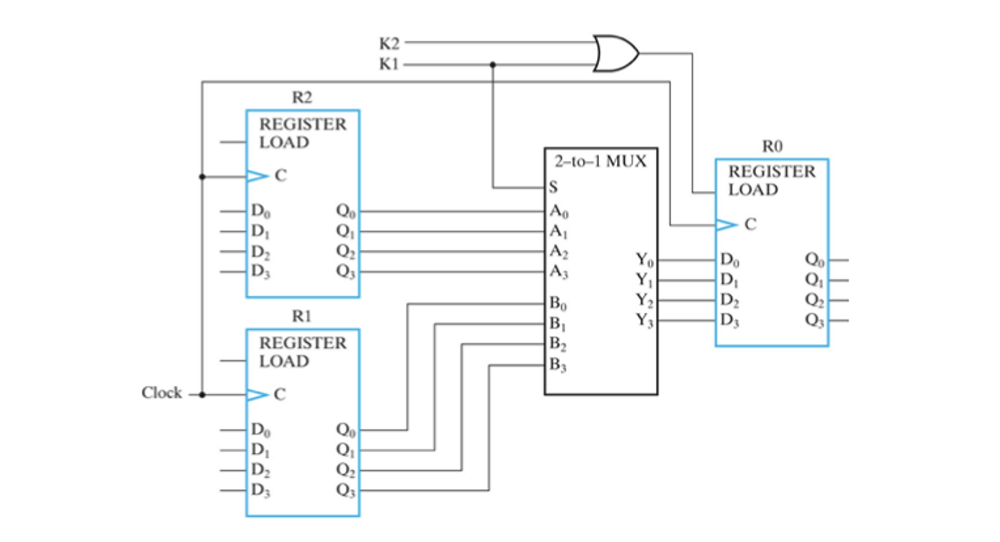  

2가지 Load 입력 K1 과 K2를 이용하여,
- **K1 = 1** 일때 `R0 ← R1`
- **K2 = 1** 일때 `R0 ← R2`

4비트의 데이터를 굳이 다이어그램에 다 표기할 필요는 없다.

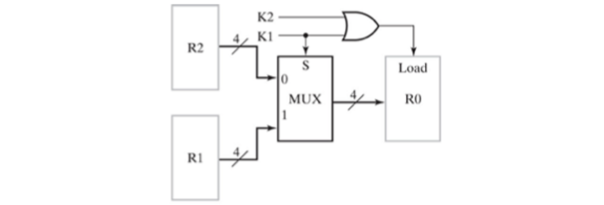  
위와 같이 vector로 묶어 나타내면 간단하고 알아보기 쉽다.

### 4-Bit Shift Register

Shift 연산을 수행하는 레지스터 회로를 만들어 볼 수도 있겠다.
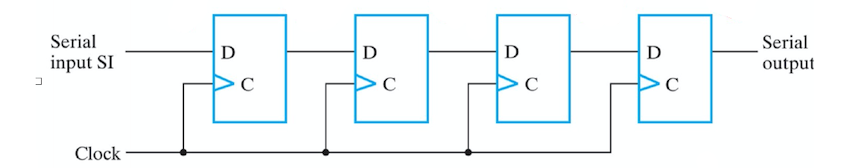  

4개의 flip flop이 직렬적으로 연결되어있다. 각각 한 비트라고 하면 1 clock cycle당 각 레지스터의 오른쪽으로 transfer 되면서 Shift연산이 일어난다. 우측으로 shift 되므로 Right Shift 이다.

  
심볼화하여 위와같이 간단하게 나타낼 수 있겠다.

### 4-Bit Shift Register with Parallel Load
  
같은 4-Bit Shift 레지스터이지만 parallel load가 가능한 회로이다.

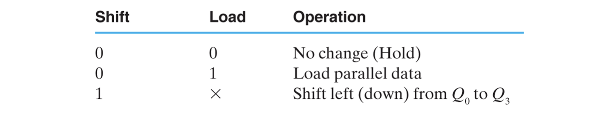  

- Shift 0  Load 0 이면 상태를 유지
- Shift 0  Load 1 이면 입력 D를 로드
- Shift 1  Load x 이면 Shift left

레지스터로 들어가는 값은 `shift * Q(i-1) + ^shift * load * D(i) + ^shift * ^load * Q(i)` 로 나타낼 수 있다.

### Bidirectional Shift Register with Parallel Load

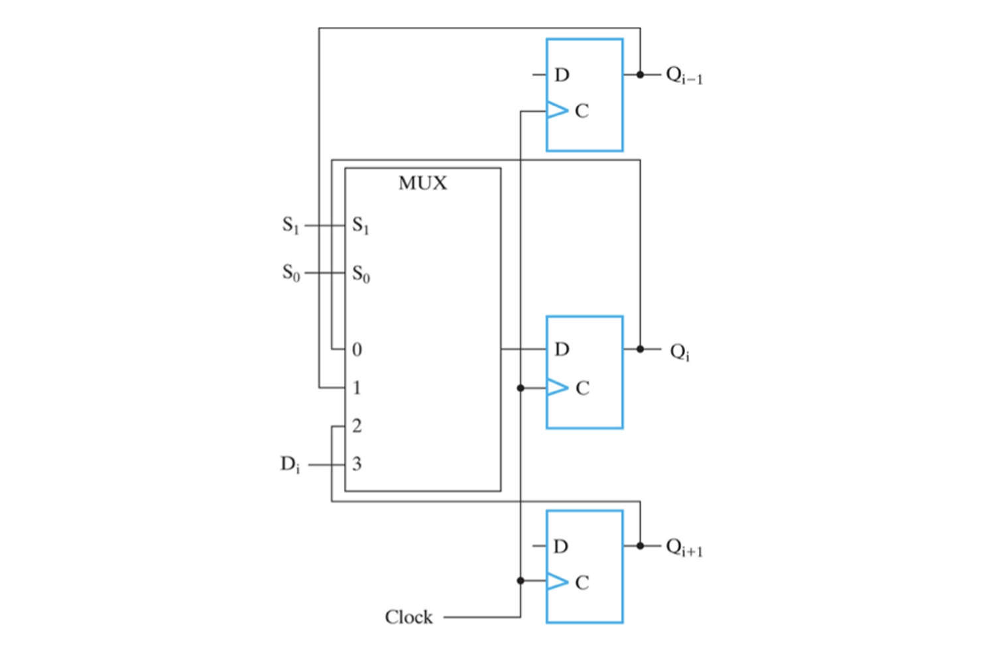  
위의 3가지 행동을 수행할 수 있는 Shift 레지스터와 달리 위 그림의 회로는 left shift와 right shift 모두 연산 가능한 bidirectional 한 레지스터이다.

  

Selector 입력에 따라 4가지 연산(LR shift, hold, load)중 한가지를 연산함으로 각 플립 플롭에 4to1 MUX 를 이용한다. 그림에서는 가운데 레지스터만의 mx를 표시하였다.
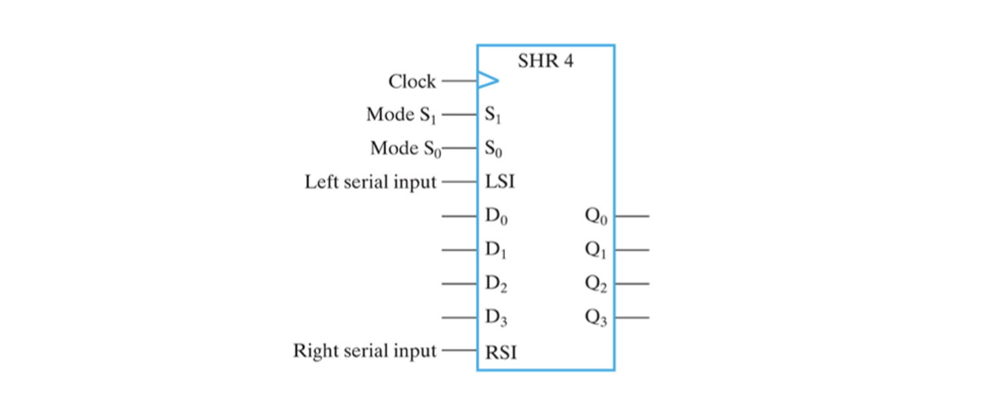  
위와 같이 심볼화하여 나타낸다.

---
 

이번 포스팅에서는 레지스터 전달을 위한 심볼들과, 여러가지 종류의 레지스터 회로에 대해 알아보았다.  
다음 포스팅에서는 입력이 없는 레지스터 회로 Counter에 대해 알아보도록 하겠다.
 

**[[Logic Design - 11]](../2021-06/logicdesign11)에 계속↗**