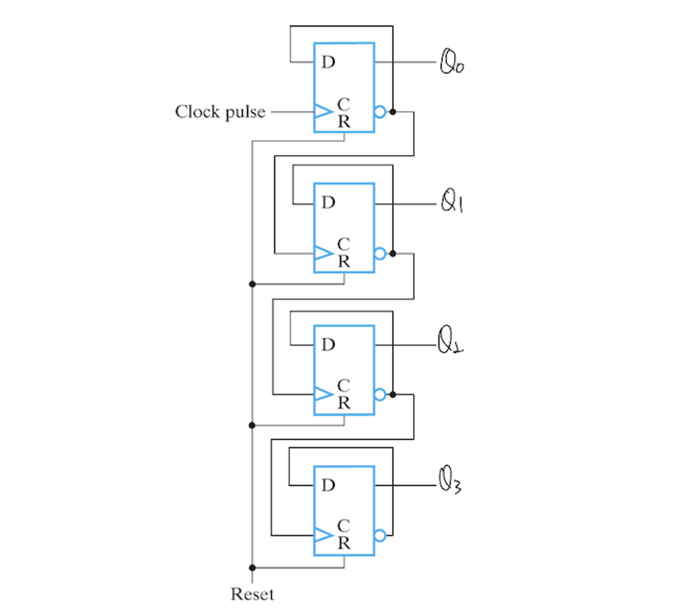
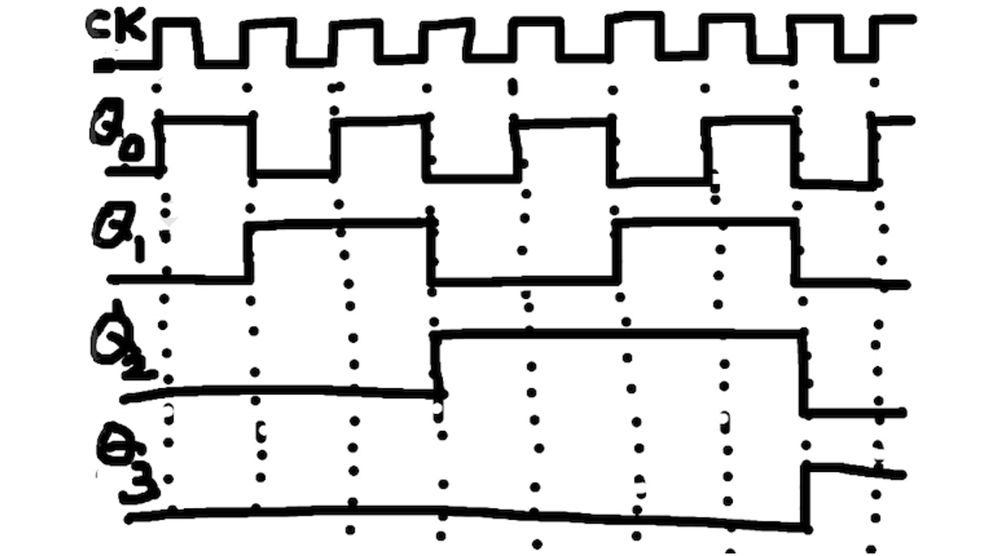
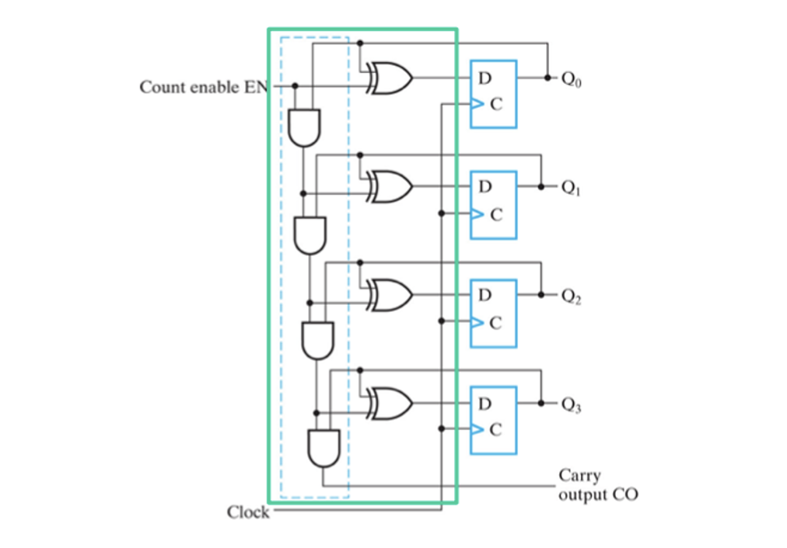
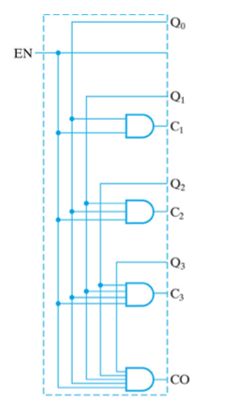
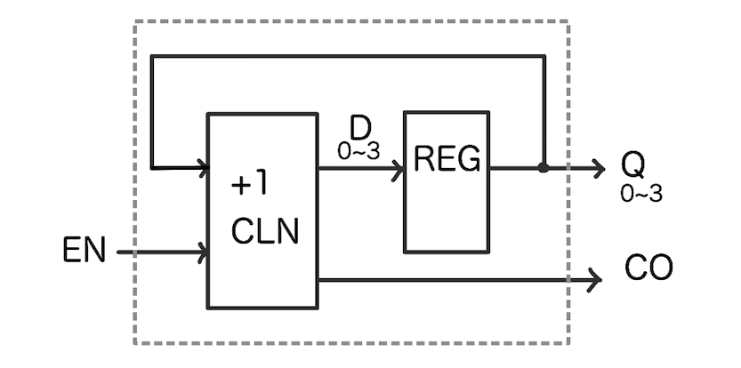
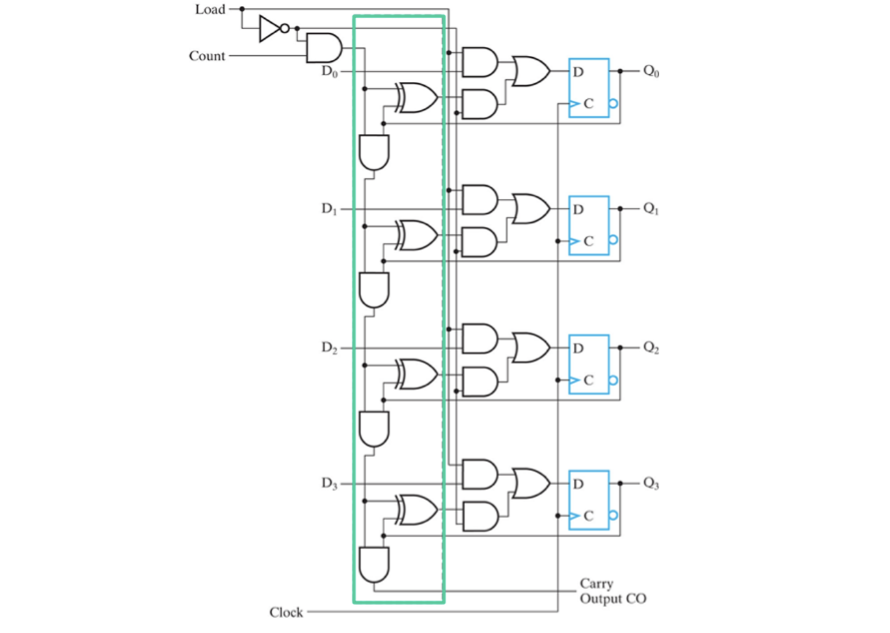
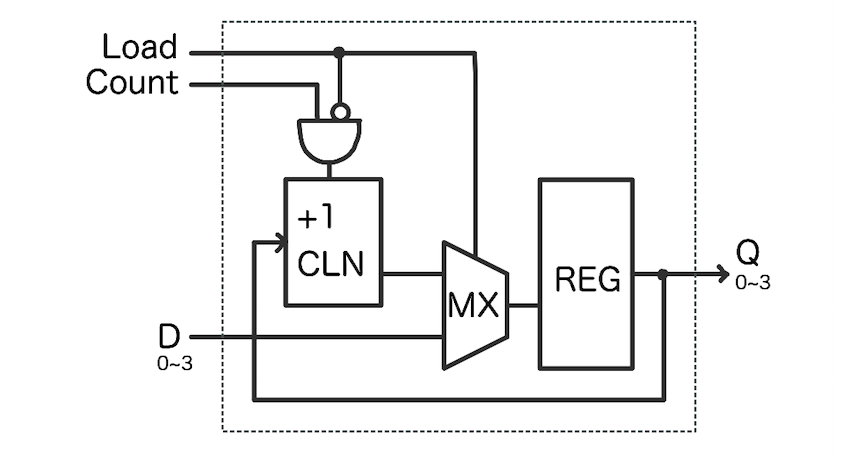

*본 포스팅은 Logic and Computer Design Fundementals (Pearson, 2013)의 내용을 다루고 있습니다.*

 

저번 포스팅에서는 레지스터 전달을 위한 심볼들과, 여러가지 종류의 레지스터 회로에 대해 알아보았다.  
이번 포스팅에서는 입력이 없는 레지스터 회로 Counter에 대해 알아보도록 하겠다.
 

## Counter
---
### Ripple Counter
Counter는 저번 포스팅에서 보았던 transfer로 연산을 하는 회로들과 같은 레지스터 회로이다. 하지만 counter는 입력이 없이 매 clock 사이클마다 1 식 증가하는 연산을 한다.

  
 
위 그림만 봐서는 왜 사이클마다 1씩 증가하는지 이해가 쉽지 않을 것이다. 

회로를 자세히 살펴보자. 먼저 가장 선두의 R0 레지스터를 보면 출력값 ^Q0가 입력 D0로 다시 들어가고 다음 레지스터 R1에 연결됨을 확인할 수 있다. 하지만 shift 연산 회로와 달리 transfer가 일어나는데 아닌 clock으로써 입력된다.

이 레지스터들은 rising sensitive 하기 때문에 clock pulse 연결 되어 있으면 rising edge 일때 (1 cylcle) 마다 data transfer가 일어난다. 그렇기 때문에 레지스터 R0는 1 clock 사이클마다 ^Q을 입력 받기 때문에 0과 1이 반복된다.

그리고 레지스터 R1은 R0의 ^Q0를 clock으로써 입력받는다. ^Q0는 1 cycle마다 변화함으로 R1에서는 2 clock cycle마다 transfer가 일어나는 것이다. 마찬가지로 R1의 ^Q1 출력은 R1의 입력과 다음 R2의 clock으로 들어간다.

즉, 각 레지스터는 각각의 clock cycle 마다 complement 상태값을 출력하며, 다음 레벨의 레지스터로 넘어갈 때마다 cycle이 2배로 증가한다.

  
이를 시간에 따른 그래프로 나타내면 위와 같다.

각 레지스터를 한 비트로 매칭하면 4비트의 이진수에 매 clock cycle마다 1을 더하는 샘이 되는것이다. 물론 gate delay가 존재하지만 위에서는 이를 무시하였다. latency 또한, 레벨이 높아짐에 따라 2배식 늘어남으로, 비트 수가 늘어나면 그에 따라 counting도 늦게 된다.

### 4-Bit Synchrononus Binary Counter
  

Ripple Counter에서 입력을 통해 원하면 상태를 hold 하여 카운팅을 멈출 수 있는 counter이다. 여러 레벨을 거쳐 AND 게이트와 XOR 게이트가 연결되어 Count Enable의 입력에 따라 counting의 활성화 여부를 결정할 수 있다. 마지막 레지스터의 출력 값은 Carryout 오버플로우가 발생하였는지 확인할 수 있다.

Count Enable을 위한 회로 부분이 비트에 따라 레벨이 증가하는 구조를 가지고 있다. 이는 곧 지연시간의 증가를 의미하고 빠른 counting 에 문제가 생길 수 있다는 뜻이다.

위와 같이 직렬적으로 연결된 게이트 대신 병렬적으로 연결하여 문제를 해결할 수 있다.

  

Enable 회로 부분을 여러개의 입력을 받는 게이트를 사용함으로 빠른 counting이 가능하다. 하지만 이러한 parallel gating 방법은 위의 serial gating에 비해 비용이 비싸므로 각자 장단점이 존재한다.

  

위와 같이 심볼화하여 간단하게 표현한다.

하지만 이것도 복잡하다! 난 더 간단한 구성을 원한다면 아래와 같이 설계 가능하겠다.
  

단순하고 명확한 구조이다. **EN이 1**이면 `D = Q + 1` , **EN이 0**이면 `D = Q`

## Register Transfer Level
---

전 그림의 counter와 위의 counter는 어떤점이 다른건까? 전자는 gate를 생략하지 않았지만 후자는 더 추상화 하여 **gate level**이 아닌 **register transfer level**의 수준으로 표시한 것이다. 우리는 이를 줄여서 **RTL**이라고 부른다.

RTL 설계는 gate level 설계보다 더 높은 abstration 수준을 가지고 있다. 예를 들면 어셈블리 코드와 C언어간의 차이 같이 말이다. 고로 더 쉬운 설계가 가능하며 이말은 즉슨 더 높은 설계 생산성을 가진다는 뜻이다. 실제 설계를 진행할 때에는 RTL 수준의 설계를 진행하면 전용 소프트웨어가 자동적으로 설계해주게 된다.

RTL 설계를 더 이해하기 위해 예시 회로를 추상화해보자.

### Abstraction

  

위는 4비트 병렬로딩 바이너리 카운터이다. 딱 봐도 정말 복잡해보인다... 하지만 걱정하지마라 우리에겐 *RTL*이 존재하니까.

먼저 추상화를 위해 어떠한 동작을 하는지 파악하도록 하자. 회로를 살펴보면 Load가 활성화되면 `Q에 D값이 전달`된다. 그렇지 않다면 `Q += 1`로 카운팅이 된다는 사실을 알 수 있다. 자 Specification을 알았으니 RTL 로 바꿔보자.

  

4비트를 vector로 묶어 표현하였다. mux를 이용하여 load값이 셀렉터 입력으로, 선택이 달라진다.  
RTL로 설계하면 위와 같이 구조가 간단하고 적은 시간에 설계할 수 있다.

---
 
지금까지 Counter와 RTL 설계에 관하여 알아보았다. 다음 포스팅에서는 BCD counter와 Arbitrary Counter에 관하여 알아보도록하자.
 

**[[Logic Design - 12]](../2021-06/logicdesign12)에 계속↗**