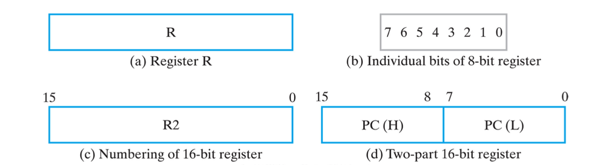
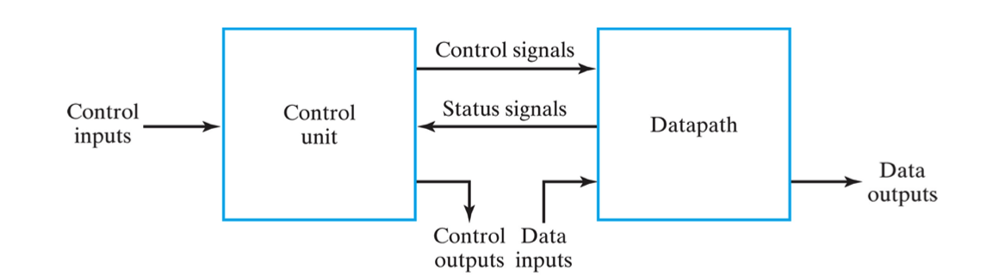
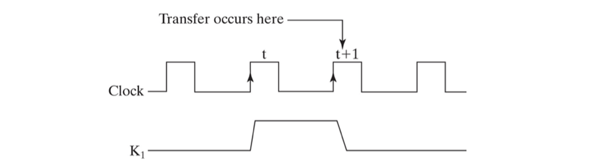

*본 포스팅은 Logic and Computer Design Fundementals (Pearson, 2013)의 내용을 다루고 있습니다.*

 

지난 포스팅까지 순차회로와 FSM 설계에 대하여 알아보았다. 이번시간에는 레지스터와 그 Transfer에 대하여 알아보도록 하자.

## Register
---
레지스터란,  
소프트웨어의 변수 같이 하드웨어에서 임시로 어떠한 데이터를 저장해놓을 수 있는 공간이다. 단순하게 말하자면 n비트를 묶어두는 (저장하는) n개의 D flip-flop으로 이루어진 회로이다.

### 4-bit Register

*4-Bit Register*

이해를 위해 4 bit 레지스터 회로를 살펴보자.

4개의 D flip-flop으로 이루어져 있으며 4비트 입력과 4비트 출력이 존재한다. 모두 같은 clock에 동기화 되어있고 초기화를 위한 Reset 인풋이 존재한다.

  
마찬가지로 레지스터 역시 심볼로서 간단하게 표현 가능하다. 아예 입력과 출력을 vector로 묶으면 더 간단할 것이다. 그리고 레지스터는 당연히 flip-flop으로 만들어지기 때문에, 당연히 clock이 존재함으로 심볼에서는 생략가능하다.

  
C 입력은 [이전 포스팅](../2021-04/logicdesign4) 배웠던 Enable 회로의 일종이다. ^Load와 Clock을 OR 게이트로 묶어 받으므로 Load 가 0이면 항상 clock에 1이 들어가고, 1일때 enable 되어 clock이 동기화 된다.

clock pulse에 따른 그래프를 그려보면 아래와 같다.
  
Load가 1일때 clock의 rising edge에서 데이터의 변화가 일어난다는 것을 예측가능하다.

위 그림에서는 사실 latency를 고려하지 않았다. 이로 인하여 회로에 glitch 가 발생할 가능성이 있다. 예를 들면 항상 1을 유지해야하는 신호가 지연시간으로 인해 짧은 시간동안 유지하지 못하고 0 으로 내려갔다가 올라올 수 있다. 그 경우 내려갔다 올라오는 과정에서 의도치 않은 rising edge가 일어나며 Transfer가 일어날 수 있다. 아주 위험한 회로안 것이다.

그러므로 이런식의 레지스터 설계는 **옳지 않다**.

### 4-bit Register with Parallel Load

그렇다면 어떻게 이러한 문제를 해결할 수 있을까. 정답은 입력들을 레지스터 측에서 받아와 MUX로 처리하는 방법이다. 예시 회로를 보자. 
  

위 회로에서는 D flip-flop에 들어오는 D 입력과 Load에 추가적인 회로가 연결되어 있다. 

이를 잘 살펴보면 [이전에 배운](../2021-04/logicdesign5) MUX 임을 확인할 수 있다. EN(Load) 가 셀렉터 인풋으로써 새로운 입력 D를 전달할지, 현재 상태 Q를 전달할지 결정하므로, Load되지 않는다면 clock과 관계없이 D값이 전달되지 않고 상태를 유지한다.

  

이러한 추가적인 회로를 역시 한 레지스터 처럼 심볼화하여 위와 같이 나타낼 수 있다.

이러한 레지스터를 *Register with Parallel Load* 또는 *Loadable Register*이라고 한다.

### Block Diagrams of Register

  
레지스터를 그림으로 표현할 때는 여러가지 방법이 존재한다.

- (a)와 같이 심볼 이름만 적힌 사각형으로 표현할 수 있고
- (b)와 같이 여러 비트를 순서대로 모두 적어놓을 수도 있다.
- (c)와 같이 시작과 끝 비트만 표시해도 된다.
- (d)와 같이 두 파트로 나눌 수도 있는데, 이는 경우에 따라 전체가 아닌 절반만 사용할 수 있도록 하기 위해서이다.

 
이제 Transfer에 대해 알아보기 전 복잡한 회로를 설계할 때 가지는 계층구조의 특성을 이해할 필요가 있다.   
Control Unit과 DataPath에 관해 알아보도록하자.

### Control Unit & Data Path
---
  

CPU와 같이 복잡한 회로를 설계하기 위해서는 위와같이 Control Unit과 DataPath로 구분하여 계층적으로 설계를 한다. 

**Control unit**은 회로에서 소프트웨어적인 측면이다. Control input을 입력받아, Data Path에게 어떠한 작업을 할 수 있도록 일의 순서를 알려주는 시그널을 전달한다. 예를 들면 Load 입력과 같이 말이다.

**DataPath**는 control unit이 주는 시그널을 통해 실질적인 작업을 하는 부분이다. 레지스터간의 transfer는 모두 datapath에서 일어난다고 보면 된다. 실제로 레지스터는 모두 datapath에 존재한다.

## Register Transfer
---
그렇다면 그 Transfer는 무엇인가?  
레지스터가 소프트웨어에서의 변수라면 레지스터 이전은 변수할당이다. 한 레지스터의 데이터를 특정 시간에 다른 곳으로 옮기는 것이다.

다이어그램으로 살펴보자

### Transfer from R1 to R2

*Transfer from R1 to R2*

위 회로는 R1에서 R2로의 n비트 transfer의 동작을 한다. 
K1 Load 입력은 1일 때 R1의 출력이 MUX에서 선택되어 R2의 입력으로 전달된다.

  
위와 같이 K1 (Load)에 latency가 존재함으로 K1 == 1 일때의 rising edge 중 t+1 시점에 Transfer가 일어난다.

---

 
이번 포스팅에서는 Register 와 Register Transfer에 대하여 알아보았다.  
다음 포스팅에선 register transfer 표기를 위한 심볼들과 연산자, 그리고 여러가지 레지스터 회로에 관하여 알아보도록 하자.
 

**[[Logic Design - 10]](../2021-06/logicdesign10)에 계속↗**