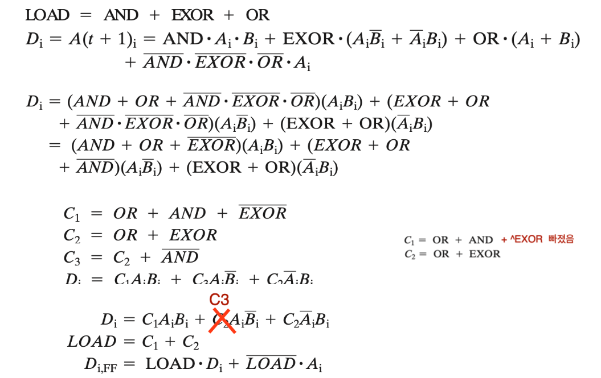
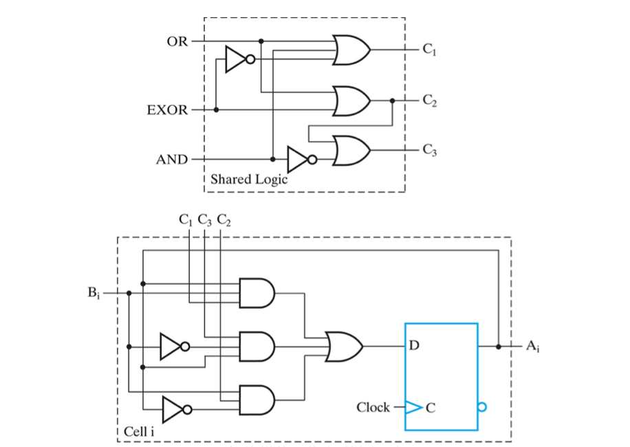
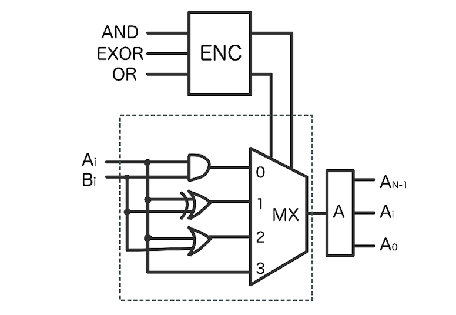
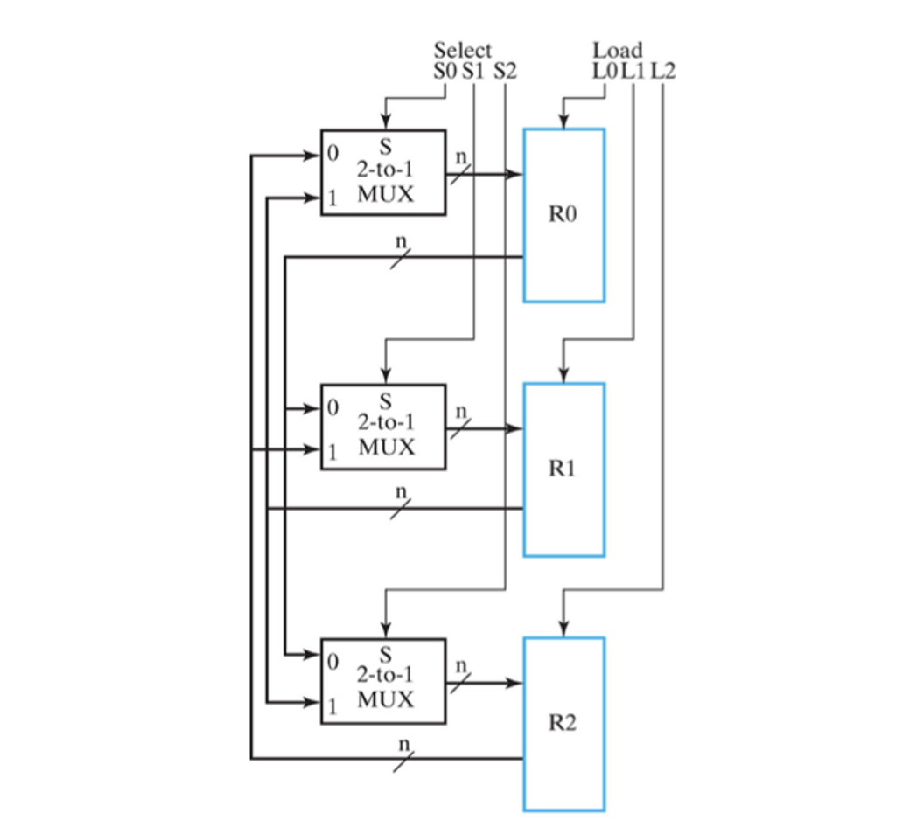
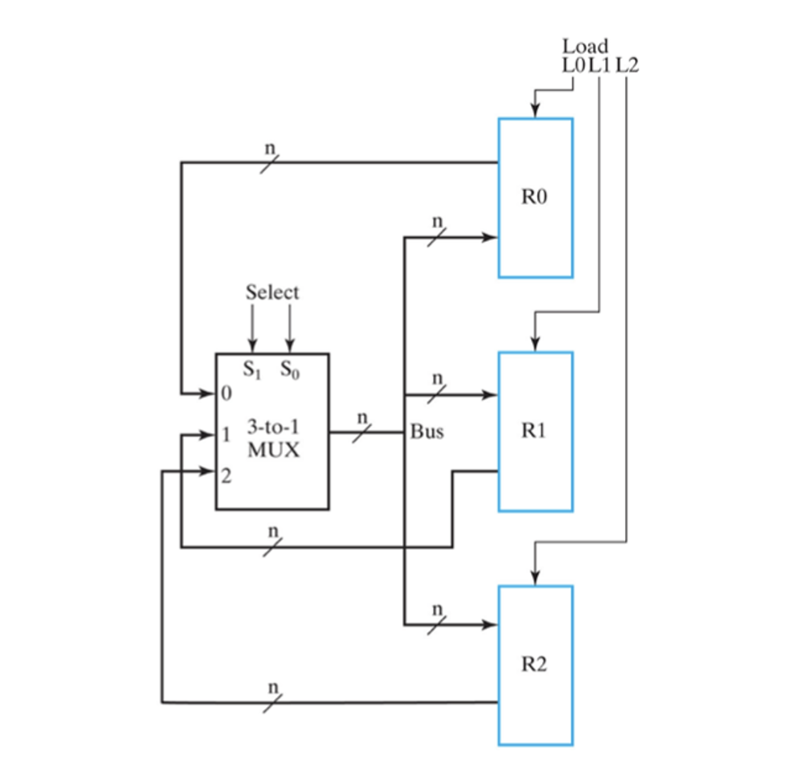

*본 포스팅은 Logic and Computer Design Fundementals (Pearson, 2013)의 내용을 다루고 있습니다.*

 

저번 포스팅에는 BCD Counter와 Arbitary Counter에 관하여 알아보았다. 
이번 포스팅에서는 다양한 논리연산을 수행하는 레지스터 회로와 Single Bus에 대해 알아보도록하자.
 

## Register Cell Design
---

  

`AND` `EXOR` `OR`과 같은 논리 연산하는 레지스터를 설계해보자. 

3가지 연산중 한 가지만을 수행해야할 것이며, 신호가 모두 0이라면 상태가 변하지 않는 동작을 한다고 하자. Control Unit 부에서 AND EXOR OR 연산의 신호를 Datapath에 전달하고, datapath에서는 레지스터 transfer을 실행한다.

먼저 게이트 레벨 설계를 살펴보자.
  
우욱.. 씹...

어찌저찌 하면 아래와 같은 멋진 회로를 설계할 수 있다.
  
어질어질함으로 치워버리고 바로 RTL 설계를 해보자.
  

Specification에서 말한대로 레지스터 A에게 4가지의 동작을 할 수 있도록 멀티플렉서를 연결한다. Mux의 selector 입력으로는 AND EXOR OR 시그널이 연결된 ENC회로의 두 출력이다. ENC 회로는 하나의 신호가 1을 가지거나 전부 0인 총 4가지 경우를 2비트로 나누어 출력한다.

당연히 이러한 복잡한 회로는 RTL설계가 더 쉽다. gate 레벨의 설계는 소프트웨어가 도와줄 것이다.

## Dedicated MUX vs Single Bus
---
3개의 레지스터가 서로 각각 transfer 할 수 있는 회로를 설계한다고 하자.

2가지 방법으로 구현해 볼 수 있는데 각각의 특성을 알아보고 비교해보자.

### Dedicated Multiflexers

  

위 회로는 Control unit에서 전달하는 Select 신호와 Load 신호로 한 레지스터를 다른 레지스트로 전달할 수 있다.

각 레지스터는 2 to 1 mux가 입력으로 들어오는데 자기자신을 제외한 나머지 레지스터들이 연결되어 있다. 그러므로 selector로 둘 중 한개를 고르고 로드 활성화 시켜주면 transfer가 일으난다는 것이다.

예를 들어 `R0 ← R2` 의 transfer를 보자. R0에 값을 전달하기 위해 L0에 1을, R2를 선택하기 위해 S0에 0을 넣어주면 전달이 성공적으로 일어날 것이다. 이러한 방법으로 각각의 레지스터의 값을 주고 받을 수 있다.

다음은 다른 방법으로 구현한 똑같은 기능을 하는 회로를 살펴보자.

### Single Bus
  
비슷하지만 다르다. 이전의 회로는 3개의 멀티 플렉서로 각각 연결되어있는 반면 이 회로는 중앙의 3 to 1 mux에 모든 레지스터가 연결되고 Load된 레지스터에 transfer 해주는 방식의 회로이다.

이렇게 transfer 자원을 공유하여 사용하는 것을 **Bus**라고한다.

버스를 이용할 경우 mux를 한개만 사용하기 때문에 더 경제적이다. 하지만 dedicated mx에서는 `R0 ← R2`, `R1 ← R0` 와 같은 연산이 같은 clock cycle에 동시에 일어날 수 있지만 , 버스의 경우 공유된 mx를 쓰기 때문에 그렇지 못한다.

---
 
이번 포스팅에는 다양한 논리연산을 하는 레지스터 회로와 single bus에 관해 알아보았다. 다음 포스팅에서는 Three-State Buffer에 대해 알아보도록하자.
 

**[[Logic Design - 14]](../2021-06/logicdesign14)에 계속↗**