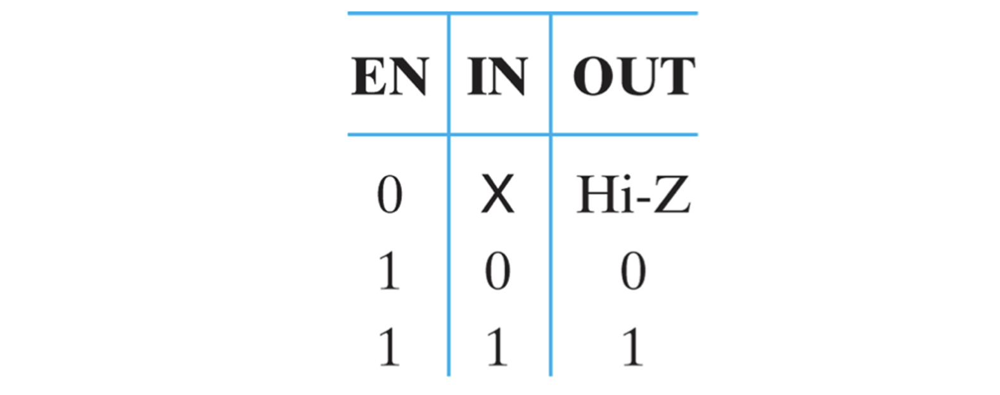
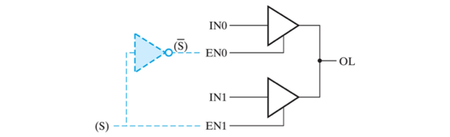
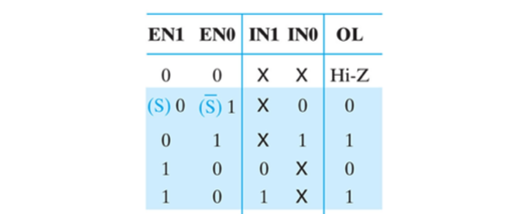
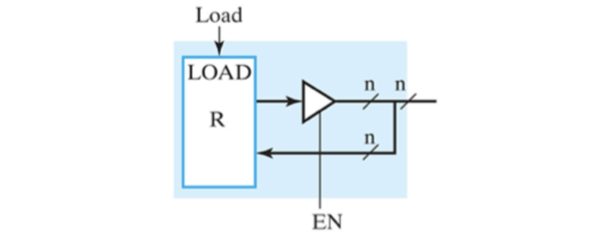
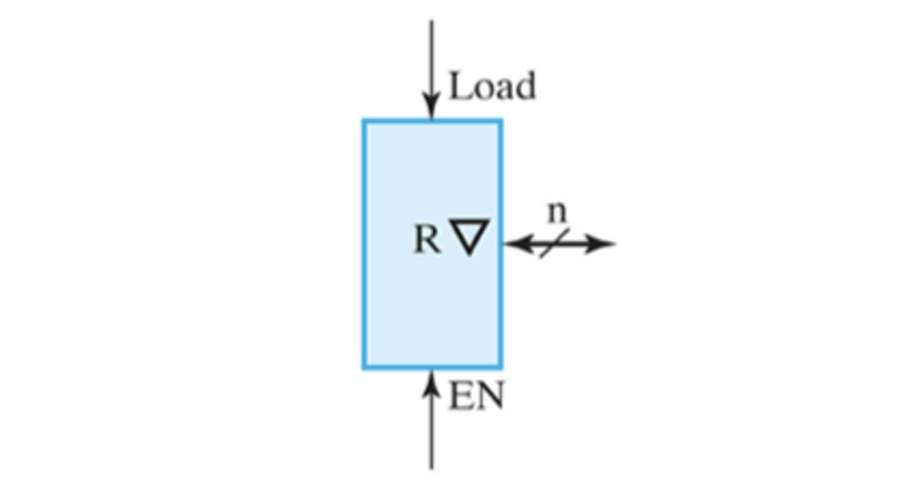
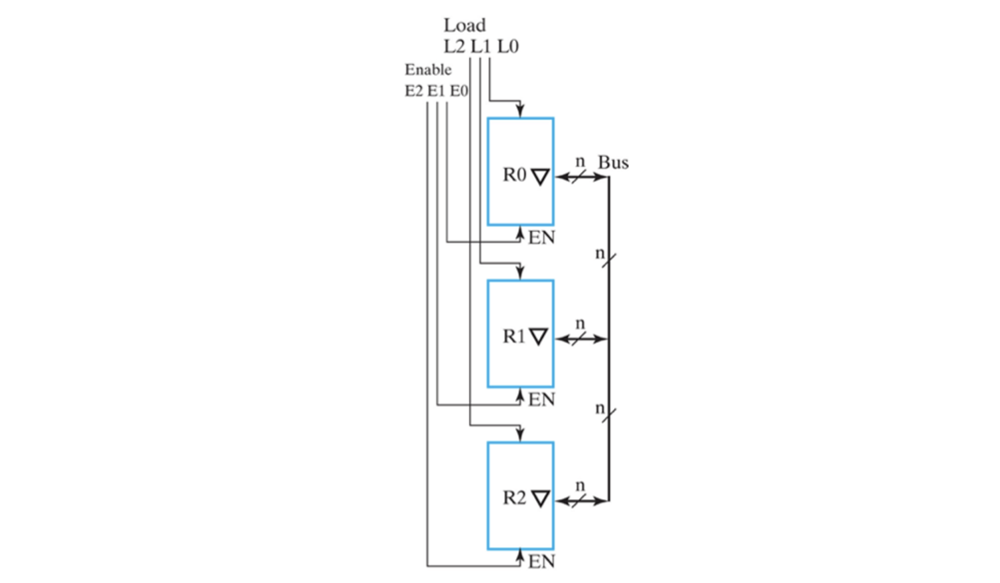
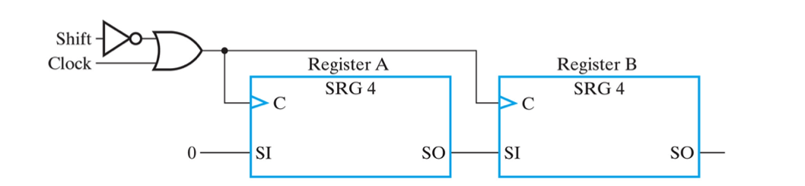
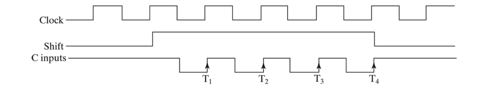
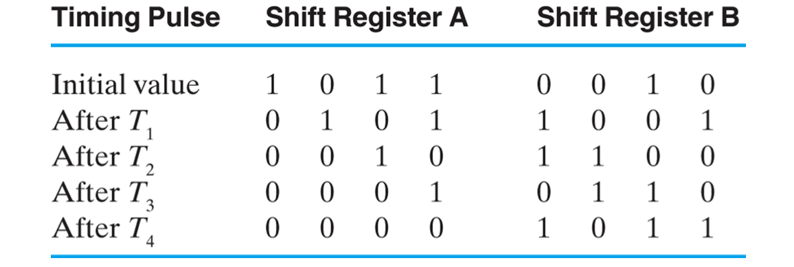

*본 포스팅은 Logic and Computer Design Fundementals (Pearson, 2013)의 내용을 다루고 있습니다.*

 

저번시간에는 여러개의 레지스터 간 transfer를 수행할 수 있는 회로를 공부해보았다. 각 레지스터에 다른 레지스터들을 연결한 mux를 입력받는 방식의 dedicated mux 와, 모든 레지스터를 공유되는 mux에 연결되어 선택하는 single bus 방식이 있었다.

위와 같은 동작을 하지만 멀티플렉서 없이 레지스터끼리 연결해서 transfer 하는 방법을 알아보자.

## Three-State Buffer
---
먼저 그러한 레지스터를 알기 위해 새로운 회로인 Three-state buffer에 대해 알아보자.
  
직역하면 3가지 상태를 가지는 완충회로 정도로 해석된다. 이 buffer의 출력은 **0** 과 **1** 외에 EN 입력을 통해 제 3의 상태 **Hi-Z** (high impedance)를 가질 수 있다.

이는 입력과 연결이 끊어진 상태라고 생각하면 된다. EN이 0이면 IN과 연결이 끊겨 Hi-Z 이고, EN이 1일때 IN값이 OUT 값으로 연결되어 들어가게 된다. 이때 Hi-Z 상태의 데이터를 **floating data**라고 한다.

*Truth Table of Three-State Buffer*

Three-State Buffer는 Tri-State 라고도 하며, OUT과 EN부에 버블이 붙어 inverting 되는 버퍼도 존재한다.
EN에 버블 (inverter)가 있으면 inverting tri-state 이겠다.

### Multiflexer Formed by Tri-state Buffer
놀랍게도 이 tri 버퍼로 멀티플렉서를 만들 수 있다.

  
tri 버퍼 2개를 연결하고, 각각의 EN 값을 S를 decode 한 값으로 넣어준다. 그러면 EN0와 EN1은 같은 값을 가지지 않고, Hi-Z 가 아닌 IN과 연결된 버퍼의 입력을 OL 출력으로 선택하여 내보낼 수 있는것이다.

  

EN 1 과 EN 0가 둘다 1이라면 의미없으므로 생략하였다.

### Register with Tri-state Buffer
처음에 말했던 mux 없이 레지스터간 transfer을 구현하기 위한 추가적인 회로의 레지스터를 살펴보자.
  

보통의 레지스터라면 입력과 출력이 따로 분리 되어 조합회로 부분으로 들어가 처리되지만, 위 그림의 레지스터는 tri buffer를 가지고 입력과 출력이 합쳐져 있는걸 확인할 수 있다.

먼저 EN이 0일때를 생각해보라. R의 출력 값이 버퍼에서 연결되지 않고 Hi-Z값을 가질 것이다. 그렇다면 외부에서 들어오는 데이터가 R의 입력으로 들어오고, Load 신호를 준다면 transfer가 일어날 것이다. 반대로 EN이 1이라면 R의 출력은 버퍼를 거쳐 정상적으로 출력될 것이다.

즉 EN 신호에 따라 레지스터가 입력받아 로드될 것 인지, 출력하여 다른 레지스터로 데이터를 보낼 것 인지 결정할 수 있다. 이를 양방향 레지스터 **Bidirectional** 이라고 한다.
  

마찬가지로 심볼화하여 간단하게 표기 가능하다.

### Three-State bus using Bidirect Register
자 이제 멀티플렉서 없이 bus로 연결된 양방향 레지스터 전달 회로를 만들 수 있다.
  
로드되는 레지스터 **R0**의 `L0 = 0`, `E0 = 0`값을 주고 전달하는 레지스터 **R1**의 `E1 = 1`로 주면 `R0 ← R1` transfer가 수행된다. 

물론 전달하는 레지스터의 EN값을 1로 줄 때 한개의 EN만 활성화 해야한다는 것을 유의하도록하자.

정말 간단하쥬?

## Serial Transfer
---
  

위 회로는 일반 4비트 shift연산 회로 2개를 연결하고 추가로 이를 컨트롤하기 위한 Shift 입력이 존재한다. 좌상단의 enable 회로를 보면 알겠지만 shift가 1일때에만 clock 이 두 레지스터에 동기화되어 shifting 될 것이다.

  

시간에 따른 데이터들의 변화를 나타내면 위와 같을 것이다. 물론 지연시간은 무시하였다.

위 그래프의 shift=1 일때의 transfer가 일어나는 rising edge시점의 shift 연산이 어떤식으로 일어나는지 표로 나타내면 아래와 같다.

  

클록 사이클이 ++ 될때마다 A에서 B로 right shift 되고 있는 모습을 확인할 수 있다.

---
 
논리회로설계 포스팅은 1부터 14까지 *Logic and Computer Design Fundementals (Pearson, 2013)*의 1장, 2장, 3장, 4장, 6장에 관하여 모두 다루어 보았다. 지금까지 공부한 내용을 모두 활용하여 다음 포스팅에서 스톱워치를 설계하고, 시리즈를 마무리 하도록 하겠다.
 

**[[Logic Design - 15] (완)](../2021-06/logicdesign15)에 계속↗**