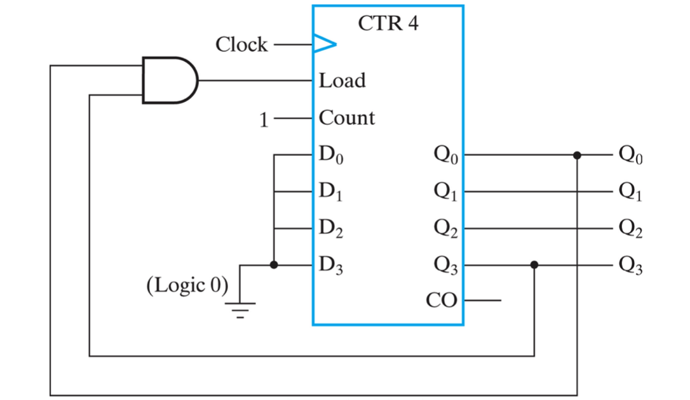
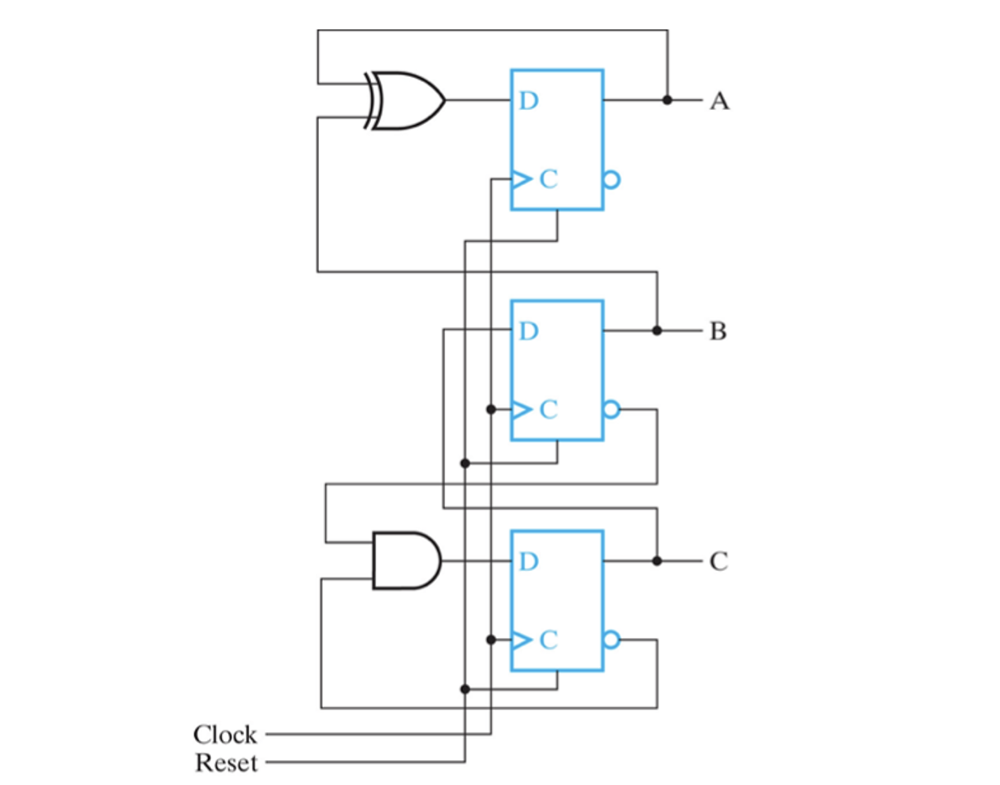
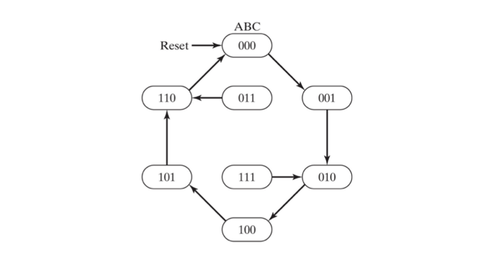
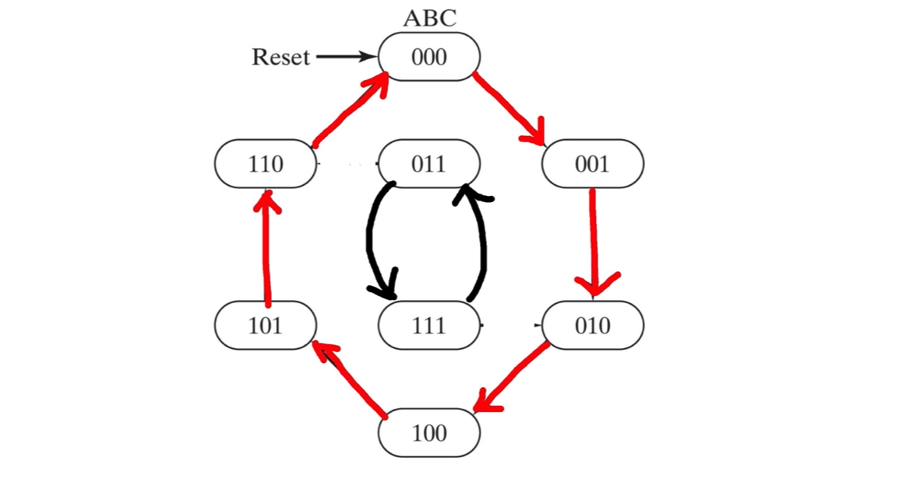

*본 포스팅은 Logic and Computer Design Fundementals (Pearson, 2013)의 내용을 다루고 있습니다.*

 

저번 포스팅에서는 Counter와 RTL 설계에 대해 알아보았다.  
이번 포스팅에서는 BCD counter와 Arbitrary Counter에 관하여 알아보도록 하자.
 

## BCD Counter
---

자 BCD 카운터란 무엇일까. 이름에서 짐작할 수 있듯이 digit 0 to 9 을 바이너리 비트로 나타내는 카운터이다. 레지스터 비트에 저장하는 값이 0에서 9의 상태를 카운팅하는 동작을 수행한다.

  

0에서 9까지의 데이터를 저장할 것임으로 0000 에서 1001 4개의 레지스터를 필요로 한다. Load 시에는 모두 0으로 초기화 할 수 있도록 ground에 연결되어 있다. 헌데 살펴보면 Q0 와 Q3가 AND게이트로 묶여 Load 입력으로 들어감을 확인할 수 있을 것이다.

이는 레지스터가 9의 값, 1001을 저장하고 있을 때 다음 값이 0000이 되어야 한다. 유일하게 Q0과 Q3가 동시에 활성화 되는 9의 경우에 Load 하여 다시 0으로 초기화 하는 것이다. `1001` → `0000`

## Counter with Arbitrary Count
---
Arbitrary Count은 무엇인가?? Arbitrary이란 임의의 라는 뜻이므로 Arbitrary Counter 기존 ripple counter와 같이 바이너리 값이 순서대로 증가하는 것이 아닌 임의의 수를 가진 상태로 순환하는 카운터되시겠다.

  

회로를 봐서는 이해가 잘 되지않는다 상태 그래프로 보자.
  
아하 이 회로는 임의로 정한 상태 바이너리 값으로 돌아가며 카운팅되는 카운터이구나? 임을 알 수 있다.

위에 회로에서는 카운팅되는 사이클에 포함되지 않는 상태값인 011과 111의 다음 상태가 지정되어있다. 굳이 지정할 필요가 있을까? 어짜피 순환되면서 011과 111로 들어갈 일이 없는데다가 식을 더 간소화 할 수 있는데 말이다.

만약 011 과 111이 다음 상태로 각자 서로를 가르킨다면 어떻게 될까. 만약 비정상적인 상황으로 기계의 상태가 011또는 111로 진입한다고 생각해보자. 그럼 기존의 arbitrary 사이클로 복귀하지 못하고 두 상태사이의 루프에 빠지게 된다. Reset하기 전까지는 무한반복에 갇히게 된다.

*001과 111의 무한반복*

그러므로 사용하지 않는 상태를 don't care 로 둔다면 논리회로를 최대한 간소화 할 수 있지만 위와 같이 최소화하는 것보다 중요한 설계 주의사항이 있을 수 있음을 유의하자.

---
 
이번 포스팅에는 BCD Counter와 Arbitary Counter에 관하여 알아보았다. 다음 포스팅에서는 다양한 논리연산을 수행하는 레지스터 회로에 대해 알아보도록하자.
 

**[[Logic Design - 13]](../2021-06/logicdesign13)에 계속↗**