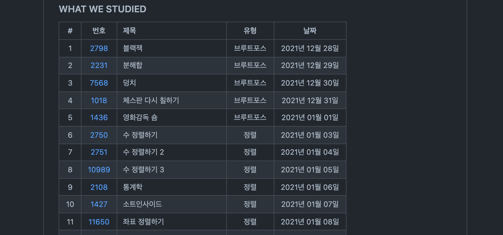

### 적당함 탈출하기

나는 게으른 성격이다. 만사 무관심하고 적당주의가 심하다. 물론 적당의 기준은 사람마다 다르기에 누군가에겐 나의 노력이 개미발톱만할 수도 있고, 나를 성실한 사람으로 볼 수도 있을 것이다. 하지만 내가 말하는 *적당*이란 내가 할 수 있는 노력에 최선을 다하지 않음을 뜻한다.  

나는 지난 20년간 적당이라는 자기만족의 늪에 빠져있지 않았나 싶다. 항상 '이정도면 적당히 공부했지' 정도의 노력만 기울이고 내가 생각하는 적정선을 초과하지 않았다. 자신과의 합의가 잘되는 사람인거다. 중학생때 중상위권, 고등학생때에도 중상위권, 심지어 대학생이 되어서도 중상위권이였다.  

그러다 군대 갈 나이가 가서 입대하였고 생각이 바뀌게 되었다. 아무생각없이 갈때 되어서 간 군대였지만 생각보다 군대는 정말정말로 시간이 아까운 곳이였다. 원하지 않는 곳에서 원하지 않는 사람들과 원하지 않은 일을 해야만 했다. 물론 몇몇 좋은 사람들과 약간의 운전실력, 상급자를 대하는 법등을 배우긴하였다. 하지만 그외에는 성장한다는 느낌을 전혀 받지 못하는 집단이다. 정체되고 멍청해지며 뒤쳐지는 느낌을 받았다.

그래서일까 약간은 조급한 마음을 가지게 되었다. 군대에서도 늘 자기계발에 대한 갈증이 있었다. 하지만 방법을 몰라서 일병때는 독서를 많이 하였다. 짬이 좀 먹고 나서는 우연히 국방부 지원 프로그램을 알게되어 웹개발을 공부하였으며 운좋게 실력있는 소대장님을 만나 해커톤에서 한번 나가 프로젝트를 경험해 볼 수 있었다. 어서 이 적당주의를 탈출해야하기 때문일까 전역하고 놀고 싶다는 생각은 그다지 들지않는다.  

### 알고리즘

1학년 마치고 바로 입대한건 아니라 작년 12월 전역 후 시간이 많지 않았다. 좀 놀다가 해가 바뀌면서 바로 동아리 친구들과 알고리즘 스터디를 시작하였다. [국밥 프로젝트](https://github.com/GANGESHOTTEOK/gukbbap) (why 국밥?) 레포지터리를 만들어서 1일 1문제를 목표로 일주일에 백준 문제 6개를 풀고 일요일날 줌으로 서로 코드를 리뷰하는 형식의 스터디를 진행하였다.

  

내 성격이 게으르긴한데 또 정리 기록하는건 좋아하는 편이라 마크다운으로 rdme에 간단하게 기록하였다. 진행도 체크와 성취감, 그리고 공부 흔적이 남은 것 같아 괜찮은 방법인듯하다. 물론 3개월 있으면 잊어먹기 때문에 블로그에 포스팅까지 한다면 베스트.

개강하고 나서는 4명 중 3명이 복학생이라 일주일에 3개씩 풀다가 중간고사 기간에 들어서며 흐지부지 되었지만, 약 3~4개월 가량 80 문제정도 풀었다. 많다면 많고 적다면 적은 양이지만 ps감을 찾는데 꽤 도움이 된 것 같다. 알고리즘 스터디를 진행하며 c++도 처음 다루었는데 ps로서의 c++은 c와 크게 다른 부분이 없어서 쉽게 갈아탈 수 있었다. 덕분에 1학기 c++ 강의 중간 전까지는 날로먹고 시험도 만점 받았다.

### 블로그

군대에서 참가했던 해커톤 외에 개발하였던 것이라하면 블로그라고도 할 수 있다. 공부하거나 이것저것 찾는다고 구글링하면 느끼는게 실력있는 사람들은 블로그를 많이 운영한다는 것이다. it 서비스계열의 회사들은 회사 자체의 기술블로그를 운영하기도 한다. 아는 것을 공유하는 개발자의 마인드가 멋있었고, 공부용으로도 좋고, 포트폴리오 용으로도 좋아보였다.  

게으르지만 정리, 분류, 기록등을 좋아하는 군인이였던 나는 사지방에서 블로그를 만들기로 결심하였다. 사실 근데 이미 운영하던 티스토리 블로그가 있었다. 하지만 가오에 집중하는 나는 jekyll과 같은 static gen으로 만들어서 깃헙의 공짜 호스팅서비스 gitpage로 올리기로 한다. 블로그 내가 만든거야~ 하면 멋있어 보일줄 알았나보다.

심플한 테마하나를 가져와서 사지방에서 시간날때마다 뜯어 고쳤다. 이때 웹땔감이 사이버야가다라고 불리는지 조금은 알게된 것 같다. 이때 배운 야가다스킬 html, scss 등은 후에 웹 프로젝트를 할때 매우 유용하였다... 그리고 대충 다 만들고 나서 내 눈엔 깜직한 우리 블로그 친구에게 uzun.dev라는 도메일을 구글에서 만오천원주고 구매하여 이름 지어주었다.

멋있게 잡설없이 전문적인 개발 이야기만 하면 참 좋겠지만 아는게 없는 블로그 주인은 포스팅의 방향을 `개발`  `회고` `알고리즘` `공부복습` 4가지로 잡았다. 근데 지금까지 블로그를 운영하면서 글을 써보니 생각보다 글쓰는게 쉽진 않은 듯하다. 남들은 글의 컨셉에 구조에 의의까지 두는데, 본인은 그런거 못하겠어서 내키는대로 막쓰고 있다. 일단 꾸준함이 중요한거 아니겠나 싶다..

### 2학년 1학기

전역버프로 자신감이 과해진 나는 전공수업 22학점 7개로 수강학점을 모두 채워보리는 패기를 선보였다. 적당주의에 탈출하기로 결심한 본인은 이번 학기에 스스로에게 적당주의에 탈출하였음을, 열정이 있음을 결과로 보여주기 했다.

- 시스템소프트웨어
- c++프로그래밍과실습
- 유닉스기초
- 논리회로와설계
- 인터넷과웹기초
- 이산수학1
- 공학선형대수학

이산수학과 인터넷과웹기초는 중간고사가 없기도 하고 중간 전까지는 강의를 안 밀려들어서 열정을 가지고 공부를 꽤 많이 했다. 생각보다 시간이 많이 남아서 여러번 복습하고 왠만한건 다 외울정도였는데 중간고사 끝나고 강의가 한 두개씩 밀리기 시작하더니 스노우볼 미친듯이 굴러서 기말 일주일전까지 강의를 듣는 기염을 토하였다. 다행히 과에서 한 손가락 안의 등수에 들며 열정증명에는 성공했지만 가장 노력한 과목인 선형대수학만 잘 안나와 가슴이 쓰라린다.. 수학은 어려워

### 기타

`~외 기타`가 아니라 진짜 기타를 샀다. 코로나 덕분일까 전부 비대면으로 신청해서 학기중에는 시험외에는 집밖에 나갈 필요가 없어져버렸다. 그래서 집돌이용 취미를 하나 찾아보다가 꽂혀서 귀여운 하늘색 일렉기타를 하나 구매하였다. 실시간으로 인테리어로써 제 역할을 다하고 있지만, 하반기에는 악기로 사용되었으면 하는 바램이다.

**끝**