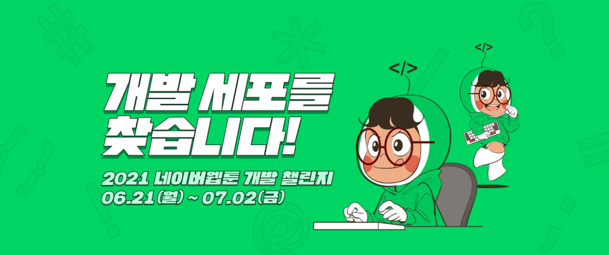
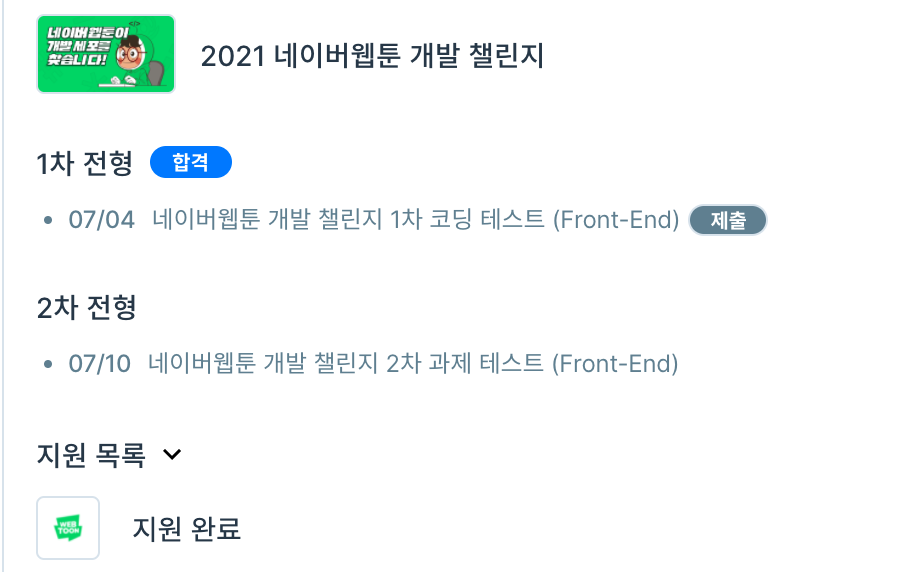

  

종강 후에 놀고 먹다가 네이버 웹툰의 채용공고를 보고 아는 형이랑 같이 지원하였다.

1차 코딩테스트와 2차 과제테스트가 주어졌는데, 각 분야별로 코딩테스트도 사용가능한 언어가 달랐다. 나는 항상 ps는 cpp로 했는데... 그래서 파이썬으로 할까 하다가 백엔드, AI, Data 쪽은 정말 몰라서 그냥 프론트로 지원하였다. 

프로그래머스에서 프론트는 자바스크립트로 코딩테스트를 진행하였는데, 문제는 생각보다 정말 쉬웠다. 대부분은 그냥 구현문제였고, 1차이다 보니 쉽게 내준건지, 프론트라서 쉬운건지는 잘 모르겠다. 분야별로 문제가 다르다고 한다.

  

욕심은 없지만 이왕 붙은거 2차 과제테스트까지 쳐볼려는데 여행계획이랑 겹쳐 가능할지는 모르겠다.

---

여행계획이랑 겹쳐 2차 과제테스트는 호텔방에서 치루게 되었다. 마찬가지로 프로그래머스에서 치루어졌지만 1차 코딩테스트와 다르게 화면과 오디오를 공유해야하고, 1분이상 자리를 비우지 못하는 등 여러가지 제약이 있었다.

내가 지원한 프론트에서는 바닐라 자바스크립트로 api를 호출하여 간단한 웹툰 사이트를 만드는 것이였다. 프로그래머스 테스트 환경에서 vscode 온라인 환경에 기본적인 베이스 코드들과 환경들이 셋팅되어 있었고, 그에 맞춰 적당히 추가로 설계하면 되는 식이였다.

js 레퍼런스 외에는 인터넷 사용이 금지되어서 검색을 할 수 없었다. 보기에 구현이 어렵지 않아보였지만 구글링이 불가한데에다가 제이쿼리와 같은 라이브러리를 사용할 수 없어서 몇몇 문법이 헷갈리거나 기억나지 않았다. 제약이 많다보니 쉬운 프로젝트도 어렵게 느껴지는 것 같다.

테스트를 치루다 호텔 와이파이가 불안정해서 도저히 진행할 수 없어 포기하고 나왔다. 아쉽지만 다음 기회가 있다면 다시 도전해봐야겠다.

