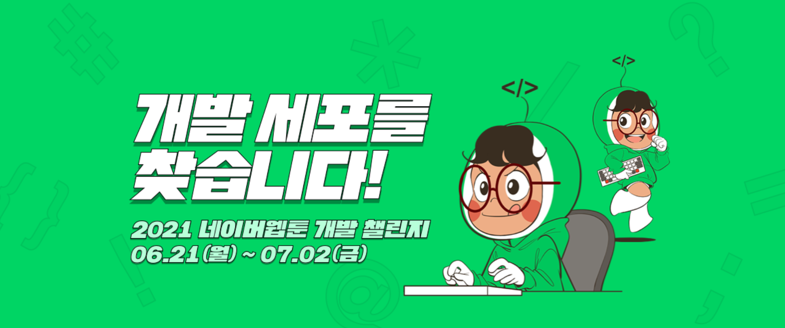
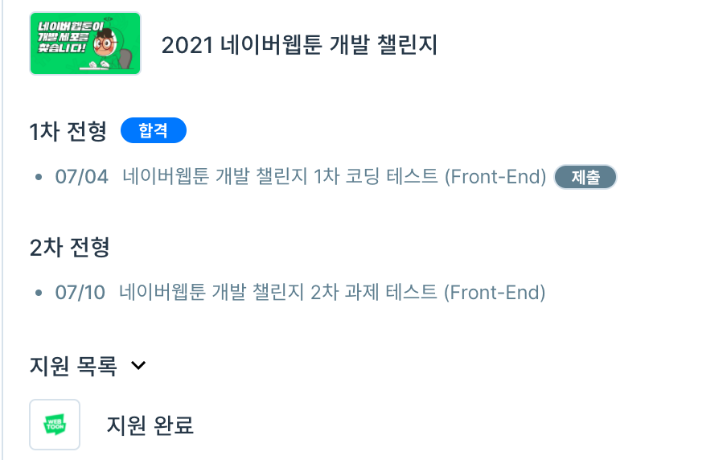

  

종강 후에 놀고 먹다가 네이버 웹툰의 채용공고를 보고 경험상 아는 형이랑 같이 지원하였다.

1차 코딩테스트와 2차 과제테스트가 주어졌는데, 각 분야별로 코딩테스트도 사용가능한 언어가 달랐다. 나는 항상 ps는 cpp로 했는데... 그래서 파이썬으로 할까 하다가 백엔드, AI, Data 쪽은 정말 몰라서 그냥 프론트로 지원하였다. 

프로그래머스에서 프론트는 자바스크립트로 코딩테스트를 진행하였는데, 문제는 생각보다 정말 쉬웠다. 대부분은 그냥 구현문제였고, 1차이다 보니 쉽게 내준건지, 프론트라서 쉬운건지는 잘 모르겠다. 분야별로 문제가 다르다고 한다.

  

욕심은 없지만 이왕 붙은거 2차 과제테스트까지 쳐볼려는데 여행계획이랑 겹쳐 가능할지는 모르겠다.

