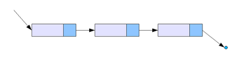
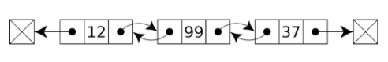

## 연결리스트 Linked List란 ?
---

추상적 자료형 **리스트**를 구현한 자료구조이다.

어떤 데이터 덩어리 **노드 node**를 저장할 때, 그 다음 순서의 자료가 있는 **위치를 데이터에 포함**시킨다.

  


위와 같이 줄줄이 소세지 마냥 딸려있는 형태의 구조이며 일반적으로 **구조체**와 그 **포인터**로 구성된다.

## 이중연결리스트 Doubly Linked List
---
단일 연결리스트가 다음 노드에 대한 참조만을 가진 단방향 구조라면, 이중연결리스트 Doubly Linked List 란 **다음** 노드뿐만 아니라 **이전** 노드에 대한 참조도 가지는 연결리스트이다.


  


각 노드는 이전과 다음 노드를 가르키는 형태로 연결되어 있다. 처음과 마지막 노드는 각각 이전과 다음 노드가 존재하지 않으므로 **NULL** 값을 가르킨다.

### 구조체

학생들의 ID와 Grade를 저장하는 구조체(노드)를 구현해보자.

```cpp
struct student {
    int id;
    char grade;
    student* next;
    student* before;
};
```

구조체 `student`에는 `id`, `grade`와 같은 학생의 정보와,  
다음 노드를 가르키는 포인터 `next` 그리고 이전 노드를 가르키는 포인터 `before`로 구성된다.

### 노드 연결

앞서 말했듯이 노드에 노드가 꼬리를 물어 리스트가 연결된다. 꼬리를 물기 위해서는 앞선 노드의 `next`가 다음 노드의 주소가 저장되면 된다.

```cpp
void linkNode(student* node){

    student* newnode = new student;  // 1

    cin >> newnode->id >> newnode->grade;  // 2

    while(node->next)  // 3
        node = node->next;
    
    node->next = newnode;  // 4
    newNode->before = node; // 4
}
```

1. 새로운 노드에 입력 받기 위해 `newNode`를 만들어 동적할당 해준다.
2. 노드의 정보(`id`, `grade`)를 입력 받는다.
3. while문을 돌며 마지막 노드를 찾는다.
4. 마지막 노드 `next`을 새로운 노드로, 새로운 노드의 `before`를 마지막 노드로 상호 연결시켜준다.

### 노드 삽입

리스트 마지막에 연결하는 것이 아닌 중간에 노드를 삽입하기 위해서는 4가지 동작이 필요할 것이다.

- **새로운 노드**가 삽입할려는 위치 **앞의 노드**를 가르킨다.
- **새로운 노드**가 삽입할려는 위치 **뒤의 노드**를 가르킨다.
- 삽입할려는 위치 **앞의 노드**가 **새로운 노드**가 가르킨다.
- 삽입할려는 위치 **뒤의 노드**가 **새로운 노드**가 가르킨다.

```cpp
void insertNode(student* node, int id){

    student* newNode = new student;  //  1
    cin >> newNode->id >> newNode->grade;  // 1

    while(node){  // 2

        if(node->id = id){  // 3

            newNode->next = node->next;
            newNode->before = node;
            node->next = newNode;
            node->next->before = newNode;

            break;
        }

        node = node->next;  // 2
    }
}
```
1. 삽입할 노드 `newNode`를 생성하여 입력받는다.
2. while문을 통해 리스트를 순회한다.
3. 만약 원하는 위치 `id`를 찾으면, 앞서 말한 4가지 동작을 수행하고 반복문을 탈출한다.

### 노드 제거

노드를 제거하기 위해서는 해당 노드의 앞과 뒤의 노드를 연결시켜주어 스킵시켜주면 된다. doubly 리스트이므로 `next`와 `before`모두 연결시켜준다.

- `deleteNode->before->next = deleteNode->next`
- `deleteNode->next->before = deleteNode->before`

하지만 싱글리스트와 마찬가지로 삭제하려는 노드가 연결리스트의 **시작**이거나, **끝**인 경우의 예외 케이스를 고려해야 할 것이다.  

- 시작의 경우, head를 해당 노드의 `next`로 옮긴다.  `head = node->next`  
- 끝인 경우, 해당 노드 앞의 노드의 `next`를 nullptr 할당한다. `beforeNode->next = nullptr`

```cpp
void deleteNode(student* head, int id) {

    student* node = head;

    while(node) {
        if (node->id == id) {
            if (!node->before && !node->next) break; // 노드가 head 하나 밖에 없는 경우
            
            if (!node->before)  // head 삭제
                *head = *node->next;

            else if(!node->next)  // tail 삭제
                node->before->next = nullptr;

            else { // 중간 노드 삭제
                node->before->next = node->next;
                node->next->before = node->before;
            }

            break;
        }
        node = node->next;
    }
}
```


