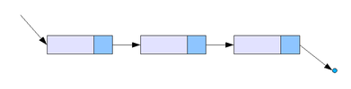

## 연결리스트 Linked List란 ?
---

추상적 자료형 **리스트**를 구현한 자료구조이다.

어떤 데이터 덩어리 **노드 node**를 저장할 때, 그 다음 순서의 자료가 있는 **위치를 데이터에 포함**시킨다.

  


위와 같이 줄줄이 소세지 마냥 딸려있는 형태의 구조이며 일반적으로 **구조체**와 그 **포인터**로 구성된다.

## 단일연결리스트 Singly Linked List
---
단일연결리스트 Singly Linked List 란 다음 노드에 대한 참조만을 가진 단방향 연결리스트이다.


*geeksforgeeks.org*

노드가 다음 노드를 가르키는 형태로 연결되어있으며, 시작지점은 **Head** 라고한다.  
마지막 노드는 연결된 존재하지 않으므로 **NULL** 값을 가르킨다.

### 구조체

학생들의 ID와 Grade를 저장하는 구조체(노드)를 구현해보자.

```cpp
struct student {
    int id;
    char grade;
    student* next;  // 단일연결리스트에서의 다음 노드을 가르키는 포인터
};
```

구조체 `student`에는 `id`, `grade`와 같은 학생의 정보와 다음 노드를 가르키는 포인터 `next`로 구성된다.

### 리스트 출력

리스트은 리스트를 순회하며 리스트를 출력하면 될 것이다.
```cpp
void printLinkedList(student* node) {

    while(node){
        cout << "ID: " << node->id << ", Grade " << node->grade << endl;
        node = node->next;
    }
}
```
한 노드 `node`를 출력하고 나면 그 노드가 가르키는 노드 `node->next`로 덮어쓴다.  
만약 `node`가 nullptr이라면, 이전 노드의 `next`가 존재하지 않는다는 것이므로 반복문을 종료한다.

### 노드 연결

앞서 말했듯이 노드에 노드가 꼬리를 물어 리스트가 연결된다. 꼬리를 물기 위해서는 앞선 노드의 `next`가 다음 노드의 주소가 저장되면 된다.

```cpp
void linkNode(student* node, student* newNode){
    
    if(!node) return;  // 1

    while(node->next)  // 2
        node = node->next;  
    
    node->next = newNode;  // 3
}
```
`node`에 `newNode`를 연결하는 함수이다.  

1. 만약 노드가 존재하지 않을때 예외 처리를 해준다.
2. while문을 돌며 기존의 `node`의 `next`가 nullptr일 때까지 탐색한다. 
3. `next`가 nullptr인 노드는 마지막이므로 `next`가 `newNode`를 가르키도록 하여 연결한다.

새로운 노드를 입력받지않고 키보드 입력으로 받고 싶다면 아래와 같이 구현할 수 있다.

```cpp
void linkNodeByInput(student* node){

    student* newnode = new student;  // 1

    cin >> newnode->id >> newnode->grade;  // 2

    while(node->next)  // 3
        node = node->next;
    
    node->next = newnode;  // 4
}
```

1. 새로운 노드에 입력 받기 위해 `newNode`를 만들어 동적할당 해준다.
2. 노드의 정보(`id`, `grade`)를 입력 받는다.
3. while문을 돌며 마지막 노드를 찾는다.
4. 마지막 노드에 `newNode`를 연결한다.

### 노드 삽입

리스트 마지막에 연결하는 것이 아닌 중간에 노드를 삽입하기 위해서는 2가지 동작이 필요하다.

- 삽입할려는 위치 **뒤**의 노드를 새로운 노드가 가르킨다.
- 삽입할려는 위치 **앞**의 노드가 새로운 노드를 가르킨다.

```cpp
void insertNode(student* node, int id){

    student* newNode = new student;  //  1
    cin >> newNode->id >> newNode->grade;  // 1

    while(node){  // 2

        if(node->id = id){  // 3
            newNode->next = node->next;
            node->next = newNode; 
            break;
        }

        node = node->next;  // 2
    }
}
```
1. 삽입할 노드 `newNode`를 생성하여 입력받는다.
2. while문을 통해 리스트를 순회한다.
3. 만약 원하는 위치 `id`를 찾으면, 앞서 말한 2가지 동작을 수행하고 반복문을 탈출한다.

### 노드 제거

노드를 제거하기 위해서는 해당노드의 앞의 노드가 해당노드가 가르키는 노드를 가르키면된다.  
- `beforeNode->next = node->next`

하지만 2가지 예외 케이스를 고려해야 할 것이다. 삭제하려는 노드가 **시작**이거나, **끝**인 경우이다.  
- 시작의 경우, head를 해당 노드의 `next`로 옮긴다.  `head = node->next`  
- 끝인 경우, 해당 노드 앞의 노드의 `next`를 nullptr 할당한다. `beforeNode->next = nullptr`

```cpp
void deleteNode(student* head, int id){

    student* beforeNode;  // 1 
    student* node = head;  // 2

    while(node){  // 3

        if(node->id == id){  // 4

            if(head == node)  // 5
                head = node->next;

            else if(node->next == nullptr)  // 5
                beforeNode->next = nullptr;

            else  // 5
                beforeNode->next = node->next;

            break;  // 5
        }

        beforeNode = next;  // 3
        node = node->next;  // 3
    }
}
```
1. 삭제하려는 노드의 이전 노드의 위치를 저장하기 위해 `beforeNode`를 선언한다.
2. 리스트를 순회하기 위한 포인터를 선언한다. 시작은 `head`부터.
3. 리스트가 끝날때까지 순회하기 위해 `beforeNode`와 `node`를 다음 노드로 이동.
4. `node`의 id가 `id`와 일치한다면 원하는 위치의 노드를 발견한 것이다.
5. 시작, 끝, 나머지 경우에 따라 노드를 삭제한다. 그리고 반복문을 탈출.

## 예제
---
```cpp
 int main(){

     student* head = new student;
     head->id = 1;
     head->grade = 'A';

     student* newnode;
     newnode->id = 2;
     newnode->grade = 'B';

    }
```
### 노드 연결

```cpp
    ...
    linkNode(head, newnode);
    linkNodeByInput(head);

    printLinkedList(head);

```
---
```shell
>> 3 C
ID: 1, Grade: A
ID: 2, Grade: B
ID: 3, Grade: C

```

### 노드 삽입

```cpp
    ...
    insertNode(head, 1);
    
    printLinkedList(head);

```

---
```shell
>> 4 D
ID: 1, Grade: A
ID: 4, Grade: D
ID: 2, Grade: B
ID: 3, Grade: C

```

### 노드 제거

```cpp
    ...
    deleteNode(head, 2);
    
    printLinkedList(head);

```

---
```shell
ID: 1, Grade: A
ID: 4, Grade: D
ID: 3, Grade: C

```