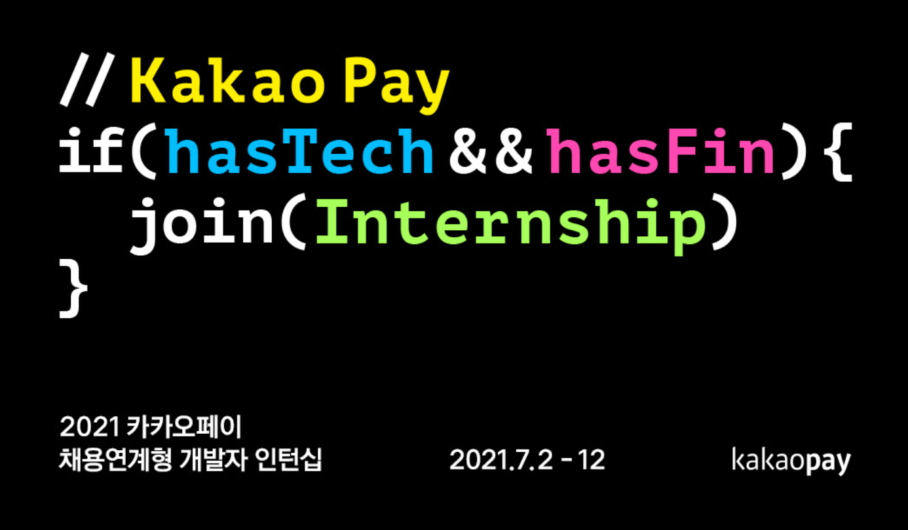
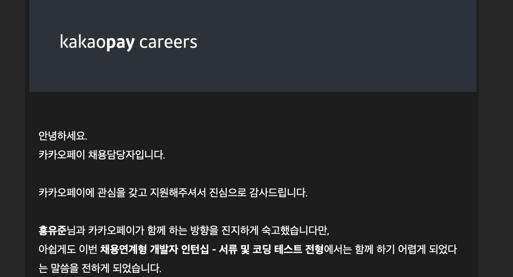

  

카카오페이에서 채용연계형 개발자 인턴십을 진행하여 신청하게 되었다. 

이전에 쳤던 네이버 개발 챌린지와는 다르게 인턴십이라 그런가 자소서를 요구하였다. [JOBFLEX](jobflex.com)이라는 채용플랫폼에서 자소서를 제출할 수 있도록 하였는데 사이트가 구려서 웹에서 쓴 후에 제출할려고 하니 로그인하라고 하며 내용을 다 날려버렸다. 어떻게 이렇게 만들지..??🤬

> 1. 지원동기와 참여를 통해 본인이 이루고 싶은 것은?
> 2. 생활의 어려움이나 불편함을 기술로 해결하기 위해 노력한 경험은?
> 3. 2인 이상의 프로젝트에서 본인의 역할과 과정, 결과등은?

의 3가지 항목의 자기소개서를 요구하였다. 그리고 당연히 github 프로필도 첨부하도록 하였다.

### 코딩테스트

1차 관문인 코딩테스트는 프로그래머스에서 진행되었으며, 여러가지 언어에 대한 폭 넓은 선택권이 주어졌다.  

3시간에 4문제였으며, 금융기업이라 그런가 첫번째 문제는 세금을 계산하는 문제가 출제되었다. 나는 C++로 풀다가 3번은 문자열 처리의 문제가 나와 자바스크립트로 풀이하였다. 4번은 깔끔하게 구현하기가 어려워서 시간부족으로 풀지 못하였다.  

전체적인 난이도는 어렵지 않다고 생각했으나 테스트 케이스 2개 외에는 코드가 맞는 지 확인할 수 없어 실수할 가능성이 높았던 것 같다.

### 결과

4문제 중 3문제면 괜찮지 않은가?는 건방진 생각이였나보다. 나한테 쉬우면 남한테도 쉽더라...

  

카카오페이.. 아쉽지만 다음 기회에..  
아디오스~

