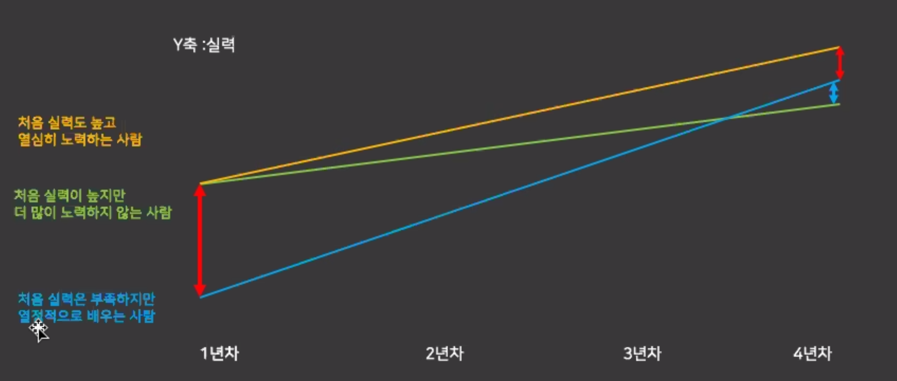
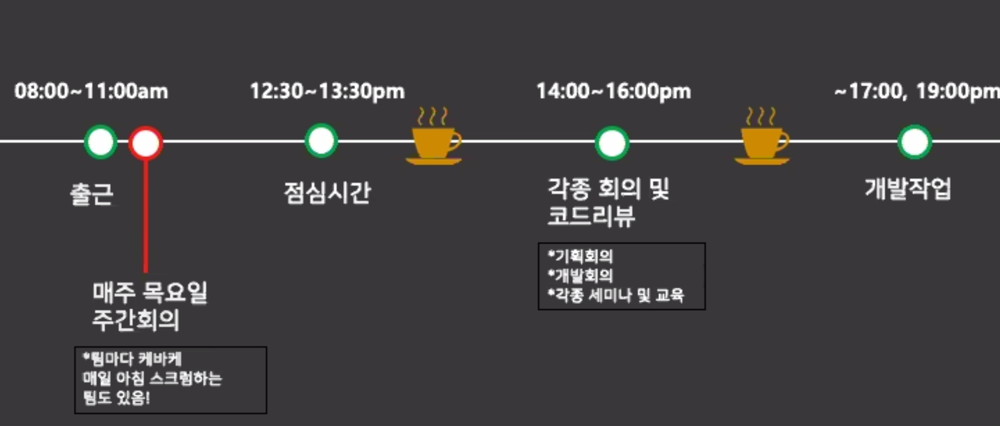

7월 20일 진행한 부산대 선배님의'*SW취업특강 1차 - 개발자로 살아남기*' 강연의 내용을 정리한 포스팅입니다.

[https://brocess.tistory.com/](https://brocess.tistory.com/)

[https://www.youtube.com/channel/UCXHt0mdmd-VIv8SuD6bhdZA](https://www.youtube.com/channel/UCXHt0mdmd-VIv8SuD6bhdZA)

# 개발자로 살아가기
---

앞으로도 IT시장은 커질 수 밖에 없다. 개발자 GOOD  
But, 적성을 고려해보아야 한다.

### 적성에 맞는지 알아보는 법
1. 일단 해보기  
2. 일단 잘해지기  
- 잘해졌는데 재미있다 / 적성에 맞음  
- 잘해졌는데 재미없다 / 적성에 맞지 않음

### 회사는 천재 개발자만 필요로 하는가?
No, 절대 그렇지 않다.
- 이미 만들어져 운영되는 수많은 시스템 / 만들어야 하는 수많은 시스템
- 아무리 똑똑한 개발자라고 하더라도 시간은 한정적이고 뭐든 걸 다 해낼 수 없다.

  

첫 빨간색 *gap*에 좌절하지 않기

### 개발을 좋아해야만 개발자가 될 수 있는가?
잘해지면 재밌다!  
당신은 잘해지기 위해 어떠한 노력을 하고 있는가?

## 취업
- - - -
### 개발자의 분야는 너무나도 많다
프론트 / 네트워크 / 서버 / 백엔드 / 안드로이드
IOS / 보안 / DB 등등

진로에 대한 충분한 고민이 필요하다.    
- 홈페이지 만들기, 앱 만들기, 자격증 등의 충분한 노력과 경험이 필요하다.

### 내가 가고 싶은 회사는?
> - 은행: 은행권 전산실  
> - 제조업 IT : 삼전 , 현대  
> - IT중심 : 네이버 카카오, NHN, 쿠팡  
> - 공기업 : 인천국제공사, KISA, 금공, 한전  

목표를 정하고 해당 회사의 코딩테스트 문제들과 프로세스에 대해 인지

그 회사에 취업한 선배 및 지인들을 통해 정보를 얻자
  - 정보는 곧 힘. 왠만한 정보는 구글 검색만해도 얻을 수 있다.

### 준비사항
1. 어떤 프로젝트를 했고, 어떤 부분에 기여했으며, 그로인해 어떤걸 배웠는지.
2. 학교 전공 과목 중 어떤 과목이 제일 재미있었고 왜 그렇게 느꼈는지.
3. 나의 장단점이 뭔지 ( 메타인지 : 내가 아는 것과 모르는 것을 구분하는 능력 )
4. 해당 회사에 대한 기본적인 지식 (회사의 서비스 or 인재상 등)
5. 앞으로 내가 어떤 개발자가 되고 싶은지 / 회사에서 어떻게 성장해 나가고 싶은지
6. 컴퓨터공학에 대한 기초지식 ( CS지식 )

- CS지식을 어떤식으로 습득하나요?
-> 정보처리기사 추천 : 각 과목들의 핵심내용들이 잘 정리됨

### 사실 신입개발자에게 많은 것을 기대하거나 바라지 않는다.
- 그렇기에 기초지식 및 그동안 해왔던 프로젝트들에 대해서 자신감 있게 설명
- 할 수 있는 기본기가 더 중요하다. 커뮤니케이션 스킬
- 같은 걸 이야기하더라도 어떻게 이야기하느냐에 따라 천지차이

### 스펙
1. 학벌 : 부산대 정도면 이미 충분 -> IT 쪽에서 학벌에 엄청 중요하지 않다.
2. 학점 : 최소 3.2 / 3.6 이상이면 보여지기에 좋다
3. 영어 : 개발자도 영어가 중요하다. (읽고 이해하는 능력)

### 코딩테스트
소프트웨어 역량 /  코딩테스트 를 보겠다. == 알고리즘 문제를 보겠다.

- 기본적으로 알고리즘 공부가 필요하다.
	1. 어떤 언어를 주력으로 할 것인지 정해야 한다.
	2. 알고리즘 사이트를 적극 활용한다.
	3. 내가 가고자하는 회사의 기출

### 면접
코딩테스트를 합격하면 CS지식을 프로젝트 기반으로 물어볼 확률이 높다.  
*EX ) 자바로 채팅 프로그램 개발 -> 서버와 클라이언트 통신은 어떻게 개발하였나요?*

- CS지식은 기본적인 내용을 위주로 물어 볼 수 있다.
	- 스택과 큐
	- 네트워크 OSI 7계층
	- 데이터베이스에서 B-TREE
	- 오버로딩과 오버라이등의 설명 등등등....

- 2차 면접은 기술 + 인성에 관한 부분이 주를 이룬다.

- 추가적으로 어필하기 좋은 활동들  
  - GIT과 같은 협업 툴을 사용하여 협업  
  - GIT에서 프로젝트들을 관리하여 포트폴리오화  
  - 기술 블로그 운영  

## 개발자
- - - -
### 개발자의 하루 일과
  

### 개발자로 취업한 이후의 삶
- 끊임없는 자기 분야에 대한 학습
- 끊임없는 스터디

- - - -
개발자는 너무 매력적인 직업이다.  
내 머릿속 상상을 현실세계에 구현할 수 있음.

