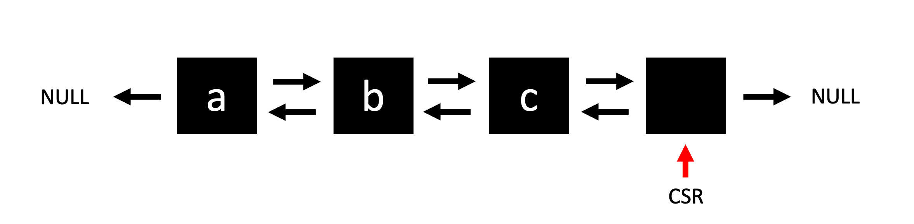
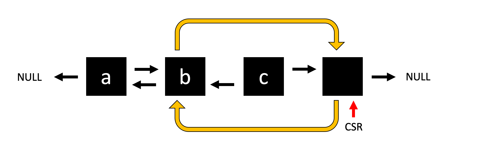
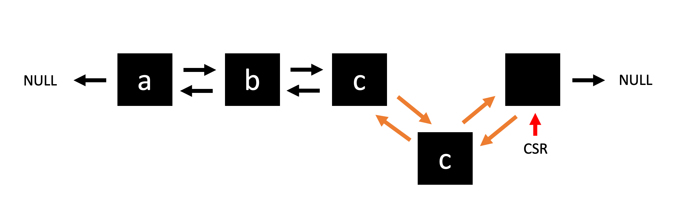

## [BOJ #1409 에디터](https://www.acmicpc.net/problem/1406)

  


## 문제

---

문제
한 줄로 된 간단한 에디터를 구현하려고 한다.   
이 편집기는 영어 소문자만을 기록할 수 있는 편집기로, 최대 600,000글자까지 입력할 수 있다.

이 편집기에는 '커서'라는 것이 있는데, 커서는 문장의 맨 앞(첫 번째 문자의 왼쪽), 문장의 맨 뒤(마지막 문자의 오른쪽), 또는 문장 중간 임의의 곳(모든 연속된 두 문자 사이)에 위치할 수 있다. 즉 길이가 L인 문자열이 현재 편집기에 입력되어 있으면, 커서가 위치할 수 있는 곳은 L+1가지 경우가 있다.

이 편집기가 지원하는 명령어는 다음과 같다.

- L	: 커서를 왼쪽으로 한 칸 옮김 (커서가 문장의 맨 앞이면 무시됨)  
- D	: 커서를 오른쪽으로 한 칸 옮김 (커서가 문장의 맨 뒤이면 무시됨)  
- B	: 커서 왼쪽에 있는 문자를 삭제함 (커서가 문장의 맨 앞이면 무시됨)  
삭제로 인해 커서는 한 칸 왼쪽으로 이동한 것처럼 나타나지만, 실제로 커서의 오른쪽에 있던 문자는 그대로임  
- P $ : $라는 문자를 커서 왼쪽에 추가함  
초기에 편집기에 입력되어 있는 문자열이 주어지고, 그 이후 입력한 명령어가 차례로 주어졌을 때, 모든 명령어를 수행하고 난 후 편집기에 입력되어 있는 문자열을 구하는 프로그램을 작성하시오. 단, 명령어가 수행되기 전에 커서는 문장의 맨 뒤에 위치하고 있다고 한다.  


## 문제 접근 및 풀이

---

문제에서는 문자열 각 문자 사이에 커서가 존재한다. 입력 `n`의 크기 만큼 반복적으로 들어오는 명령에 따라 커서의 위치에 움직이거나, 커서의 위치에 따른 삭제 또는 문자 삽입을 수행한다.

여러가지 풀이 방법이 존재하겠지만, 필자는 공부를 위해 **doubly linked list 이중연결리스트** 자료구조를 사용하여 풀어보았다.

문자열 각각의 문자를 구조체, 노드의 정보로 저장하고 노드끼리 앞뒤를 연결해준다면 자료의 삽입과 삭제를 쉽게 할 수 있겠다. (물론 사용자가...)

### 자료 저장

```cpp
struct Node {
    char c;
    Node* next;
    Node* before;
};
```
이중 연결 리스트이므로 앞과 뒤를 가르킬 포인터와, 문자 정보를 저장할 변수를 가진 구조체를 선언해야 할 것이다.

그리고 커서는 문자(노드) 사이에 위치하는데, 노드 중간을 가르킬 순 없으므로 커서가 가르키고 있는 위치의 노드와 커서의 이전 노드에 위치한다고 가정한다. 이를 위해서는 연결리스트의 꼬리부에 끝을 의미하는 노드가 하나 더 필요할 것이다.

예를 들자면 문자열 "abc"에서 커서가 c 오른쪽인 마지막을 가르킨다면 아래와 같은 구조를 가질 것이다.

  

그렇다면 먼저 입력받은 문자열을 연결리스트의 형태로 구현해야한다.

```cpp
/* 입력받는 node의 뒤에 새로운 노드를 생성하여 문자 c를 저장 후 연결한다. */
void linkNode(Node* &node, char c){
    Node* newNode = new Node;
    newNode->c = c; 
    node->next = newNode; // link
    newNode->before = node; // link
}

int main(){
    int n;
    string str;
    cin >> str >> n;

    Node* head = new Node; // 리스트의 시작 노드
    Node* csr = head; // 리스트의 커서

    for(auto c : str){ // 문자열을 돌며 한 문자당 한 노드를 새롭게 만들어 연결
        linkNode(csr, c);
        csr = csr->next;
    }

    linkNode(csr, ' '); // 끝을 의미하는 추가 노드 연결
    csr = csr->next;

    head = head->next; // 문자열을 연결리스트화 할때 사용한 head는 필요가 없어짐
    head->before = nullptr; // 삭제

    ...
}
```

이제 자료를 구조적으로 저장했으므로 명령어에 따라서 자료를 탐색, 수정할 수 있는 코드를 작성하면 되겠다.

### 명령어 

커서를 옮기는 명령어 L과 D는 어렵지 않다.  
`csr = csr->next` 또는 `csr = csr->before`로 커서가 가르키는 노드를 이동할 수 있음을 쉽게 짐작 가능하다.

하지만, 항상 edge 케이스를 생각해야한다. 커서가 처음이거나 마지막에 존재한다면 이동이 불가능하니까 예외처리에 유의한다.

```cpp
    if (pg == 'L') {
        if(!csr->before) continue;
        csr = csr->before;

    } else if (pg == 'D') {
        if(!csr->next) continue;
        csr = csr->next;
    }
```

다음 명령어 B는 커서 왼쪽에 위치하는 노드를 삭제해야한다.

이중연결리스트의 노드를 삭제하기 위해서는 2가지 작업이 필요하다.
1. `csr->before = csr->before->before`
2. `csr->before->before->next = csr`

커서의 노드와 커서의 전전 노드를 연결시켜주는 것이다.
  

다만 이번에도 예외 케이스를 고려해봐야한다. 

1. 커서가 마지막이라면?
   - 커서 왼쪽의 노드를 삭제함으로 아무 상관이 없다.
2. 커서가 처음이라면?   
   - 커서 왼쪽에 노드가 존재하지 않음으로 예외처리 해준다.  
3. 커서의 전전노드가 존재하지 않는 2번째 노드라면...?
   - nullptr의 `before`를 참조함으로 참조오류가 발생할 것이다. 예외처리가 필요하다.


```cpp
    else if (pg == 'B') {
        if(!csr->before) continue; // 2

        if(!csr->before->before){ // 3
            csr->before = nullptr;

        } else{
          csr->before = csr->before->before; // 일반적인 케이스
          csr->before->next = csr;
        }
    }           
```

마지막으로 명령어 P를 살펴보자. 문자를 추가로 입력받아 커서 왼쪽에 삽입한다.

이중연결리스트에서는 노드를 삽입하기 위해서는 일반적으로 4가지 동작이 필요하다.
1. `newNode->before = csr->before`
2. `newNode->next = csr`
3. `csr->before->next = newNode`
4. `csr->before = newNode`

커서와 새로운 노드, 그리고 커서 전의 노드와 새로운 노드간을 연결하는 작업이다. 순서에 따라 포인터가 덮혀쓰여 꼬일 수 있으므로 순서에 유의한다.

  

당연히 이번에도 edge 케이스가 존재한다!   
커서가 리스트의 head를 가르키고 있는 경우, 전 노드가 존재하지 않는다. 그러므로 전 노드와 새로운 노드를 잇는 2가지 작업을 생략해준다.


```cpp
   else if (pg == 'P'){
       char c;
       cin >> c;

       Node* newNode = new Node;
       newNode->c = c;

       if(!csr->before){
           newNode->next = csr;
           csr->before = newNode;

       } else {
           newNode->before = csr->before;
           newNode->next = csr;
           csr->before->next = newNode;
           csr->before = newNode;
       }
   }
```

## 코드
---
```cpp
#include <iostream>
#include <string>
using namespace std;

struct Node {
    char c;
    Node* next;
    Node* before;
};

void linkNode(Node* &node, char c){
    Node* newNode = new Node;
    newNode->c = c;
    node->next = newNode;
    newNode->before = node; 
}

void printNode(Node* node){
    while(node->before) node = node->before;
    while(node->next){
        cout << node->c;
        node = node->next;
    } 
    cout << endl;
}

int main(){
    int n;
    string str;
    cin >> str >> n;

    Node* head = new Node;
    Node* csr = head;

    for(auto c : str){
        linkNode(csr, c);
        csr = csr->next;
    }
    linkNode(csr, ' ');
    csr = csr->next;

    head = head->next;
    head->before = nullptr;

    for(int i=0; i<n; i++){
        char pg;
        cin >> pg;

        if (pg == 'L') {
            if(!csr->before) continue;
            csr = csr->before;

        } else if (pg == 'D') {
            if(!csr->next) continue;
            csr = csr->next;

        } else if (pg == 'B') {
            if(!csr->before) continue;

            if(!csr->before->before){
                csr->before = nullptr;
                continue;
            }

            csr->before = csr->before->before;
            csr->before->next = csr;
                
            
        } else if (pg == 'P'){
            char c;
            cin >> c;

            Node* newNode = new Node;
            newNode->c = c;

            if(!csr->before){
                newNode->next = csr;
                csr->before = newNode;

            } else {
                newNode->before = csr->before;
                newNode->next = csr;
                csr->before->next = newNode;
                csr->before = newNode;
            }
            
        } else break;
    }

    printNode(csr);
}

```