방학이 끝나갈 무렵, 9월 초에 부산 한화리조트에서 해커톤이 열린다고 해서 참가하게 되었다.

근데 이름이 왜 해커톤이 아니라 해"카"톤 인지는 모르겠네

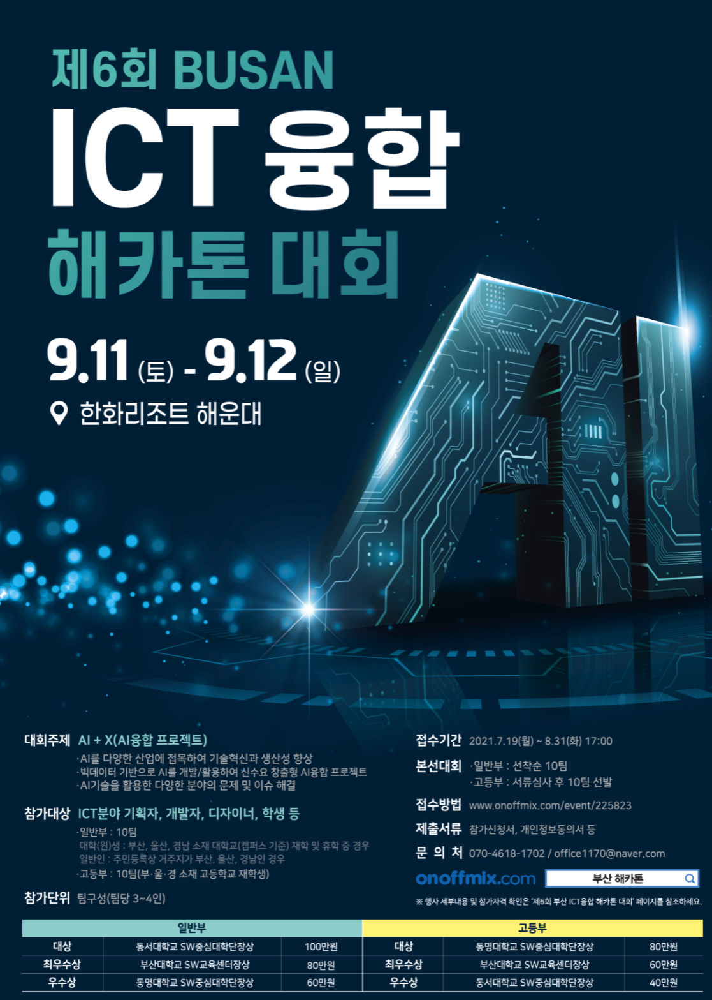  

요즘 코로나로 느슨해진 온라인 해커톤과는 다르게 한화리조트에 숙박하게 하면서 까지 무박이일로 진행하는 국밥같은 공모전이였다. 

이런 제대로 된 해커톤은 처음인데다가 해운대 리조트에 방까지 준다하니 놀러가는거 같이 괜히 설렜다.

2시까지 집합하기 전에 팀원 형들과 해운대에서 이때리 요리로 배를 채웠다.

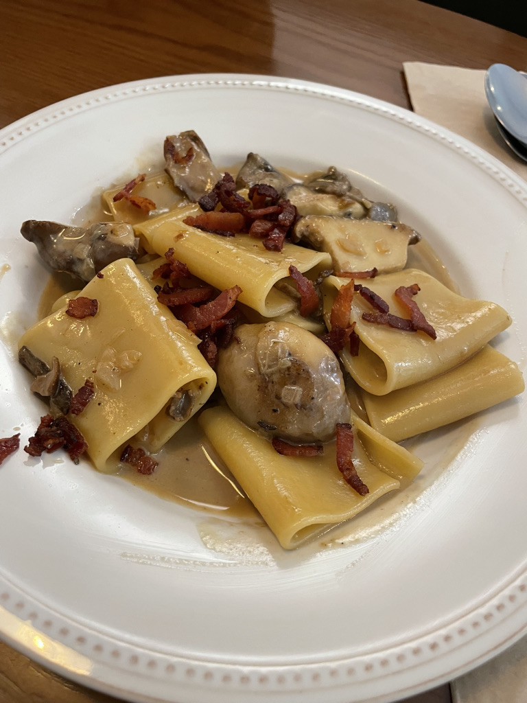  
파스타를 시켰는데 버섯 수제비가 나왔다

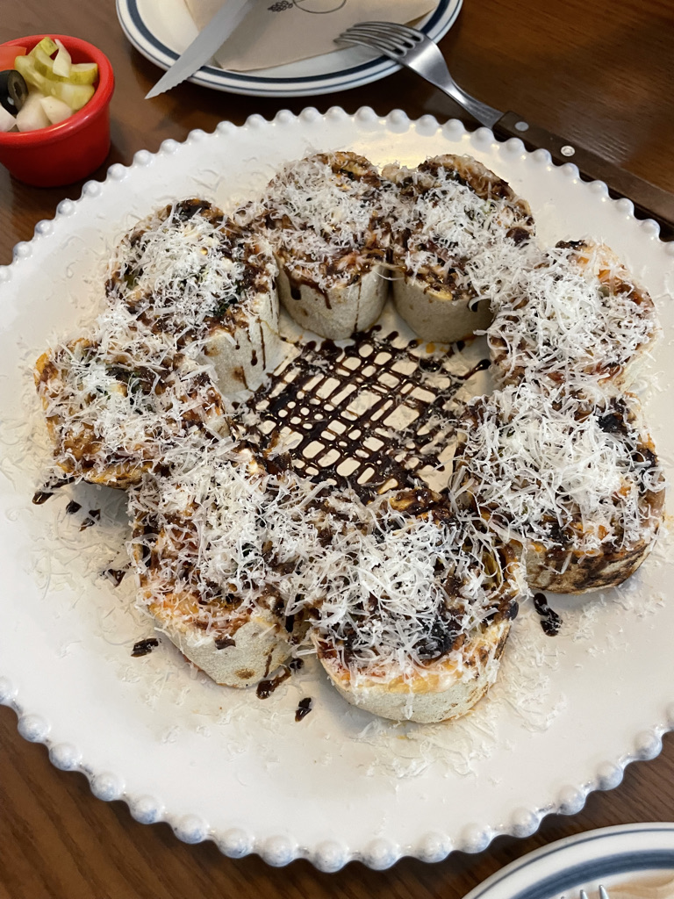  

피자를 말아서 롤피자라는데 애초에 roll한 순간부터 피자가 아니지 않나?

전날 재난지원금 25만원을 get하여 조삼모사의 원숭이마냥 신나게 결제했다.

---

대회 장소인 한화 리조트에 도착하니 다른 팀들도 꽤 도착해있었다.

막 서로 인사 나누고 하던데 아는 사람이 없는 우리 팀은 찐따처럼 가만히 기다리다가 대회 티랑 간식, 모니터링 노트북등을 가지고 숙소에 올라갔다.

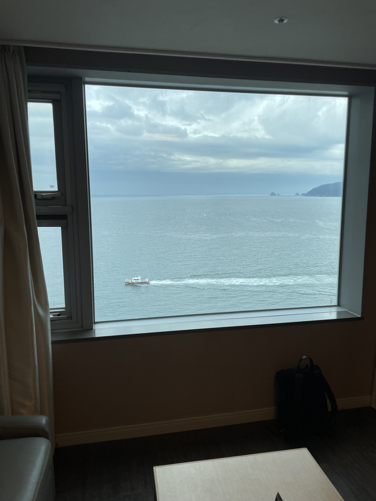  
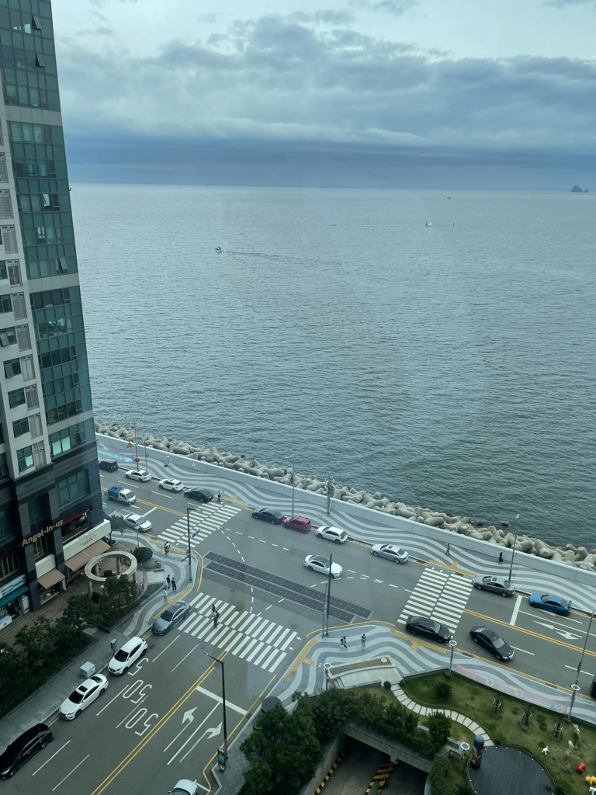  

wow 공짜 숙소주제에 꽤나 뷰가 좋다. 다만 숙소에 테이블이 없어 밥상에서 코딩해야하긴 하지만.

언택트 코로나 시대답게 설명회도 대강당에 몰아 놓고 훈화말씀하지 않고, 모두 숙소에서 Zoom으로 진행되었다.

안타깝게도 구린 wifi의 속도로 인해 알아 들을 순 없었지만, 추첨으로 발표 순서를 정했다는 사실은 알 수 있었다.

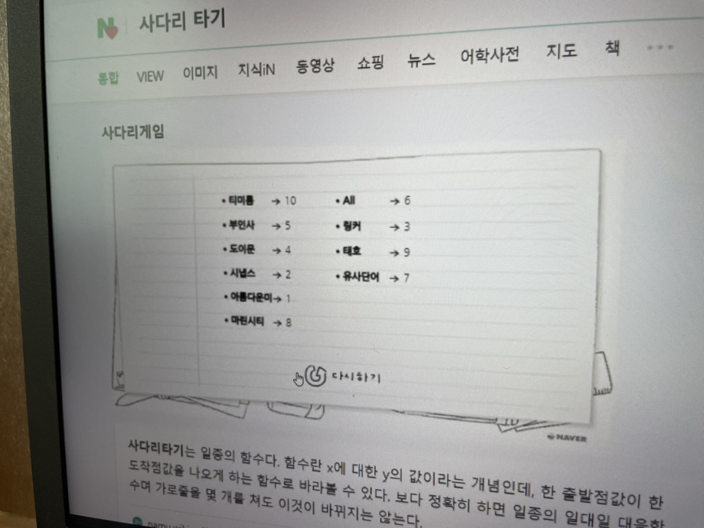
*최첨단 추첨기구 네이버 사다리 타기*

---

본격적으로 개발을 시작하면서 저녁시간 때 까지는 5명의 멘토님이 번갈아 가며 각 팀에게 조언을 해주었다.

솔직히 짧은 시간동안 뭔 말을 하던 도움이 될까 했는데, 생각보다 정말 많은 인사이트를 주셨는데,
개발만 하는 코딩경진대회가 아니라 사업성을 포함하여 여러가지 요소를 고려해야 하는 공모전임을 인지시켜 주셨다.

저녁으로는 사진은 못찍었는데 비싸보이지만 맛 없는 도시락이 나왔다. 팀원이 가격을 검색해보니 13000원이라고 한다. 반찬은 없는데 먹을 껀 없는 풍요속 빈곤...

---

다른 팀도 마찬가지겠지만 우리 팀은 어느정도 완성된 주제를 가지고 약간 변형시킬 계획이였다.
기존에 가지고 왔던 "머신러닝을 이용한 청각장애인 육아 도우미"의 하드웨어 요소를 빼고 새로 스마트 워치도 연동될 수 있도록 소프트웨어를 개발하였다.

어쩌다보니 갤럭시 워치의 타이젠 web os환경의 어플리케이션 내가 개발하게 되었는데 삼성이 왜 타이젠을 버렸는지 알 수 있는 부분이였다...^^

그 나머지는 모두 발표에 집중하였다. 짧은 시간안에 개발해낼 수 있는 건 제한되어있다. 가장 중요한 건 당연히 발표.

열심히 준비하고 새벽에 4시간정도 잔거 같다.

---

시간이 되고, 준비해서 11시까지 체크아웃하고 발표장으로 모였다.

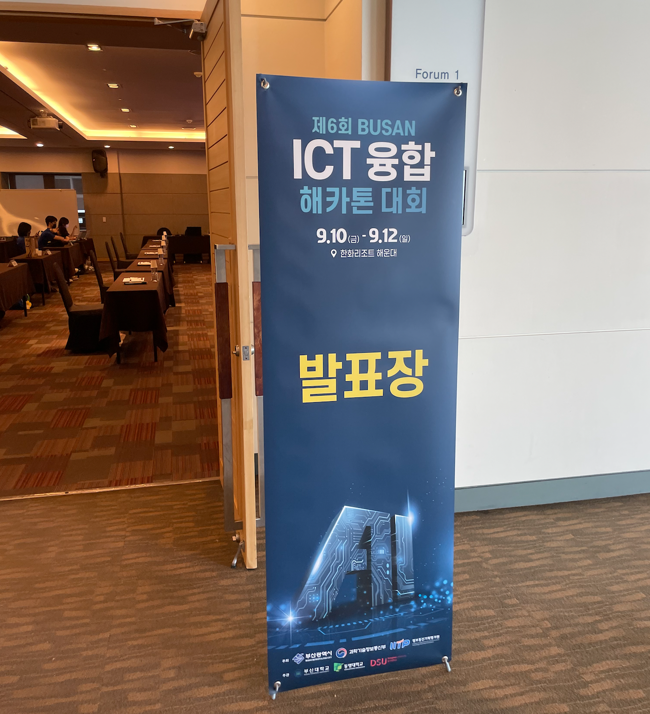  

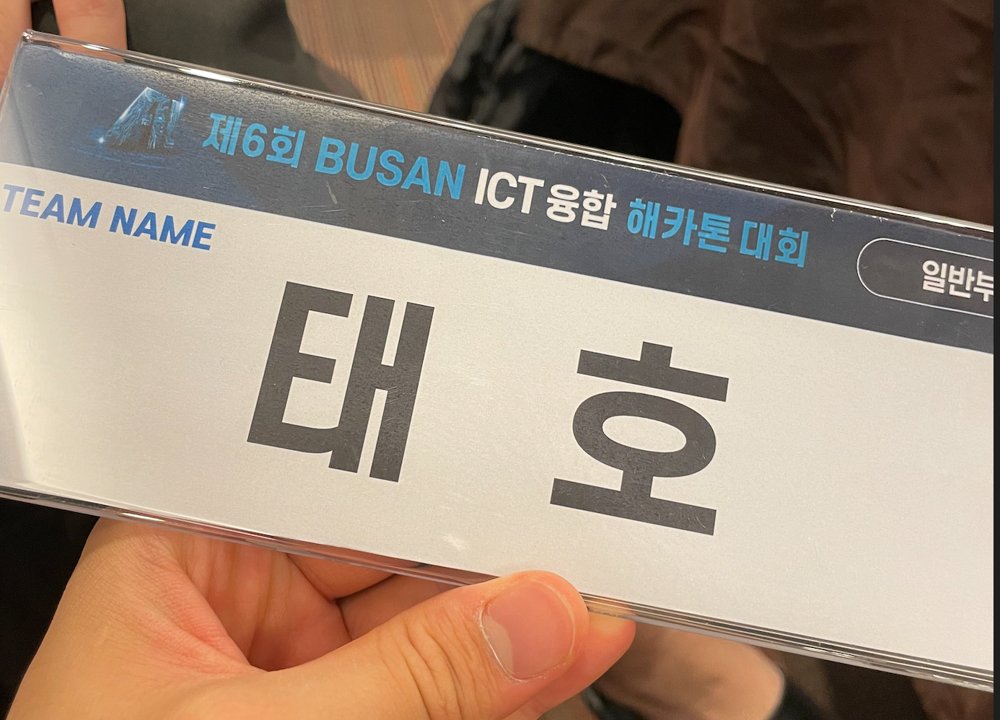  

자랑스러운 우리 태호형...^^7

*태호 팀*

*발표장*

이제 점심 식사를 하고 13시부터 대망의 발표를 기다리고 있었다.

점심은 주체측에서 한화리조트 뷔페? 식권을 나눠주었다.
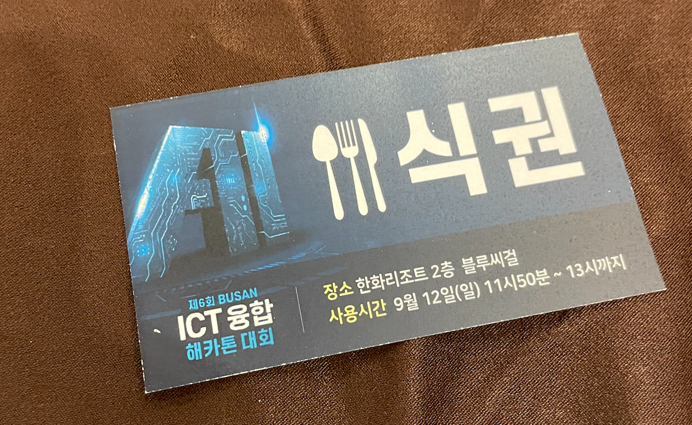  

쪼매난 호텔이지만 리조트의 블루씨걸이라.. 이름이 블루씨걸이면 해산물이 나오지 않나? 

랍스터나 새우를 기대하고 들어갔는데

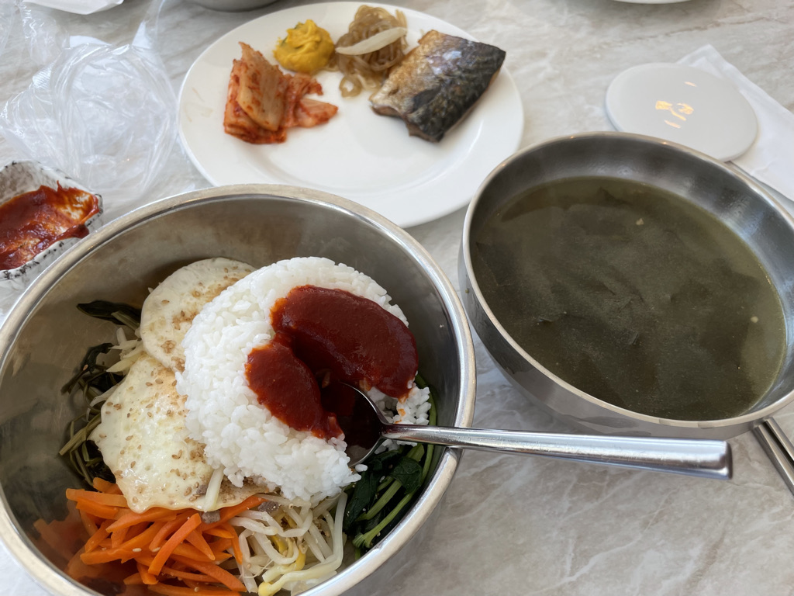  

아니 고순조에 나물비빔밥은 선넘은거 아니냐고 ㅋㅋ

군대씩 밥상에 깜짝놀란 마음을 진정시키고 발표전 마지막 준비를 위해 리조트안의 카페 올리비아를 들렀다.

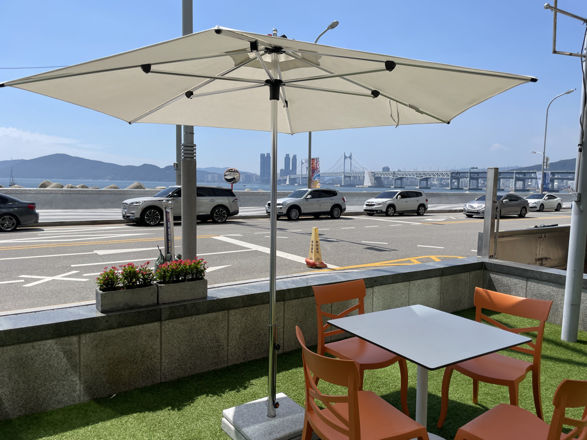  

잠은 별로 못잤지만 날씨가 좋아 잠시 나마 상쾌했다 ㅎ
같은 부산인데 해운대 오니 놀러온 느낌이 나는 신기한 경험...

---

발표가 시작되고 여러팀이 발표를 끝마치니
심사위원분들의 질문이 생각보다 엄청 날카로웠다.

쉽게 쉽게 좋아보이는 기술과 사업구조로 갈려고 한다면 질문 폭탄을 받을 수도 있겠구나 싶었다.

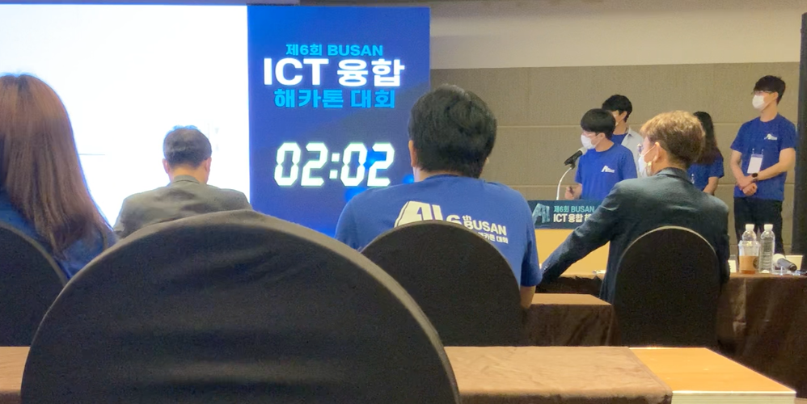

제한시간이 걸려있어 토론장 같이 시간이 지나면 아예 마이크가 꺼져버리는 방식이다.

물론 내가 발표한건 아니지만, 발표가 끝나고 질의응답 시간에서 심사위원분들에게 생각치 못했던 피드백들이 많이 날라와 어질어질했다...

---

이번 해커톤에서 10개 팀 중 3개의 상이 걸려있었는데, 아쉽게도 수상권에 들지는 못했다.
 
해커톤을 경험해보니 느끼는 점이 많은 것 같다. 일단은 피로도가 엄청나서 확실히 많이는 못 나가는게 확실하다 ㅋㅋㅋ

다음 실력이 더 쌓이고 기회가 된다면 다시 참가해보고 싶은 공모전이였다.

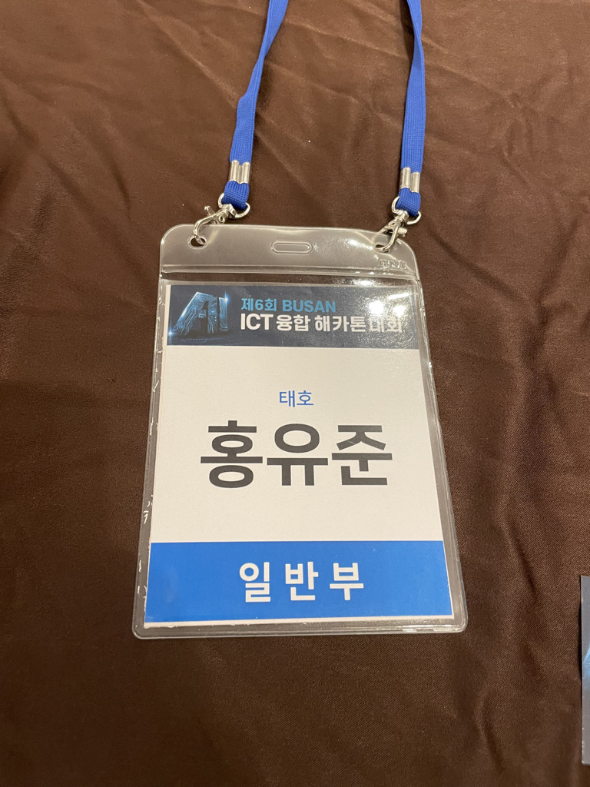  

---

끝