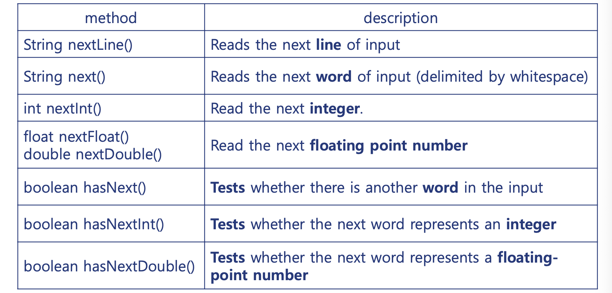
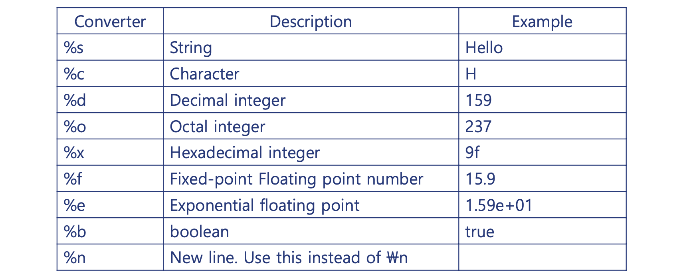
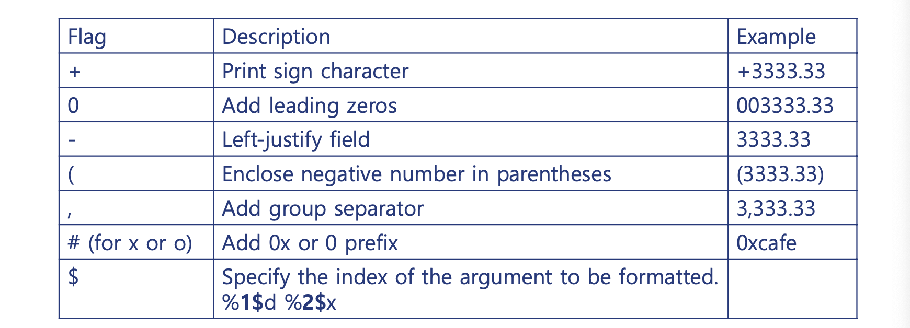

>목차
- Input
  - Scanner
  - Scanner Class
  - Scanner from String
  - Input mismatch exception
  - Exception Handling
- Output
  - Formatting

## Input
---
자바에서 표준 입력은 Scanner으로 System.in을 읽어 입력 받을 수 있다.  
`import java.util.Scanner`로 임포트하여 사용할 수 있다.

### Scanner로 입력받기

```java
final Scanner scanner = new Scanner(System.in); 

final String name = scanner.nextLine(); // 이름 입력받기

final int age = scanner.nextInt(); // 나이 입력받기
 
scanner.close(); // 종료
```

위와 같이 scanner객체의 next메소드들을 이용하여 입력 받을 수 있다.

항상 scanner 사용이 끝나면 `scanner.close()`로 종료시켜줘야 한다.ㄴ

### Scanner Class

스캐너 클래스는 아래와 같은 여러 메소드를 가진다.

  

메소드의 종류에 따라 입력하는 방법이나, data를 해석하는 방법이 다르다.

### Scanner from String 문자열 입력

Scanner는 문자열로 생성된다.

꼭 `System.in` 표준 입력이 아니여도 문자열이라면 scanner로 사용할 수 있다.

```java
final String message = "Hello World\nWelcom Java!"; 
final Scanner scanner = new Scanner(message);

while ( scanner.hasNext() ) {
    final String word = scanner.next(); 
    System.out.println(word);
}

scanner.close();
```
```
> Hello
> World
> Welcom
> Java!
```

### Input mismatch exception

Scanner를 이용한 입력에서, type에 맞지 않는 대입을 실시 하였을 때, Exception이 발생한다.

```java
final Scanner scanner = new Scanner(System.in) ; 

final int a = scanner.nextInt() ;
final int b = scanner.nextInt() ;
```
```
100
100F
> Exception in thread "main" java.util.InputMismatchException
          at java.util.Scanner.throwFor(Unknown Source)
          at java.util.Scanner.next(Unknown Source)
          at java.util.Scanner.nextInt(Unknown Source)
          at java.util.Scanner.nextInt(Unknown Source)
          at ScannerExample2.main(ScannerExample3.java:7)
```
int 자료형 `b`에 `100F`라는 실수를 입력하여 **InputMismatchException**이 발생하였다.

#### Exception Catch 예외 핸들링

이러한 exception을 **try-catch**문으로 따로 캐치하여 핸들링 할 수 있다.

```java
final Scanner scanner = new Scanner(System.in) ; 

try {
    while ( scanner.hasNext()) {
    final int n = scanner.nextInt() ;
    System.out.println(n) ; }
} catch (Exception e) {
    System.out.println("Exception: " + e) ;
    System.out.println("정수 형태의 문자열을 입력하세요!") ;
}
finally { scanner.close() ; }
```
```
100
> 100
100F
> Exception: java.util.InputMismatchException 
  정수 형태의 문자열을 입력하세요!
```


## Output
---
자바에서는 `System.out` 객체의 출력 메소드를 사용할 수 있다.

### printf() formatting
C++에서의 `printf()`함수와 같이 자바에서도 `System.out.printf()`로 출력할 수 있다.

아래는 출력 format를 사용하는 방법이다.

  
  


#### Example
  
```java
long n = 123456;
System.out.printf("%d%n", n); // 정수
System.out.printf("%10d%n", n); // 길이
System.out.printf("%-10d%n", n); // 좌측정렬
System.out.printf("%010d%n", n); // leading zero
System.out.printf("%+10d%n", n); // 부호표시
System.out.printf("%,10d%n", n); // 숫자 3개마다 comma
System.out.format("%d\t%1$#x%n%n", n); // argument index and hex

double pi = Math.PI;
System.out.printf("%n%f%n", pi); // 실수
System.out.printf("%e%n", pi); // exponential로 표현 (e+00)
System.out.printf("%10.3f%n", pi); // 길이와 소수점
System.out.printf("%10.3e%n", pi); // 길이와 소수점과 expon
System.out.printf("%+-10.3f%n", pi); // 부호와 좌측정렬과 길이와 소수점
```
```
> 123456
>     123456
> 123456    
> 0000123456
>    +123456
>     123,456
> 123456  0x1e240
> 
> 3.141393
> 3.141393e+00
>       3.142
> 3.142e+00  
> +3.142     
```