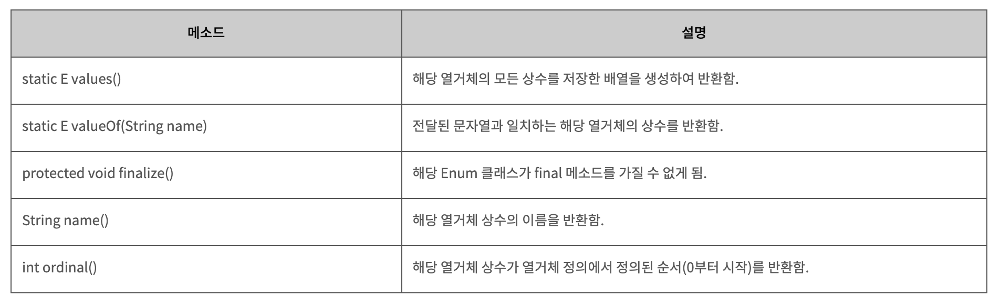

>목차
- Enumerated Type
  - Methods
  - Example1
  - Specify Const values
  - Example2

## Enumerated Type : enum 열거형
---

**enum** 자료형은 유한한 집합의 value로 변수를 특정하기 위해 사용된다.  
주로 switch의 case로 자주 들어간다.

열거체의 상수값은 0부터 선언 순서대로 증가한다.

  

```java
enum Fruit {APPLE, GRAPE, PEAR, NO_FRUIT} ;

public static void main(String[] args) {

  final Fruit apple = Fruit.APPLE ; 
  //    Fruit apple = Fruit.valueOf("APPLE") 
  System.out.println(apple) ;

  final String SaGya = getFruitKoreanName(apple); 
  System.out.println(apple.name() + "은 한글로 " + SaGya );
  // name() 해당 열거체 상수의 이름 리턴

  final Fruit fruit = getFruit(System.in);
  final String fruitName = getFruitKoreanName(fruit); 
  System.out.println(fruit.name() + "은 한글로 " + fruitName) ;
}
```
```java
// enum 형 입력받아 한글이름 문자열로 리턴
private static String getFruitKoreanName(final Fruit myFruit) { 
  String fruitName ;

  switch ( myFruit ) {
    case APPLE : 
      fruitName = "사과" ;  break ; 
    case GRAPE : 
      fruitName = "포도" ;  break ; 
    case PEAR : 
      fruitName = "배" ;   break ; 
    default : 
      fruitName = "모름" ;  break ;
  }
  return fruitName; 
}
```
```java
// 표준 입력으로 enum형 입력받기
private static Fruit getFruit(InputStream in) { 
  final Scanner scanner = new Scanner(in); 
  final String fruitName = scanner.next();
  Fruit fruit; 

  try{ fruit = Fruit.valueOf(fruitName.toUpperCase()); }
  catch(IllegalArgumentException e) { fruit = Fruit.NO_FRUIT; } 
  finally{ scanner.close(); }

  return fruit;
} 
```
```
> APPLE
> APPLE은 한글로 사과
> PEAR은 한글로 배
```

### enum 열거형의 상수값 지정

열거체의 상수값을 따로 지정하고 싶다면 이름 옆에 괄호()를 추가하여 원하는 상수 값을 명시할 수 있다.

이때는 상수값을 위한 인스턴스 변수와 생성자를 별도로 추가해야 한다.

```java
enum Currency {
  PENNY(1), NICKLE(5), DIME(10), QUARTER(25); 
  private final int value; // 특정 상수
  private Currency(final int value) { this.value = value; } 
  public int getValue() { return value; }
}
```

### example 2
```java
enum Fruit {
  APPLE("사과"), GRAPE("포도"), PEAR("배");
  private final String name;
  private Fruit(final String name) { this.name = name; }
  public String getName() { return name; } 
}
```
```java
public static void main(String[] args) {
  final Fruit[] fruits = {Fruit.PEAR, Fruit.GRAPE, Fruit.APPLE};

  for ( final Fruit fruit : fruits )
    System.out.println("The fruit is " + fruit.getName() ) ;
}
```
```
> The fruit is 배
> The fruit is 포도
> The fruit is 사과
```