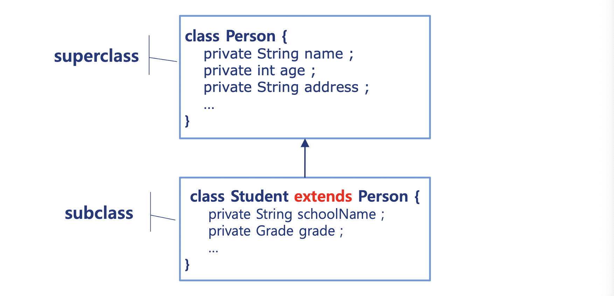
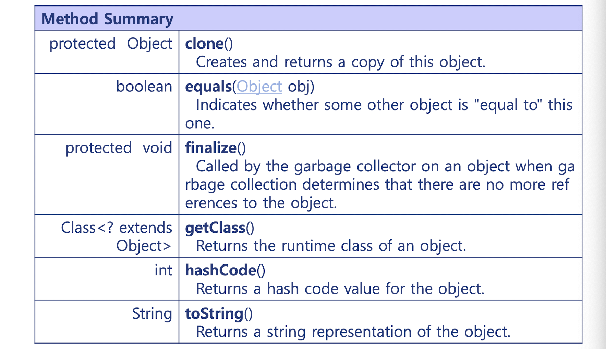
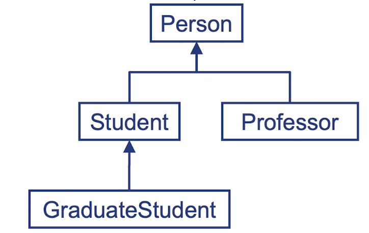
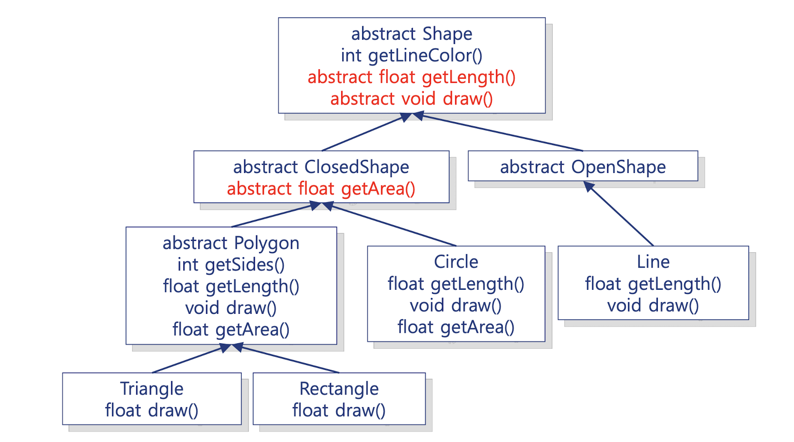

>목차
- Inheriatance
  - Construction of subclass
  - Access to the inherited members
    - Keyword super
    - Protected member
  - Overriding
  - Object
  - instanceof
  - Polymorphism
    - Abstract
    - Final


## Inheriatance 상속이란?
---
subclass는 superclass의 모든 맴버 변수와 메소드를 **상속** **Inherit** 한다.

  

위 예시외 같이 `Student` 클래스는 superclass인 `Person`을 상속 받는 subclass이다.

이때 `extends` 키워드를 통해 상속임을 나타낸다.

#### Person (superclass)
```java
class Person {
  private String name ;
  private int age ;
  private String address ;
  public Person(String name, int age, String address) {
    this.name = name ; this.age = age ; this.address = address ; 
  } 
  public String getName() { return name ; } 
  public void rename(String name) { this.name = name ; } 
  public int getAge() { return age ; } 
  
  public void increaseAge() { age ++ ; } 
  public String getAddress() { return address ; }
  public void moveTo(String address) { this.address = address ; } 
  
  @Override public String toString() {
  return String.format("%s, %d, %s", name, age, address) ; 
} // override hashCode() and equals()
```
#### Student (subclass)
```java
public class Student extends Person {
  private String schoolName ;
  private Grade grade = new Grade();

  public Student(String name, int age, String address, String schoolName) {
    super(name, age, address) ; 
    this.schoolName = schoolName ;
  }

  public String getSchoolName() { return schoolName ; }
  public void setSchoolName(String schoolName) { this.schoolName = schoolName ; } 
  public Grade getGrade() { return grade ; } 
  public void upGrade() { grade.upGrade() ; } 
  
  @Override public String toString() {
  return String.format("%s, %d, %s, %s, %s",
    getName(), getAge(), getAddress(), schoolName, grade) ; 
  } // override hashCode() and equals()
}
```

`Student` 클래스는 `Person`의 inherited public member에 모두 접근 가능하다.

```java
Student s1 = new Student("james", 19, "Busan", "PNU");
s1.rename("dancingMachineRalo"); // Person의 메소드에 접근
```

### Keyword "super"

또한 `super()` 키워드를 통해 상위 클래스의 생성자를 사용할 수 있다.  
다만 생성자에서 가장 첫 번째 줄로만 사용해야 한다.
```java
public Student(String name, int age, String address, String schoolName) {
  super(name, age, address) ; 
  this.schoolName = schoolName ;
}
```

### Access to inherited mebers 맴버 접근
1. **Private** 
  - 클래스 내부에서만 접근 가능하며 그 외에는 아무도 못 건들인다.
2. **Public**
  - 내부든 외부든 누구나 접근 가능하다.
3. **Protected**
  - Private와 마찬가지로 외부에서 접근 불가능 하지만 자식 클래스에서는 가능하다.

#### Protected member

`protected` 키워드는 private한 맴버 변수나 메소드를 자식 클래스에 한하여 접근 가능하도록 해준다.

유용하지만 protected를 남발하면 maintainabillity를 잃고 맴버가 전역변수처럼 쓰일 수 있으므로 제한적으로 사용하는 것이 좋다.

#### super
키워드 `super`를 통해 부모 클래스를 지칭할 수 있다.
```java
class Student extends Person {
  private String name ;
  private Grade grade = new Grade();

  public String toString() {
    return String.format("%s, %d, %s, %s, %s",
      super.name, age, address, name, grade) ;  
      // super(Person).name vs this(Student).name
  }
}
```

### Overriding
superclass를 상속받은 subclass는 상위 클래스의 맴버 메소드를 **Overriding**할 수 있다.

- Overriding : 하위 클래스가 같은 이름, 같은 인자의 함수를 정의하는 것.
- Overloading : 같은 클래스 내에서 같은 이름의 함수를 인자 값을 다르게 받아 정의하는 것.

```java
class Person {
  public void toString() { return ...; }
}

class Student extends Person {
  @Overriding
  public void toString() {return ...;  }
}
```

### Object
`Object`클래스는 모든 객체의 superclass이다.

상속받지 않는 모든 객체는 Object객체를 상속 받지만 문법상에서 생략된다.

즉 자동적으로 모든 클래스는 defalut로 Object 객체를 상속한다.

#### Object 클래스의 메소드
  


### Polymorphism 다형성

Superclass의 변수는 자손 클래스의 어떠한 객체도 point할 수 있다.

즉 부모 클래스의 레퍼런스는 자식 클래스의 객체를 참조할 수 있다는 뜻이다.

앞서 계속 예제로 들었던 `Person`과 그 자식 `Student` 클래스를 살펴보자
```java
Person p1  = new Person();
Student s1 = new Person();

Person p2;
p2 = p1; // 당연히 OK
p2 = s1; // 자식을 참조 -> OK!

Student s2;
s2 = s1; // 당연히 OK
s2 = p1; // ERROR!! 자식이 부모를 참조할 수 없다.
s2 = (Student) p1; // OK! but 캐스팅이 필요하고 권장되지 않는다.
```

위와 같이 부모는 자식을 참조 가능하지만, 자식은 바로 부모를 참조할 수 없다.

예제를 하나 더 살펴보자

```java
Person p1  = new Person();
Person p2  = new Person();
Student s1 = new Student();
Student s2 = new Student();

Person[] list = {p1, p2, s1, s2}; 
// Person 레퍼런스만 선언되고 객체는 아직 생성되지 않았다.

for ( Person p: list )
  System.out.printf("%s, %d%n", p.getName(), p.getAge()) ;
// Person p = s1, s2 로 자식을 참조 가능하다!!
```
마찬가지로 ranged based 반복문의 Person p가 Student 클래스의 s1, s2를 참조 가능하다.

#### instanceof
상위 클래스가 하위 클래스를 참조한다면 그 클래스가 실제로 어떤 클래스인지는 어떻게 구분할까?

이때 사용가능한 연산자가 `instanceof` 이다.

위 예제와 마찬가지로 `Person[]`에서 반복문을 돌린다고 하자.
```java
Person[] list = {p1, p2, s1, s2}; 

for ( Person p: list ) {
  if(p instanceof Student) {// Student 클래스인것만 통과
    Student s = (Student) p; // Student로 사용하기 위해 캐스팅 해준다.
    System.out.printf("%s, %d%n", s.getSchoolName(), s.getGrade()) ;
  }
}
```
`instanceof Student`를 사용하여 필터링 할 수 있음을 확인가능하다.

### Inheritance Hirarchy 상속 계층구조

  

상속은 부모-자식 2대가 끝이 아니라 자식을 상속받은 또 다른 자식 클래스를 생성함으로써 계층적인 설계의 프로그램을 만들 수 있다.

### Abstract 추상 클래스, 메소드

메소드에 Abstract 키워드를 붙인다면 온리 상속만 받아 사용하겠다는 굳건한 의지를 보여줄 수 있다.

이러한 메소드는 함수의 내용이 정의되지 않으며 자식클래스에서 오버라이딩된 형태로만 사용된다.
```java
public abstract void draw(); // 내용이 없다.
```

abstract를 사용하기 위해서는 클래스 자체 역시 추상 클래스여만 사용할 수 있다.

```java
public abstract class AbstractClass {
  ...
}
```

abstract 추상 클래스 역시 상속을 받아 사용할 것이라는 의지를 가졌기 떄문에 new 키워드를 통해 생성할 수 없다. 

오직 자식만이 상속받아 사용 가능하다.

물론 추상 메소드가 없어도 추상 클래스로써 정의 가능하다.

  

위 그림은 같이 abstract를 활용한 상속 계층 구조를 나타내었다.


### Final 최종 클래스, 메소드

`final` 키워드로 선언된 클래스는 상속 받을 수 없다.

이름에서 알 수 있듯이 더 이상 자식을 두지 않는 최종 클래스라는 의미를 띈다.

```java
final class Teacher extends Person{
  ...
}

class MathTeacher extends Teacher {}// ERROR!!
```

마찬가지로 `final` 키워드를 메소드에 사용한다면 더 이상 하위 클래스에서 이 함수를 오버라이딩 받을 수 없다.

```java
class Student extends Person {
  public final String getSchoolName();
}

class FemaleStudent extends Student {
  @Overriding
  public String getSchoolName(); // ERROR!!
}
```