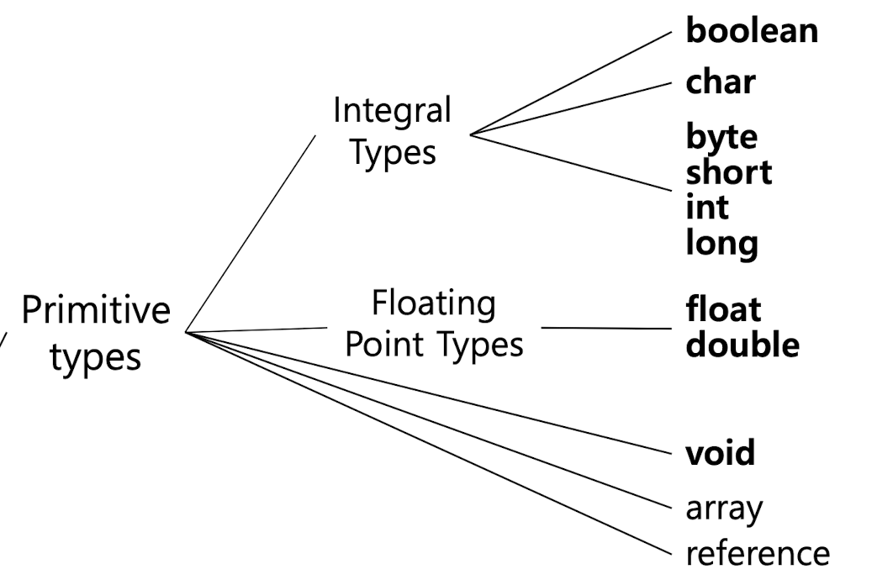
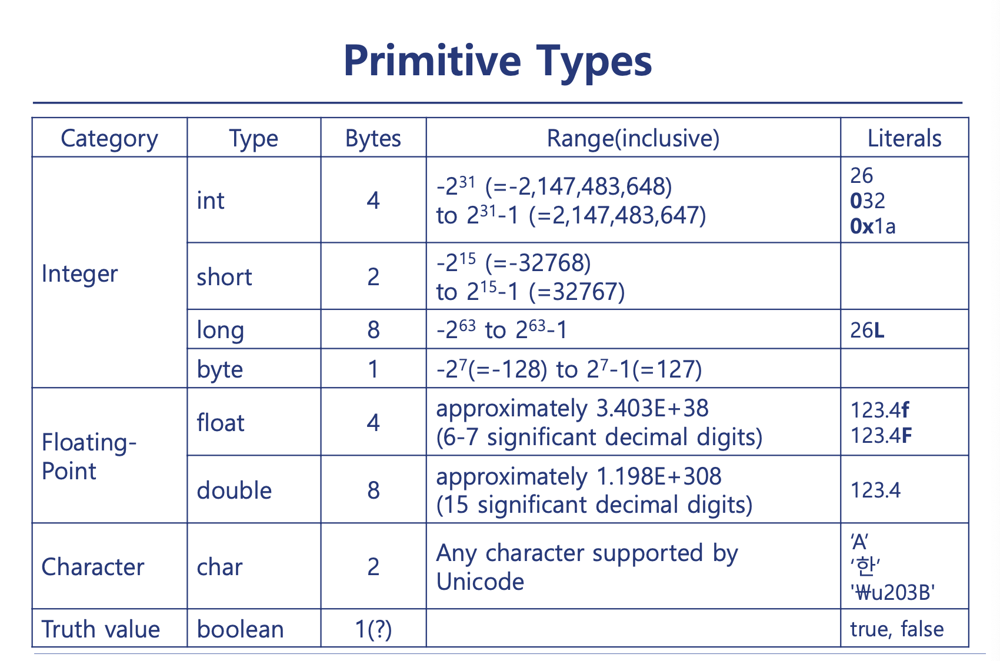
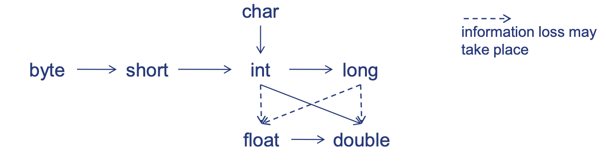
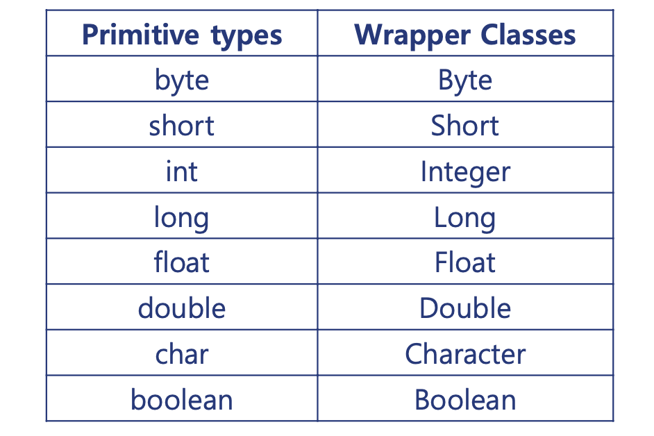

>목차
- Primitive Types
  - Type Cast
- Wrapper Class
  - Conversion
  - Auto Boxing & UnBoxing
  - Useful Features
  - When to Use?


## Primitive Types
---


  

자바에서는 기본 자료형 **primitive type**들이 존재한다.

다른 언어들과 마찬가지로 **정수**, **실수**, **문자**와 **부울 대수**의 자료형을 가지고 있다.
  

### Type Conversion 형변환

type끼리 **형변환**이 가능하다.

#### Impicit Conversion 묵시적 형변환

numeric 숫자의 자료형끼리는 자동적으로 **형변환**이 가능하다.
  
다만 (int) ➡️ (float)와 같은 경우 데이터 타입의 한계에 따라 data의 손실이 존재 할 수 있다.

#### Explicit Cast 명시적 형변환
```java
double x = 999.7;
int nx1 = (int) x;
int nx2 = (int) Math.round(x);
```
위와 같이 double형의 자료형 `x`를 `(int)`라는 명시적인 문법으로 캐스팅 할 수 있다.

## Wrapper Class
---
자바에 는 primitive numeric 자료형들을 위한 **wrapper class**가 존재한다.

Primitive types와 다르게 대문자로 시작되는 키워드로 선언 가능하다.

  

```java
int intValue = 10;               // primitive integer
Integer integerValue = intValue; // integer Wrapper class
```

### Conversion : Primitive ➡️ Wrapper

위 코드와 같이 primitive type을 wrapper class로 형변환 하는데는 2가지 방법이 존재한다.

1. **Constructor** 생성자 사용
```java
Integer integer1 = new Integer(10);  // 자바9 이상부터 지원
```

2. Static factory method : **valueOf()** 사용
```java
Integer integer2 = Integer.valueOf(20);
```

### Conversion :  Wrapper ➡️ Primitive
Wrapper class 자료형을 primitive로 바꾸기 위해서는 **xxxValue()** 메소드를 사용하면 된다.

   
```java
Integer integer = new Integer(128);

int intValue = integer.intValue();
short shortIntValue = integer.shortValue();
long longIntValue = integer.longValue();
byte byteValue = integer.byteValue(); // overflow -> -128
```

### Boxing
Wrapper class는 primitive 자료형을 한 층 더 감싸고 있어 box에 담아놓은 것과 같다.
#### Boxing & UnBoxing
- Primitive type 을 wrapper class로 바꾸어 주는 것을  **Boxing**  이라고 한다.
- Wrapper class을 Primitive type으로 바꾸어 주는 것을 **Unboxing**이라고 한다.

#### Auto Boxing & UnBoxing
자바에서는 이러한 작업들을 자동적으로 casting 되도록 지원한다.
```java
// Auto Boxing
List<Integer> integerList = new ArrayList<>();
for (int i = 1; i < 10; i ++)
    integerList.add(i); // add(Integer.valueOf(i))가 생략됨


// Auto Unboxing
int sumOfEven = 0;
for (Integer i : integerList)
    if(i % 2 == 0) sumOfEven += i ; // i.intValue()가 생략됨
```

#### Useful Features
Wrapper 클래스는 이러한 Box를 가짐으로써 여러가지 유용한 **변수**와 **메소드**등을 제공한다.
```java
byte b ;
if ( integerValue <= Byte.MAX_VALUE ) 
    b = integerValue.byteValue() ; 

Double d;
if ( Double.isInfinite(d) ) ...
if ( d.isInfinite() ) ...
if ( Double.isNaN(d) ) ...
if ( d.isNaN()) ...
```

#### Wrapper class는 언제 사용하는가?
자바에서의 `Collections`는 오직 `object`로만 다룬다.  
EX : `ArrayList<>`

이러한 클래스에 primitive type을 저장하기 위해서는 반드시 wrapper class로 wrap해주어야 한다.
```java
List<int> ints = new ArrayList<>(); // ERROR!!!

List<Integer> integers = new ArrayList<>(); // GOOD!!
```


