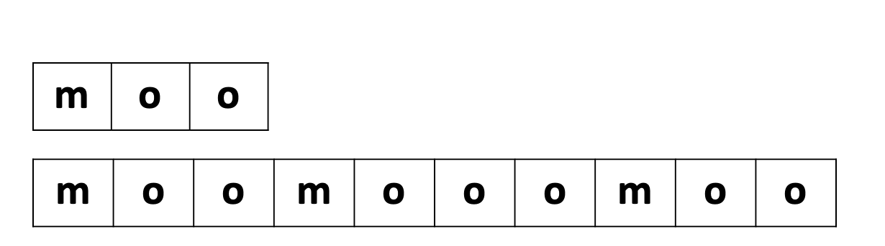

# BOJ #5904 Moo 게임

## 문제

---

Moo는 술자리에서 즐겁게 할 수 있는 게임이다. 이 게임은 Moo수열을 각 사람이 하나씩 순서대로 외치면 되는 게임이다.

Moo 수열은 길이가 무한대이며, 다음과 같이 생겼다.

```
m o o m o o o m o o m o o o o m o o m o o o m o o m o o o o o
```

Moo 수열은 다음과 같은 방법으로 재귀적으로 만들 수 있다. 먼저, S(0)을 길이가 3인 수열 "m o o"이라고 하자. 1보다 크거나 같은 모든 k에 대해서, S(k)는 S(k-1)과 o가 k+2개인 수열 "m o ... o" 와 S(k-1)을 합쳐서 만들 수 있다.

```
S(0) = "m o o"
S(1) = "m o o m o o o m o o"
S(2) = "m o o m o o o m o o m o o o o m o o m o o o m o o"
```

위와 같은 식으로 만들면, 길이가 무한대인 문자열을 만들 수 있으며, 그 수열을 Moo 수열이라고 한다.

N이 주어졌을 때, Moo 수열의 N번째 글자를 구하는 프로그램을 작성하시오.

## 입력

---

첫째 줄에 N (1 ≤ N ≤ 10^9)이 주어진다.

## 출력

---

N번째 글자를 출력한다.

## 풀이

---



문자열 S(0)와 S(1)


S(k)는 S(k-1)과 o가 k+2개인 수열 "m o ... o" 와 S(k-1) 이므로

S(1)은 위와 같이 S(0) + "m+(1+2) 개의 o + S(0) 이다.

 


일반화 하면 위와 같이 나타 낼 수 있다.

---

점화식을 세웠으므로 N이 포함되는 S(i)까지의 수열의 길이를 **bottom-up** 으로 구할 수 있다.

길이를 구하여 tabulation 하고, N번째 글자를 포함하는 수열의 인덱스를 구하기 위해  `get_moolen()` 을 선언

```cpp
int N;
vector<int> moolen(30);

int get_moolen(){
    moolen[0] = 3;
    for(int i=1;1;i++){
        moolen[i] = 2 * moolen[i-1] + i + 3;
        if(moolen[i] > N) return i;
    }
}
```

입력 N은 1부터 10의 9승 까지이다.

moo 수열의 길이는 다음 수열로 넘어갈 때마다 약 2배 조금 더 씩 증가한다.

2^30 = 1073741824 > 10^10 이므로 moolen의 벡터공간의 크기는 30개 정도면 충분히 들어갈 것이다.

N번째 글자가 포함되는 길이의 moo 수열 까지만 필요하므로

moo수열의 길이가 N보다 커지면 종료하고, 다음 함수를 위해 인덱스를 반환한다.

---

만약 `get_moolen()` 함수를 돌려서 N번째 글자를 포함하는 수열 S(i) 가 있다고 하자.


1. 중간 "moo...o" 구간에 위치한 경우
    - `moolen[i-1]` **≤** `N` **<**  `moolen[i-1]` + `i` + 3

        ⇒ 첫번째 ***m*** 출력  or   나머지 ***o*** 출력

2. 오른쪽 S(i-1) 구간

- `moolen[i-1]` + `i` + 3 **≤** `N`


3. 왼쪽 S(i-1) 구간


총 3가지 경우

```cpp
if(moolen[i-1] >= n) // s(i-1)을 호출. 시작점부터 길이 동일 

else if(moolen[i-1] + i + 3 < n) // s(i-1)을 호출하되 시작점부터 길이 짧아짐

else // 중간 mo...o 구간

// 구간의 첫번째 이면 m 아니면 o 출력
```

함수 `get_char()`

```cpp
void get_char(int i, int n){
    if(!i){
        if(n==1) cout << 'm';
        else cout << 'o';
        return;
    }
    
    if(moolen[i-1] >= n) get_char(i - 1, n);
    else if(moolen[i-1] + i + 3 < n) get_char(i - 1, n - (moolen[i-1] + i + 3));
    else
        if(n - moolen[i-1] == 1) cout << 'm';
        else cout << 'o';
}
```

`get_char()` 함수는 `i` 와 `n` 을 매개 변수로 받는데,

- `i` 는 함수를 재귀적으로 호출되면서 현재 가르키고 있는 `moolen[]` 의 인덱스이다.
- `n` 은 현재 위치한 `moolen[i]` 의 시작점 부터 타겟 까지의 길이이다.

---

```cpp
#include <iostream>
#include <vector>
using namespace std;

int N;
vector<int> moolen(30);

int get_moolen(){
    moolen[0] = 3;
    for(int i=1;1;i++){
        moolen[i] = 2 * moolen[i-1] + i + 3;
        if(moolen[i] > N) return i;
    }
}

void get_char(int i, int n){
    if(!i){
        if(n==1) cout << 'm';
        else cout << 'o';
        return;
    }
    
    if(moolen[i-1] >= n) get_char(i - 1, n);
    else if(moolen[i-1] + i + 3 < n) get_char(i - 1, n - (moolen[i-1]+i+3));
    else
        if(n - moolen[i-1] == 1) cout << 'm';
        else cout << 'o';
}

int main(){
    cin >> N;
    get_char(get_moolen(), N);
}
```
