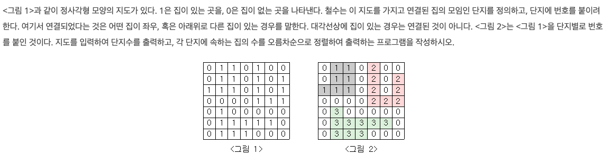

## [BOJ #2667 단지번호붙이기](https://www.acmicpc.net/problem/2667) 


## 문제
---
  


## 문제 접근 및 풀이
---

N x N 크기의 정사각형에서 각각의 연결된 집의 수와 그룹의 갯수를 알아내면 된다.  
**연결**된 집을 탐색해야하므로 상하좌우로 연결된 그래프라고 생각한 후 dfs를 돌릴 수 있겠다.


## 코드
---

```cpp
int N; string inp;

void input(vector<vector<bool>> &map, int N) {
    for(int i=0;i<N;i++){
        cin >> inp;
        for(int j=0;j<N;j++)
            if(inp[j]=='1') map[i][j] = true;
    }
}

int countHouses(vector<vector<bool>> &map, int i, int j) {
    int count = 1;
    map[i][j] = false;
    if(j!=N-1 && map[i][j+1]) count += countHouses(map, i, j+1);
    if(i!=N-1 && map[i+1][j]) count += countHouses(map, i+1, j);
    if(j!=0   && map[i][j-1]) count += countHouses(map, i, j-1);
    if(i!=0   && map[i-1][j]) count += countHouses(map, i-1, j);
    return count;
}

int main() {
    cin >> N;
    vector<vector<bool> > map(N, vector<bool>(N));
    multiset<int> complex;

    input(map, N);

    for(int i=0;i<N;i++) for(int j=0;j<N;j++) 
        if(map[i][j]) complex.insert(countHouses(map, i, j));

    cout << complex.size() << '\n';
    for(auto &w : complex) cout << w << '\n';
}
```

2차원 배열 map에 위치 정보를 저장한다.  

그리고 전체를 배열을 훑으면서 집을 발견하면  
`countHouses()` 를 통해 dfs로 탐색함과 동시에 마킹 해제한다.  

재귀적으로 호출되며, 마지막에는 탐색한 노드(집)의 수를 반환하게 된다.

반환된 집의 갯수는 오름차 순으로 정렬하기 위해 set 자료구조인 `complex`에 저장하였다.