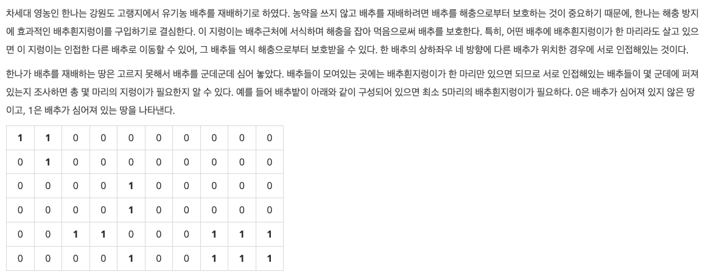

## [BOJ #1012 유기농 배추](https://www.acmicpc.net/problem/1012) 


## 문제
---
  


## 문제 접근 및 풀이
---

N x M 크기의 배열에서 연결된 배추 그룹의 수의 갯수를 알아내면 된다.  
2667번 문제와 마찬가지로 **연결**된 배추들을 탐색해야하므로 상하좌우로 연결된 그래프라고 생각한 후 dfs를 돌릴 수 있겠다.


## 코드
---

```cpp
int T, M, N, K; 

void input(vector<vector<bool> > &map) {
    int i, j, k = K;
    while(k--){
        cin >> i >> j;
        map[j][i] = true;
    }
}

int searchBaechu(vector<vector<bool> > &map, int i, int j) {
    int count = 1;
    map[i][j] = false;
    if(j!=M-1 && map[i][j+1]) count += searchBaechu(map, i, j+1);
    if(i!=N-1 && map[i+1][j]) count += searchBaechu(map, i+1, j);
    if(j!=0   && map[i][j-1]) count += searchBaechu(map, i, j-1);
    if(i!=0   && map[i-1][j]) count += searchBaechu(map, i-1, j);
    return count;
}

int main() {
    cin >> T;
    while(T--) {
        cin >> M >> N >> K;
        vector<vector<bool> > map(N, vector<bool>(M));
        
        input(map);
        int count = 0;
        for(int i=0;i<N;i++) for(int j=0;j<M;j++) 
            if(map[i][j]) {
                searchBaechu(map, i, j);
                count++;
            }
        cout << count << '\n'; 
    }
}
```

2차원 배열 map에 배추 위치 정보를 저장하였다.

N x M 배열을 한 바퀴 돌면서 배추가 존재하는 노드를 찾는다면,  
시작점에서부터 dfs를 돌리며 마킹 해제한다.

한번 돌릴 때 마다 카운팅하며 이는 곧 문제의 답
