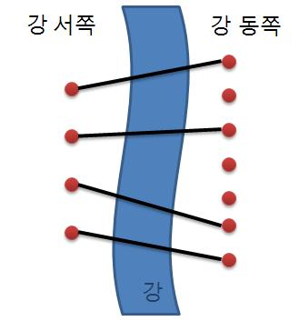
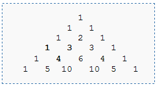

## 다이나믹 프로그래밍(DP)이란?

---

- 여러 개의 하위 문제를 먼저 푼 후 그 **결과를 쌓아 올려** 주어진 문제를 해결하는 알고리즘
- 문제 해결을 위한 점화식을 찾아 밑에서 (혹은 위에서) 부터 차례로 답을 구해나가는 형태이다

### 간단한 예제 : 피보나치 수열

```cpp
int fibo(int n) {
	if(n <= 1) return 1;
	return fibo(n-1) + fibo(n-2);
}
```

피보나치 수열을 분할 정복 알고리즘으로 재귀적으로 구한다면 중복되는 연산이 발생하여 효율적이지 않음

예로 `fibo(5)` = `fibo(4) + fibo(3)` = `fibo(3) + fibo(2) + fibo(3)`  을 보자.

`fibo(3)` 의 결과 값은 저장되지 않음으로 알고리즘 과정에서 중복 연산하게 된다.

```cpp
int fibo(int n) {
	int f[20];
	f[0] = f[1] = 1;

	for(int i=2;i<=n;i++)
		f[i] = f[i-1] + f[i-2];

	return f[n];
}
```

| i : 인덱스 | 0 | 1 | 2 | 3 | 4 | 5 |
| --- | --- | --- | --- | --- | --- | --- |
| f[i] : 메모 | 1 | 1 | 2 | 3 | 5 | 8 |

그런데 이를 DP로 해결하면 이렇게 이미 `f` 라는 배열을 만들어 두고,

0번째부터 점화식 `f[i] = f[i-1] + f[i-2]` 으로 채워서 중간 결과를 저장함으로 시간복잡도 상에서 이득을 취할 수 있다.

## 문제 해결 전략

---

> **DP 를 푸는 과정**
> 
> 1. 점화식 찾기
> 2. 초기값 설정하기
> 3. dp를 위한 테이블을 정의한다.

DP를 풀기 위해서는 먼저 테이블을 정희해야 하고 점회식을 찾은 후 초기값을 정해야 한다.

코딩테스트에 나올 수준의 DP 문제는 일단 점화식을 찾고 나면 구현이 어렵지 않다고 한다.

하지만 다양한 문제를 풀어봤거나 수학적 직관력이 높지 않은 이상 문제에서 점화식을 이끌어 내는 과정이 쉽지는 않고 무엇보다 **DP 문제라는 사실 자체를 알아차리지 못 할** 가능성이 있음.

→ 많고 다양한 유형을 학습하고 숙달하는 것이 중요

## Top-down vs Bottom-up

---

dp를 구현할 때 **Top-down** 방식과  **Bottom-up** 방식으로 풀 수 있다.

두 방법 모두 큰 문제를 여러개의 부분 문제들로 나누어 풀지만, 

**바텀업(상향식)** 은

```cpp
int fibo(int n) {
	int f[20];
	f[0] = f[1] = 1;
	for(int i=2;i<=n;i++) 
		f[i] = f[i-1] + f[i-2];

	return f[n];
}
```

- 가장 작은 문제를 해결 후 중간 결과를 저장하며 전체 문제의 답을 찾는 방식이다.
- 반복문을 이용해 구현한다.
- 탑다운에 비해 재귀 호출로 인한 오버 헤드를 줄일 수 있다.

**탑다운(하향식)** 은 

```cpp
int f[20];

int fibo(int n) {
	if(f[n]!=0) return f[n];
	if(n <= 1) return 1;
	return fibo(n-1) + fibo(n-2);
}
```

- 가장 큰 문제를 방문 후 중간 결과를 저장하며 작은 문제를 호출하는 방식이다.
- 재귀호출을 이용하여 구현한다.
- 점화식을 이해하기 쉽다. (보다 더 자연스럽게 접근 가능)
- 스택오버플로우의 위험 존재

bottom-up 이 더 전형적인 풀이 방법이라고는 한다.

하위 문제가 복잡하여 점화식이 떠오르지 않을 경우 탑다운으로 접근해보는게 좋다고 함

자신이 더 쉽게 구현할 수 있는 방법을 사용하도록 하자

[참고](https://inginious.org/course/competitive-programming/dp-topdown-bottomup)

## 문제 풀이

---

### 다리 놓기 : S5

재원이는 한 도시의 시장이 되었다. 이 도시에는 도시를 동쪽과 서쪽으로 나누는 큰 일직선 모양의 강이 흐르고 있다. 하지만 재원이는 다리가 없어서 시민들이 강을 건너는데 큰 불편을 겪고 있음을 알고 다리를 짓기로 결심하였다. 강 주변에서 다리를 짓기에 적합한 곳을 사이트라고 한다. 재원이는 강 주변을 면밀히 조사해 본 결과 강의 서쪽에는 N개의 사이트가 있고 동쪽에는 M개의 사이트가 있다는 것을 알았다. (N ≤ M)

재원이는 서쪽의 사이트와 동쪽의 사이트를 다리로 연결하려고 한다. (이때 한 사이트에는 최대 한 개의 다리만 연결될 수 있다.) 재원이는 다리를 최대한 많이 지으려고 하기 때문에 서쪽의 사이트 개수만큼 (N개) 다리를 지으려고 한다. 다리끼리는 서로 겹쳐질 수 없다고 할 때 다리를 지을 수 있는 경우의 수를 구하는 프로그램을 작성하라.

  


서쪽의 사이트와 동쪽의 사이트를 겹침없이 연결하는 방법의 수를 구한다.

이는 $C(N, M)$ 조합을 구하는 것과 같으므로 결국 조합을 구현하면 된다.

DP 로 문제를 풀 것이므로 이 조합을 채워나가는 점화식을 찾아내면 된다.

이러한 점화식으로 널리 알려진 **파스칼의 삼각형**을 활용한다.

  


알다싶이 위 두수의 합은 아래 수와 같다는 점을 이용해서 점화식을 세운다.

$C(N, M) = C(N-1, M) + C(N-1, M-1)$

```cpp
int comb[30][30];

int combination(int n, int r) {
    if(comb[n][r]) return comb[n][r];

    if(n==r | r==0) {
        comb[n][r] = 1;
        return 1;
    }
    comb[n][r] = combination(n-1, r) + combination(n-1, r-1);
    return comb[n][r];
}

int main() {
		int N, M, T;
    cin >> T;
    comb[0][0] = comb[1][0] = comb[0][1] = 1;
    while(T-- && cin >> N >> M) cout << combination(M, N) << '\n';
}
```

하향식으로 원하는 결과까지 내려가며 해를 구하는 알고리즘이다.

이미 dp 테이블에 메모이제이션 된 값은 바로 반환해줘 중복 연산하지 않도록 해준다.

### 1, 2, 3 더하기 : S3

정수 4를 1, 2, 3의 합으로 나타내는 방법은 총 7가지가 있다. 합을 나타낼 때는 수를 1개 이상 사용해야 한다.

- 1+1+1+1
- 1+1+2
- 1+2+1
- 2+1+1
- 2+2
- 1+3
- 3+1

정수 n이 주어졌을 때, n을 1, 2, 3의 합으로 나타내는 방법의 수를 구하는 프로그램을 작성하시오.

먼저 테이블을 채워넣기 위한 초기값을 살펴보자

- fx(1) = 1
    - ( 1 )
- fx(2) = 2
    - ( 1 + 1 ) , ( 2 )
- fx(3) = 4
    - ( 1 + 1 + 1 ) , ( 2 + 1 ) , ( 1 + 2 ) , ( 3 )
    

그 다음 fx(4) 를 어떻게 구해볼 지 생각해보자

- 1 + (3) 의 형태인 경우
    - 3은 fx(3) = 4 이므로 4가지 존재
- 2 + (2) 의 형태인 경우
    - 2는 fx(2) = 2 이므로 2가지 존재
- 3 + (1) 의 형태인 경우
    - 1는 fx(1) = 1 이므로 1가지 존재
    

그리하여 총합 f(4) = f(3) + f(2) + f(1) = 7 임을 알 수 있다.

따라서 점화식은 $f(i) = f(i-1) + f(i-2) + f(i-3)$ 이다.

```cpp
int T, n, dp[12];

int solve(int n) {
    if(dp[n]) return dp[n];
    dp[n] = solve(n-1) + solve(n-2) + solve(n-3);
    return dp[n];
}

int main() {
    cin >> T;
    dp[1] = 1;
    dp[2] = 2;
    dp[3] = 4;
    while(T-- && cin >> n) cout << solve(n) << '\n';
```