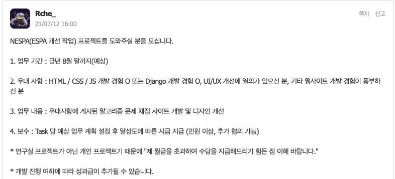
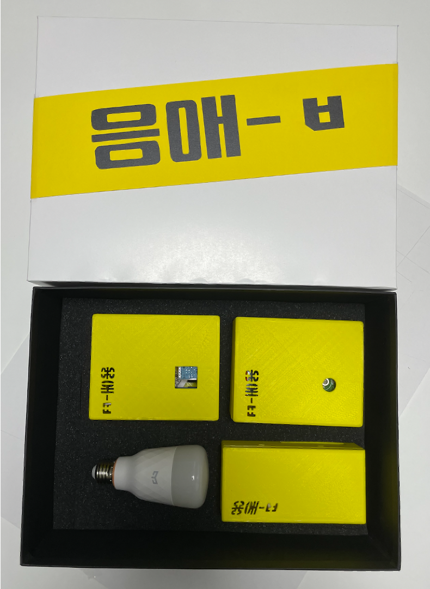
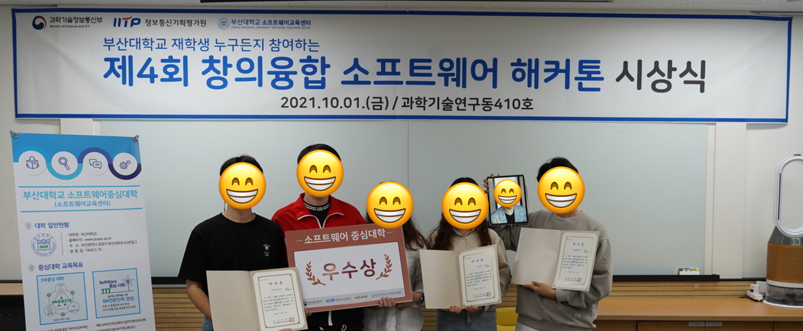
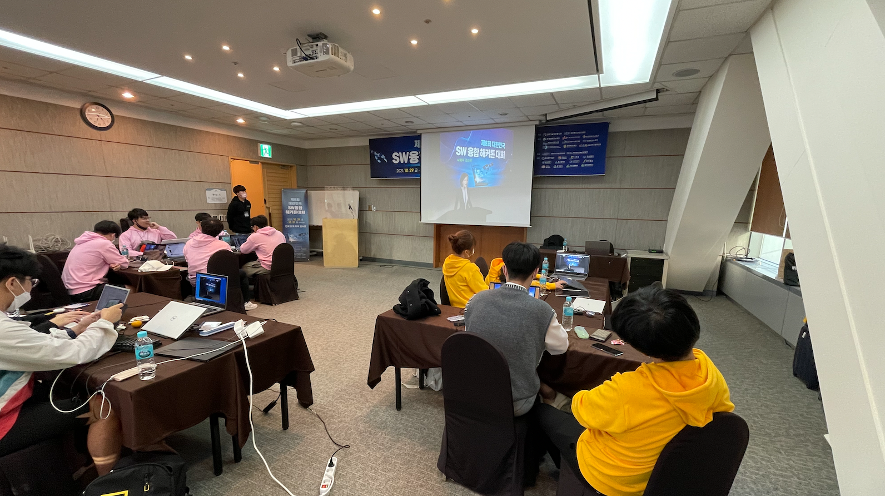
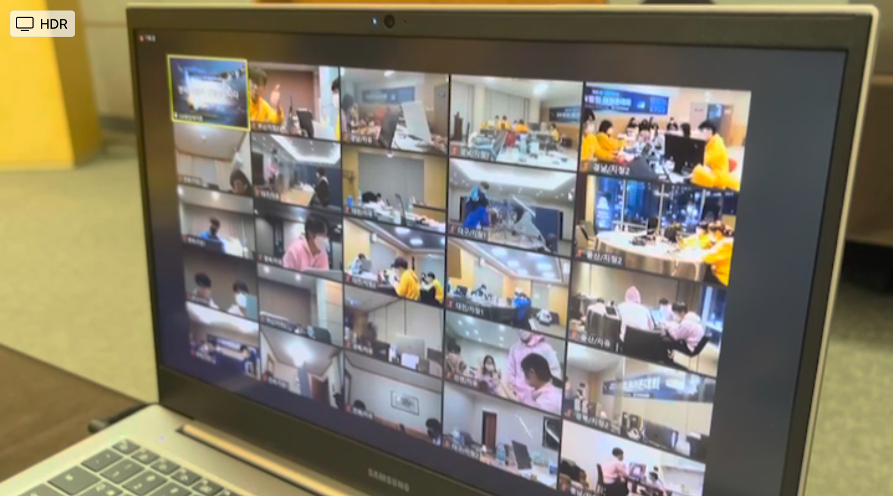
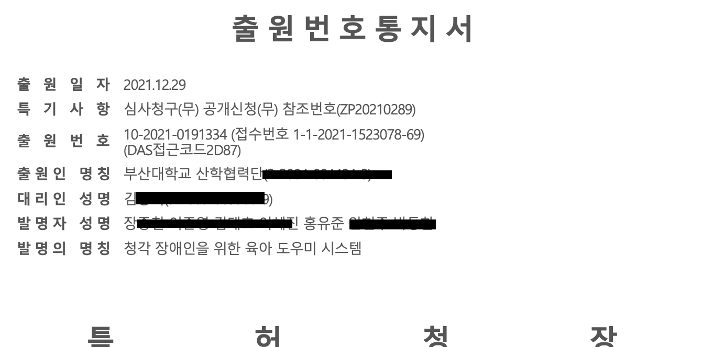
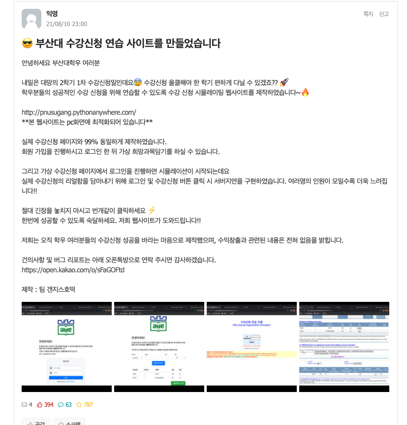
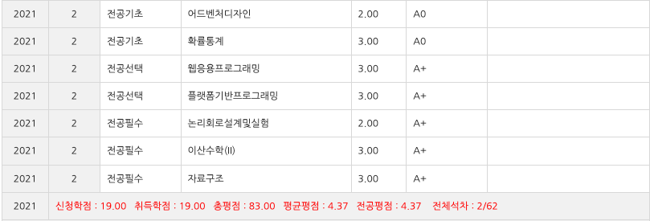

### 자료구조 스터디
2학년 1학기를 마치고 여름방학을 맞아 자료구조 스터디를 시작했다. 같이 공부하는 방식보다는 동아리에 잘하는 선배가 수업하는 식으로 진행되었다. 이때는 기억은 잘 나지 않지만 코로나가 조금 약해져서 인원제한이 풀렸던거 같다. 그래서 6~7명에서 진행하고 있었는데 또 뜬금없이 인원 제한이 걸려버려서 인원을 쪼개어 참 힘들게도 스터디 했다... 

자료구조 스터디라 해봤자 구조 설명하고 구현 조금 관련 문제푸는거라 큰 비중은 두지 않았지만 방학 간 진행하면서 개강이 다가올수록 흐지부지 되어 아쉬운 마음이 있다. 그래도 사람 만나는 일이라 재밌게 나갔던 것 같다. 처음으로 외국인 친구도 알게되었다. 제인하이~

### NESPA 개발
기말고사에 사채로 열정을 당겨쓰고 백수마냥 누워있다가 에브리타임에서 공식 노예 구인글을 보게되었다.
  

본인도 1학년 조환규 교수님의 차일드였기에 ESPA 사용경험이 있다.  

정컴아이돌 교수님의 과제사이트에 이름 석자박을수 있다니... 고민하다가 신청했는데 놀랍게도 조교님이 신청자가 나 한명이랜다. 그래서 맨날 같이 다니는 동아리 형 데리고 NESPA 개발 작업에 착수했다.

사실 내가 맡은 부분은 웹땔깜과 다를바없는 HCJ 부분이라 큰 능력이 필요한건 아니지만 노가다는 맞는거 같다. 디자인도 정해진 것이 없어 내맘대로 기획없이 진행했는데 어째저째 받아드려져서 다음학기 자료구조 수업까지 잘 쓴거보면 신기하긴하다.

웹프레임워크로 장고를 다른 형이 맡아 진행했는데 계속 장고 베이스로 프로젝트를 진행하다보니 배운적이 없는데 주먹구구로 문법 검색해가며 만지작거렸던 기억이 난다. 기회가 된다면 따로 장고를 공부해볼 생각이다.

개강 때까지 이것저것 열심히 만들고... 교수님의 자료구조 수강해서 잘 사용했다. 사실 이거 내가만듬ㅋ 하고 싶어서 시작했는데 딱히 자랑할만한데가 없더라

### 부산대학교 SW해커톤
여름 방학간 진행되는 부산대 제 4회 창의융합 해커톤에 참가하였다. 동아리원들과 "청각장애인을 위한 IOT 시스템" 이라는 주제로 3달가량 개발하게 되었다. 솔직히 큰 도움을 줄 능력은 안되었다고 생각하지만 최대한 맡은 파트를 이해하고 개발하려고 노력하였다. 

IOT관련 주제이다보니 환경데이터를 측정할 센서와 통신모듈의 하드웨어가 필요한데 이를 아두이노로 개발하였다. 다음 학기 아두이노 실험이 있으니 배운다 생각하고 코딩하고 납땜도 이때 처음해봤다. 하다보니 개인적으로 납땜에 재능이 있는거 같다... 재밌음..

뭐 3d 프린팅도 하고 앱 개발도 하고 머신러닝도 하고 아두이노도 하고... 
능력좋은 팀원들을 잘 만나 감사하게도 우수상(3등)까지 타게 되었다.

  

재미있고 유익한 경험이였습니다.

### 코딩 과외하기
친한 형이 과외 괴물이 되어 경제적 자유를 누리는 것을 보고 부러워서 과외를 알아보게 되었다. 내가 할 수 있는건 코딩 기초 문법들과 간단한 웹개발뿐... 인맥도 없어서 플랫폼으로 발품뛰며 과외생을 구인했다. 내 인생 첫 코딩 과외는 30대 중반 영업사원분이셨는데, 언젠가 회사를 나와 자신만의 플랫폼 사업을 하려는 야망을 가지신 분이였다.

영업을 하셔서 그런가 항상 피곤해 하시고 수업 후반부에는 거의 정신을 못차리셔서 좀 안타까웠다. 나는 최선을 다해서 지식을 전수하려했지만 학습자의 상태에 맞춰서 알아서 잘 조절하는 능력도 필요한 것 같다. 2~3달하시다가 어느날 2주뒤에 하자고하시고 잠수를 타버리셨다. 많이 힘드셨구나... 과외비는 선불인데...

### 부산 ICT 융합해커톤대회 & 대한민국 SW 융합해커톤
부산대학교 SW 해커톤대회로 수상했던 주제 청각장애인을 위한 육아도우이 시스템을 가지고 다른 두 가지 해커톤에 참가하였다.

첫 번째로는 부산 ICT 융합해커톤대회였는데 1박2일로 밤새서 개발하고 다음날 발표하는 해커톤 대회였다.  
이와 관련해서는 후기를 작성하였다. https://uzun.dev/2021-09/BusanICThackaton

두 번째로는 SW센터에서 추천해줘서 나간 제 8회 대한민국 SW 융합해커톤이다.  
마찬가지로 해운대 한화리조트에서 진행했으며 무박3일간 진행하며 전국적으로 진행하는 규모가 엄청큰 해커톤이였다. 다른 대회와 다르게 반팔티 쪼가리로 때우지않고 분야별로 후드티도 주고 칫솔세트까지 받았다 ㅋㅋ

  

부산팀은 3팀이 출전해서 대회를 진행했는데 알고보니 전부 부산대대라. 몇명 없어보이지만 전국 각각 모여서 생중계 중이였다.

  

발표까지 모두 끝나고 수상에서 놀랍게도 부산광역시장상을 수상했다.  
근데 킹받게 메타버스로 수상해서 수상한 기분이 안난다. 나는 아직도 메타버스가 뭔지 잘모르겠는데 높으신분들은 되게 좋아하는듯...

  

노올랍게도 이걸로 특허출원도 했다...

### 수강신청연습사이트
  
예전부터 뭔가 해볼려고 수강신청 페이지를 아카이브 떠놓았었다. 2학기 개강을 맞아서 뭔가 수강신청 연습사이트가 있으면 어떨까 싶어서 항상 보는 친한 형이랑 만들어보기로 했다. 장고매니아인 그 분은 뚝딱뚝딱하고 나는 회원가입 및 연습을 위한 폼 데이터 부분등의 잡일을 대충해서 만들었다. 호스팅은 무료 호스팅업체를 사용했다.

그리고 에타에 쓰라고 올렸는데 반응이 매우 좋아서 좋아요 400개 가까이 받고 사용자도 2천명넘게 왔던걸로 기억한다. 웃긴게 실제로 사용자가 급격하게 몰리면서 무료 서비스가 버티지 못하고 튕기는 현상까지 있었는데 진짜 실전 수강신청까지 구현한거냐고 좋아하시더라

### 2학년 2학기

이번 학기도 1학기와 마찬가지로 7전공으로 신청했다. 다만 다른 점이 있다면 복학생이라 커리큘럼이 꼬여서 실험이 2개라는거.. 
- 웹응용프로그래밍
- 자료구조
- 확률통계
- 논리회로설계및실험
- 어드벤처디자인
- 이산수학 2
- 플랫폼기반프로그래밍

일명 조료구조로 과제가 엄청나게 많기로 유명한 수업을 신청해서 유의하고 있었는데 복병이 있었다. 김OO 교수님의 플랫폼(자바)... 정말 실로 엄청난 과제와 실습으로 나를 한학기 동안 가장 힘들게 하셨다. 이 과목 A+ 못받았으면 울었다. 그리고 학기 막바지에는 실험 프로젝트 2개가 같은 날 검사 및 발표를 받아서 심적으로 정말 힘들었다. 프로젝트 실험이 한 학기에 하나인 이유가 있다.
  
1학기보다 열심히 한거 같지는 않았는데 생각보다 잘나와서 길가다가 꽁돈 주운기분이다.  
학점보고 눈꼽만큼 과탑 기대해봤는데 당연히 아니였다. 4.5는 어떻게 받는거지?

### 회고 끝
여행 좀 다녀온거 빼고는 너무 컴퓨터와 관련된거만 했던거 같다. 새로운 취미를 가지고 싶은데...